# 🗺️ MOC - Mapa de Contenidos (Map of Content) Frontend

Este documento sirve como el **índice central de navegación estructurada** de **CRM TIBS App**, diseñado para ofrecer acceso inmediato a la arquitectura técnica, módulos operativos, servicios de comunicación y catálogo de componentes de la aplicación web.

---

## 🧭 Diagrama de Navegación Sistémica

```mermaid
graph TD
    APP["🚀 [[CRM TIBS APP]]<br/>(Master Hub)"]

    %% Arquitectura Base
    APP --> ARC["🏗️ [[CRM TIBS - Arquitectura Frontend & React 19]]"]
    APP --> TEN["🏢 [[CRM TIBS - Multi-Tenancy, Axios & Interceptores]]"]
    APP --> SEC["🔐 [[CRM TIBS - Autenticacion, JWT & Protected Routes]]"]

    %% Modulos Operativos
    APP --> PIP["📊 [[CRM TIBS - Tablero Kanban & Pipeline Comercial]]"]
    APP --> CAL["📅 [[CRM TIBS - Calendario FullCalendar & Actividades]]"]
    APP --> CRM["👥 [[CRM TIBS - Modulo de Clientes, Empresas & CRM]]"]
    APP --> HEL["🎫 [[CRM TIBS - Mesa de Ayuda, Tickets & Helpdesk]]"]
    APP --> CHA["💬 [[CRM TIBS - Chat Omnicanal, WebSockets & Agente IA]]"]
    APP --> PRO["📦 [[CRM TIBS - Cotizaciones PDF & Modulo de Productos]]"]
    APP --> DAS["📈 [[CRM TIBS - Dashboard, Analitica & Reportes]]"]
    APP --> CON["⚙️ [[CRM TIBS - Centro de Configuracion, Tenants & Roles]]"]

    %% Indices y Soporte
    APP --> MOC["🗺️ [[MOC - Mapa de Contenidos Frontend]]"]
    APP --> RET["🤖 [[Guia de Contexto para Agentes de IA (MCP Retrieval)]]"]
    APP --> CAT["🧩 [[Catalogo de Componentes y Vistas]]"]
    APP --> API["⚡ [[Matriz de Servicios y Hooks API]]"]

    classDef hub fill:#1e40af,stroke:#60a5fa,stroke-width:2px,color:#fff;
    classDef arch fill:#0f766e,stroke:#2dd4bf,stroke-width:1px,color:#fff;
    classDef biz fill:#1e293b,stroke:#94a3b8,stroke-width:1px,color:#fff;
    classDef idx fill:#3730a3,stroke:#818cf8,stroke-width:1px,color:#fff;

    class APP hub;
    class ARC,TEN,SEC arch;
    class PIP,CAL,CRM,HEL,CHA,PRO,DAS,CON biz;
    class MOC,RET,CAT,API idx;
```

---

## 🏛️ 1. Arquitectura y Fundamentos del Sistema
* [[CRM TIBS APP]] — **Hub Maestro de la Aplicación**. Resumen ejecutivo, stack tecnológico (React 19, Vite 7, TypeScript 5.8, TailwindCSS), variables de entorno, topología de directorios y dependencias.
* [[CRM TIBS - Arquitectura Frontend & React 19]] — Estructura modular por capas (`core`, `pages`, `components`, `hooks`, `services`, `store`), empaquetado Vite 7, compilación SWC y soporte para PWA (`vite-plugin-pwa`).
* [[CRM TIBS - Multi-Tenancy, Axios & Interceptores]] — Inyección transparente del esquema PostgreSQL mediante la cabecera HTTP `x-tenant-schema`, selector reactivo de tenants en `configStore`, desempaquetado de respuestas NestJS y captura global de códigos HTTP 401 (desconexión) y 402 (límites de tokens / suscripción).
* [[CRM TIBS - Autenticacion, JWT & Protected Routes]] — Gestión de sesión basada en JWT (`jwtDecode`), control de acceso por roles (RBAC: `superadmin`, `admin`, `executive`) y protección de rutas mediante `ProtectedRoute`.

---

## 💼 2. Módulos Funcionales y Operación de Negocio
* [[CRM TIBS - Tablero Kanban & Pipeline Comercial]] — Flujo comercial visual con Drag & Drop (`@dnd-kit`), etapas semánticas (`open`, `won`, `lost`), animación de confeti en tratos ganados, filtros avanzados y sincronización en tiempo real vía WebSockets.
* [[CRM TIBS - Calendario FullCalendar & Actividades]] — Agenda operativa interactiva con `@fullcalendar/react` (vistas mes, semana, día, lista), categorización cromática por tipos de actividad, popovers contextuales y coordinación de sincronización con Google Calendar, Outlook e iCloud.
* [[CRM TIBS - Modulo de Clientes, Empresas & CRM]] — Gestión de empresas B2B y contactos directos, bitácora de interacciones, cambio de estatus activo/inactivo y vinculación contextual a oportunidades y tickets.
* [[CRM TIBS - Mesa de Ayuda, Tickets & Helpdesk]] — Sistema de tickets de soporte estilo Kanban y Lista, matriz de prioridades (baja, media, alta, urgente), cálculo de antigüedad en etapa, notas públicas/internas y automatización de cron de SLAs.
* [[CRM TIBS - Chat Omnicanal, WebSockets & Agente IA]] — Centro de mensajería unificada (WhatsApp, Messenger, Instagram, WebChat), conexión viva Socket.IO en `/conversations`, reasignación de agentes, panel simulador de prospectos y toggle para intervención de bot de IA.
* [[CRM TIBS - Cotizaciones PDF & Modulo de Productos]] — Catálogo de productos/servicios con notas para el bot de IA, detección inteligente de enlaces a cotizaciones PDF en el chat (`messageUtils`) y exportación con `jspdf` y `jspdf-autotable`.
* [[CRM TIBS - Dashboard, Analitica & Reportes]] — Indicadores clave de rendimiento (KPIs), gráficas dinámicas de conversión por mes y etapa, filtrado multidivisa (MXN, USD, Consolidado) y generación de resúmenes ejecutivos en PDF.
* [[CRM TIBS - Centro de Configuracion, Tenants & Roles]] — Panel maestro de configuración (`SettingsPage`), pestañas de empresa, catálogos auxiliares (líneas de negocio, licenciamientos), credenciales de IA globales, administración de inquilinos y control de planes SaaS.

---

## 📑 3. Índices Técnicos de Referencia y Soporte a IA
* [[Catalogo de Componentes y Vistas]] — Inventario completo de páginas de ruta (`src/pages/`) y componentes reusables de interfaz (`src/components/shared/`, `Pipeline`, `Helpdesk`, `WebChat`, etc.).
* [[Matriz de Servicios y Hooks API]] — Mapeo detallado de los **23 servicios** de comunicación HTTP (`src/services/`), los **13 custom hooks** (`src/hooks/`) y los endpoints backend asociados.
* [[Guia de Contexto para Agentes de IA (MCP Retrieval)]] — Protocolo de recuperación de contexto, catálogo de búsquedas clave y directrices obligatorias para agentes que operan mediante el servidor MCP `obsidian-ss-app`.
