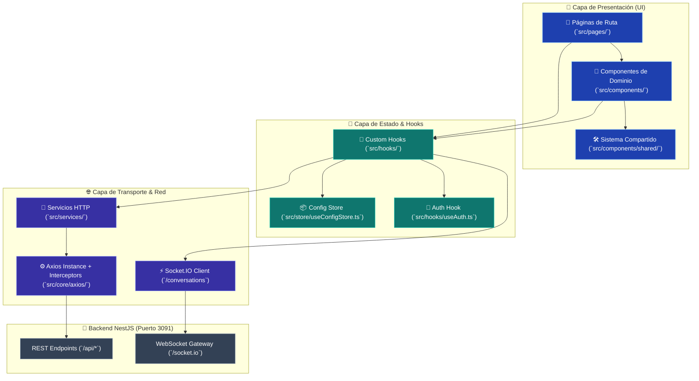
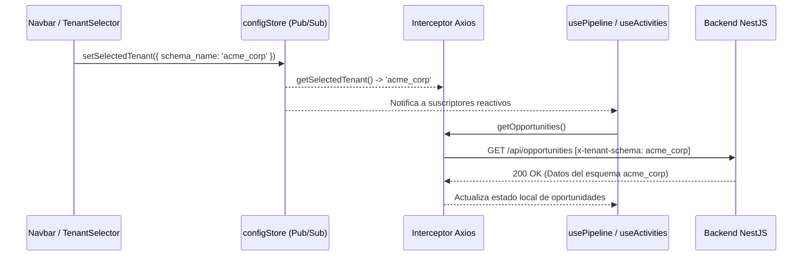

# 🏗️ CRM TIBS — Arquitectura Frontend & React 19

Este documento describe la arquitectura modular, el ciclo de vida de empaquetado con **Vite 7**, el uso de **React 19** y los patrones de gestión de estado que estructuran el frontend de **CRM TIBS App**.

---

## 📐 Flujo de Capas y Flujo de Datos

---

## 🧩 1. Organización Modular por Capas

La aplicación está diseñada bajo el principio de separación de responsabilidades:

1. **`src/pages/` (Vistas de Ruta):**
   * Actúan como orquestadores de alto nivel.
   * Conectan la URL con los hooks de dominio y renderizan el diseño estructural provisto por [`Layout.tsx`](file:///c:/Users/sopor/Proyectos/CRM/crm-tibs-app/src/components/Layout/Layout.tsx).
2. **`src/components/` (Componentes de Dominio):**
   * Agrupados por contexto (`Activity`, `Company`, `Client`, `Dashboard`, `Expense`, `Helpdesk`, `Pipeline`, `Product`, `Settings`, `User`, `WebChat`).
   * No realizan peticiones `axios` directamente; delegan los eventos hacia props o consumen hooks.
3. **`src/components/shared/` (Sistema de Diseño Reusable):**
   * Primitivas agnósticas al negocio: botones, inputs, tablas con paginador, diálogos modales, stepper de etapas y zona de carga `Dropzone`.
4. **`src/hooks/` (Lógica de Negocio y Reactividad):**
   * Encapsulan estados locales, efectos, suscripciones WebSocket, temporizadores y llamadas a servicios.
   * Previenen cierres obsoletos (*stale closures*) en llamadas asíncronas mediante el uso intensivo de `useRef` (e.g. en [`useConversationsSocket.ts`](file:///c:/Users/sopor/Proyectos/CRM/crm-tibs-app/src/hooks/useConversationsSocket.ts)).
5. **`src/services/` (Clientes de Red Tipados):**
   * Colección de 23 módulos de funciones asíncronas que consumen `axiosInstance` y devuelven modelos TypeScript limpios.
6. **`src/store/` (Almacén de Configuración Global):**
   * [`useConfigStore.ts`](file:///c:/Users/sopor/Proyectos/CRM/crm-tibs-app/src/store/useConfigStore.ts) implementa un patrón **Observable / Pub-Sub** liviano para almacenar el tenant activo seleccionado por el usuario y la lista de inquilinos accesibles.

---

## ⚡ 2. Características de React 19 y Empaquetado con Vite 7

### Adopción de React 19:
* **Mejoras en el motor de renderizado:** React 19 (`19.1.1`) optimiza el reconciliador de árbol virtual eliminando costos de re-renderizado innecesarios en listas largas de oportunidades y tablas de tickets.
* **Transiciones y renderizado concurrente:** Permite mantener responsiva la interfaz mientras se realizan cálculos complejos de filtros o agrupaciones de fechas en [`useDashboard.ts`](file:///c:/Users/sopor/Proyectos/CRM/crm-tibs-app/src/hooks/useDashboard.ts).

### Configuración de Vite 7 (`vite.config.ts`):
* **Hot Module Replacement:** Tiempos de recarga en caliente inferiores a 50ms durante desarrollo.
* **Proxy Transparente:** Redirección de `/api`, `/socket.io` y `/uploads` al backend para evitar problemas de CORS en local.
* **Soporte PWA Integral (`vite-plugin-pwa`):**
  * `registerType: 'autoUpdate'`: Actualización automática del service worker ante despliegues de nuevas versiones.
  * Manifiesto PWA completo con iconos `180x180`, `192x192` y `512x512`.
  * Caché de Workbox con límite de tamaño de hasta 5 MB (`maximumFileSizeToCacheInBytes: 5 * 1024 * 1024`).

---

## 🔄 3. Patrón de Gestión de Estado y Eventos

En lugar de requerir librerías pesadas como Redux, CRM TIBS utiliza una estrategia equilibrada de 3 niveles:

1. **Estado de Sesión:** `localStorage` para tokens JWT decodificados al vuelo mediante [`useAuth.ts`](file:///c:/Users/sopor/Proyectos/CRM/crm-tibs-app/src/hooks/useAuth.ts).
2. **Estado de Tenant Activo:** `configStore` con persistencia en `localStorage.getItem('selected_tenant')`.
3. **Eventos Desacoplados:** `window.dispatchEvent(new CustomEvent('settingsTabChanged'))` para comunicación entre componentes hermanos en la pantalla de configuración sin prop-drilling.

---

## 🔗 Enlaces Relacionados
* [[CRM TIBS APP]] — Hub Maestro.
* [[CRM TIBS - Multi-Tenancy, Axios & Interceptores]] — Capa HTTP y propagación del esquema.
* [[CRM TIBS - Autenticacion, JWT & Protected Routes]] — Seguridad y guardias de navegación.
* [[Catalogo de Componentes y Vistas]] — Inventario de componentes y páginas.
