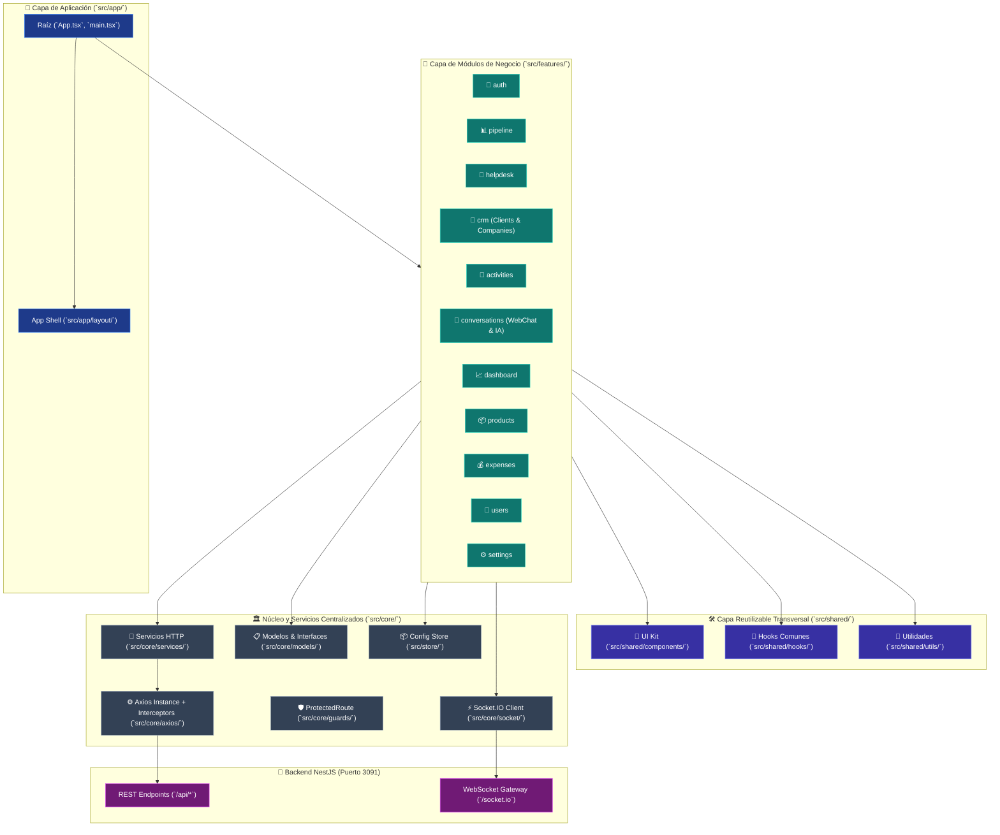

# 🏗️ CRM TIBS — Arquitectura Frontend & React 19

Este documento describe la arquitectura modular basada en características (**Feature-Driven Modular Architecture**), el ciclo de vida de empaquetado con **Vite 7**, el uso de **React 19**, las estrategias de **Lazy Loading / Code-Splitting** y los patrones de gestión de estado que estructuran el frontend de **CRM TIBS App**.

---

## 📐 Flujo de Capas y Flujo de Datos

```mermaid
flowchart TD
    subgraph CapaApp ["🚀 Capa de Aplicación (`src/app/`)"]
        AppRoot["Raíz (`App.tsx`, `main.tsx`)"]
        Layout["App Shell (`src/app/layout/`)"]
    end

    subgraph CapaFeatures ["💼 Capa de Módulos de Negocio (`src/features/`)"]
        AuthFeat["🔐 auth"]
        PipeFeat["📊 pipeline"]
        HelpFeat["🎫 helpdesk"]
        CrmFeat["👥 crm (Clients & Companies)"]
        ActFeat["📅 activities"]
        ChatFeat["💬 conversations (WebChat & IA)"]
        DashFeat["📈 dashboard"]
        ProdFeat["📦 products"]
        ExpFeat["💰 expenses"]
        UserFeat["👤 users"]
        SettFeat["⚙️ settings"]
    end

    subgraph CapaShared ["🛠️ Capa Reutilizable Transversal (`src/shared/`)"]
        SharedUI["🎨 UI Kit (`src/shared/components/`)"]
        SharedHooks["🎣 Hooks Comunes (`src/shared/hooks/`)"]
        SharedUtils["🧮 Utilidades (`src/shared/utils/`)"]
    end

    subgraph CapaCore ["🏛️ Núcleo y Servicios Centralizados (`src/core/`)"]
        Services["📡 Servicios HTTP (`src/core/services/`)"]
        Axios["⚙️ Axios Instance + Interceptors (`src/core/axios/`)"]
        Guards["🛡️ ProtectedRoute (`src/core/guards/`)"]
        Models["📋 Modelos & Interfaces (`src/core/models/`)"]
        Sockets["⚡ Socket.IO Client (`src/core/socket/`)"]
        Store["📦 Config Store (`src/store/`)"]
    end

    subgraph Backend ["🏢 Backend NestJS (Puerto 3091)"]
        API["REST Endpoints (`/api/*`)"]
        WSGateway["WebSocket Gateway (`/socket.io`)"]
    end

    AppRoot --> Layout
    AppRoot --> CapaFeatures
    CapaFeatures --> SharedUI
    CapaFeatures --> SharedHooks
    CapaFeatures --> SharedUtils
    CapaFeatures --> Services
    CapaFeatures --> Models
    CapaFeatures --> Store
    CapaFeatures --> Sockets

    Services --> Axios
    Axios --> API
    Sockets --> WSGateway

    classDef app fill:#1e3a8a,stroke:#3b82f6,color:#fff;
    classDef feat fill:#0f766e,stroke:#2dd4bf,color:#fff;
    classDef shared fill:#3730a3,stroke:#818cf8,color:#fff;
    classDef core fill:#334155,stroke:#94a3b8,color:#fff;
    classDef bnd fill:#701a75,stroke:#d946ef,color:#fff;

    class AppRoot,Layout app;
    class AuthFeat,PipeFeat,HelpFeat,CrmFeat,ActFeat,ChatFeat,DashFeat,ProdFeat,ExpFeat,UserFeat,SettFeat feat;
    class SharedUI,SharedHooks,SharedUtils shared;
    class Services,Axios,Guards,Models,Sockets,Store core;
    class API,WSGateway bnd;
```

---

## 🧩 1. Organización Modular por Características (Vertical Slices)

La aplicación implementa una **arquitectura modular orientada al dominio**, eliminando la dispersión horizontal y garantizando alta cohesión:

1. **`src/app/` (Capa de Aplicación y Shell):**
   * Contiene el punto de entrada, configuración de rutas y el Layout unificado (`src/app/layout/` con `Sidebar`, `Navbar`, menús estacionales y contenedor principal).
2. **`src/features/` (Módulos de Negocio Autónomos):**
   * Cada módulo encapsula sus componentes, hooks, páginas de ruta y utilidades específicas:
     * `auth/`: Login, recuperación de contraseña, cambio de credenciales y `useAuth`.
     * `pipeline/`: Tablero Kanban comercial, modales de oportunidades, cotizaciones, archivos e interacciones.
     * `helpdesk/`: Mesa de ayuda, SLAs, cron de helpdesk y portal de tickets público.
     * `crm/`: Gestión unificada de clientes (contactos) y empresas B2B.
     * `activities/`: Agenda operativa, calendario FullCalendar y tipos de actividades.
     * `conversations/`: Centro omnicanal de mensajería en vivo, WhatsApp Cloud API y WebChat con IA.
     * `dashboard/`: Analítica ejecutiva, gráficas comparativas, indicadores KPI y exportación PDF/Excel.
     * `products/`: Catálogo de productos, fichas técnicas y notas contextuales para IA.
     * `expenses/`: Registro y control de gastos corporativos y comprobantes.
     * `users/`: Administración de ejecutivos comerciales, avatares y control de roles.
     * `settings/`: Centro de configuración SaaS, tenants multi-empresa, planes y canales de IA.
   * Cada feature expone un barril público canónico (`index.ts`) para proteger sus fronteras internas.
3. **`src/shared/` (Componentes y Utilidades Agnósticas al Negocio):**
   * `components/`: UI Kit modular (`Button`, `Input`, `Select`, `Modal`, `Dropzone`, suite TanStack `Table`, etc.).
   * `hooks/`: Hooks transversales agnósticos (`useDebounce`, `useNotification`, `useFormValidation`).
   * `utils/`: Utilidades generales (`formatters.ts` para MXN/USD y fechas, `toast.ts` para alertas).
4. **`src/core/` (Servicios Centralizados e Infraestructura):**
   * `services/`: Los 23 clientes HTTP centralizados para toda la aplicación.
   * `axios/`: Instancia singleton de Axios con inyección dinámica del Bearer Token y cabecera `x-tenant-schema`.
   * `guards/`: `ProtectedRoute` y guardias de navegación por rol.
   * `models/`: Contratos de interfaces TypeScript de entidades globales.
   * `socket/`: Gestor base de conexiones Socket.IO.
5. **Path Aliases Tipados:**
   * `@/*` $\rightarrow$ `src/*`
   * `@app/*` $\rightarrow$ `src/app/*`
   * `@features/*` $\rightarrow$ `src/features/*`
   * `@shared/*` $\rightarrow$ `src/shared/*`
   * `@core/*` $\rightarrow$ `src/core/*`

---

## ⚡ 2. Características de React 19 y Empaquetado con Vite 7

### Adopción de React 19:
* **Mejoras en el motor de renderizado:** React 19 (`19.1.1`) optimiza el reconciliador de árbol virtual eliminando costos de re-renderizado innecesarios en listas largas de oportunidades y tablas de tickets.
* **Transiciones y renderizado concurrente:** Permite mantener responsiva la interfaz mientras se realizan cálculos complejos de filtros o agrupaciones de fechas.

### Configuración de Vite 7 (`vite.config.ts`):
* **Hot Module Replacement:** Tiempos de recarga en caliente inferiores a 50ms durante desarrollo.
* **Proxy Transparente:** Redirección de `/api`, `/socket.io` y `/uploads` al backend para evitar problemas de CORS en local.
* **Soporte PWA Integral (`vite-plugin-pwa`):**
  * `registerType: 'prompt'`: Actualización interactiva controlada del service worker. Cuando se detecta una nueva compilación, se despliega la notificación interactiva `PwaUpdateNotification`.
  * Manifiesto PWA completo con iconos `180x180`, `192x192` y `512x512`.
  * Caché de Workbox optimizado.

---

## 🚀 3. Code Splitting, Lazy Loading & Optimización de Chunks

Para evitar la descarga de un bundle monolítico inicial que sobrepasaba los 2.8 MB, la aplicación implementa una estrategia de carga diferida en tres niveles:

### A. Route-Level Code Splitting (`React.lazy` + `<Suspense />`):
En [`src/App.tsx`](file:///Users/eimvi/Documents/GitHub/crm-tibs-app/src/App.tsx), todas las vistas de ruta se cargan bajo demanda:
* **Rutas Públicas / Auth:** `LoginPage`, `ForgotPasswordPage`, `ResetPasswordPage`, `SupportTicketPage` y `OAuthCallbackPopup`. Un usuario no autenticado descarga un chunk de solo ~16 kB.
* **Rutas Protegidas:** `DashboardPage`, `PipelinePage`, `ClientsPage`, `ActivitiesPage`, `HelpdeskPage`, `ConversationsPage`, `ExpensesPage`, `ProductsPage`, `UsersPage` y `SettingsPage`.
* **Shell Estable (Zero-Flicker):** El contenedor principal [`src/app/layout/Layout.tsx`](file:///Users/eimvi/Documents/GitHub/crm-tibs-app/src/app/layout/Layout.tsx) envuelve su contenido `children` en un `<Suspense fallback={<Loader className="h-64" size="lg" />}>`. Esto garantiza que la navegación entre páginas no destruya ni haga parpadear el `Navbar` o el `Sidebar`.

### B. Segmentación de Vendors en Vite (`manualChunks`):
En [`vite.config.ts`](file:///Users/eimvi/Documents/GitHub/crm-tibs-app/vite.config.ts), se definen particiones manuales en Rollup para librerías de terceros con ciclos de actualización independientes:
* `vendor-calendar`: Paquetes de FullCalendar (`@fullcalendar/core`, `@fullcalendar/react`, `@fullcalendar/daygrid`, etc. ~268 kB). Solo se descarga al abrir la Agenda/Calendario.
* `vendor-dnd`: Paquetes de Drag & Drop (`@dnd-kit/core`, `@dnd-kit/sortable` ~51 kB).
* `vendor-table`: Paquete de `@tanstack/react-table` (~59 kB).
* `vendor-xlsx`: Motor de hojas de cálculo `xlsx` (~429 kB), aislado completamente.

### C. Importaciones Dinámicas Bajo Demanda:
Las librerías analíticas y de exportación pesadas (como `xlsx`) no se cargan al montar módulos, sino mediante `const XLSX = await import('xlsx')` dentro de los handlers de exportación en `exportCourtesy.utils.ts` y `exportHistory.utils.ts`.

#### 📊 Resultado de Optimización:
* **Bundle inicial:** Reducido de **2,859.40 kB (2.86 MB)** a **495.10 kB** (**-82.7% de reducción** en carga inicial).
* **Chunk de Login:** Reducido a **16.14 kB** (5.65 kB gzipped).
* **Eliminación de advertencias:** Cero advertencias de Rollup por chunks superiores a 500 kB.

---

## 🔄 4. Patrón de Gestión de Estado y Eventos

En lugar de requerir librerías pesadas como Redux, CRM TIBS utiliza una estrategia equilibrada:

1. **Estado de Sesión:** `localStorage` para tokens JWT decodificados al vuelo mediante `@features/auth`.
2. **Estado de Tenant Activo:** `configStore` (`src/store/useConfigStore.ts`) con persistencia en `localStorage.getItem('selected_tenant')` y sincronización reactiva con interceptores Axios.
3. **Eventos Desacoplados:** Canales de comunicación reactivos y `BroadcastChannel` para sincronización inter-pestañas.

---

## 🔗 Enlaces Relacionados
* [[CRM TIBS APP]] — Hub Maestro.
* [[CRM TIBS - Multi-Tenancy, Axios & Interceptores]] — Capa HTTP y propagación del esquema.
* [[CRM TIBS - Autenticacion, JWT & Protected Routes]] — Seguridad y guardias de navegación.
* [[Catalogo de Componentes y Vistas]] — Inventario de componentes y páginas.
