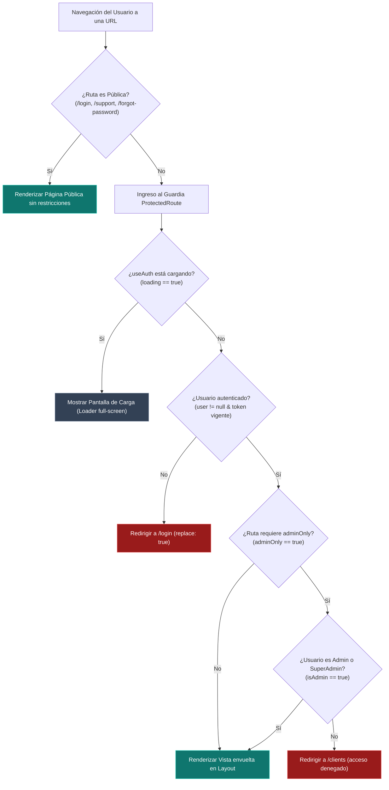

# 🔐 CRM TIBS — Autenticación, JWT & Protected Routes

Este documento explica el modelo de autenticación basado en **JSON Web Tokens (JWT)**, el ciclo de vida de la sesión en el cliente, el control de acceso basado en roles (**RBAC**) y la protección de vistas mediante el componente guard [`ProtectedRoute.tsx`](file:///c:/Users/sopor/Proyectos/CRM/crm-tibs-app/src/core/guards/ProtectedRoute.tsx).

---

## 🛡️ Flujo de Validación de Rutas y Sesión



---

## 🔑 1. Estructura y Decodificación del Token JWT

Cuando el usuario inicia sesión mediante [`authService.login`](file:///c:/Users/sopor/Proyectos/CRM/crm-tibs-app/src/services/authService.ts), el token de acceso se almacena en el `localStorage` del navegador bajo la clave `'token'`.

El hook [`useAuth.ts`](file:///c:/Users/sopor/Proyectos/CRM/crm-tibs-app/src/hooks/useAuth.ts) se encarga de inspeccionar y validar la firma del token en el montaje de la aplicación:

```typescript
// Fragmento de src/hooks/useAuth.ts
interface DecodedToken {
  id: string;
  sub: string;
  username: string;
  role: 'superadmin' | 'admin' | 'executive';
  tenant?: string;
  iat: number;
  exp: number;
}
```

### Comprobación de Caducidad:
Para evitar llamadas innecesarias al backend con tokens expirados, el hook evalúa:
```typescript
if (decodedToken.exp * 1000 > Date.now()) {
    setUser({ ...decodedToken, id: decodedToken.sub || decodedToken.id });
}
```
Si la fecha actual supera el timestamp `exp`, el usuario se considera nulo y se fuerza el reingreso.

---

## 👥 2. Matriz de Roles y Permisos (RBAC)

El frontend clasifica a los usuarios en tres niveles operativos:

| Rol | Bandera Booleana | Capacidades Principales |
| :--- | :--- | :--- |
| **`superadmin`** | `isSuperAdmin: true`, `isAdmin: true` | Control total del sistema. Acceso a creación de inquilinos (`tenants`), planes SaaS (`plans`), credenciales maestras de IA y selector global de tenant en el Navbar. |
| **`admin`** | `isAdmin: true`, `isSuperAdmin: false` | Administrador del tenant activo. Gestión de usuarios de su organización (`/users`), configuración de empresa, líneas de negocio y sincronizaciones de calendario. |
| **`executive`** | `isEjecutivo: true`, `isAdmin: false` | Asesor comercial / técnico. Operación del Pipeline, registro de actividades, gestión de clientes asignados y atención de chats y tickets. |

---

## 🚪 3. Implementación del Guardia `ProtectedRoute`

En [`src/core/guards/ProtectedRoute.tsx`](file:///c:/Users/sopor/Proyectos/CRM/crm-tibs-app/src/core/guards/ProtectedRoute.tsx):

```tsx
const ProtectedRoute: React.FC<Props> = ({ children, adminOnly = false }) => {
  const { user, isAdmin, loading } = useAuth();

  if (loading) {
    return <div className="flex h-screen w-screen items-center justify-center"><Loader /></div>;
  }

  if (!user) {
    return <Navigate to="/login" replace />;
  }

  if (adminOnly && !isAdmin) {
    return <Navigate to="/clients" replace />;
  }

  return children;
};
```

> [!TIP]
> En [`App.tsx`](file:///c:/Users/sopor/Proyectos/CRM/crm-tibs-app/src/App.tsx), la ruta `/users` utiliza `adminOnly={true}`. Si un usuario con rol `executive` intenta ingresar directamente a `/users` mediante la barra de direcciones, es devuelto suavemente a `/clients` sin romper el estado de la aplicación.

---

## 🔗 Enlaces Relacionados
* [[CRM TIBS APP]] — Hub Maestro.
* [[CRM TIBS - Multi-Tenancy, Axios & Interceptores]] — Inyección del token Bearer en solicitudes.
* [[CRM TIBS - Centro de Configuracion, Tenants & Roles]] — Administración de usuarios y permisos.
* [[Catalogo de Componentes y Vistas]] — Mapeo de rutas protegidas y públicas.
