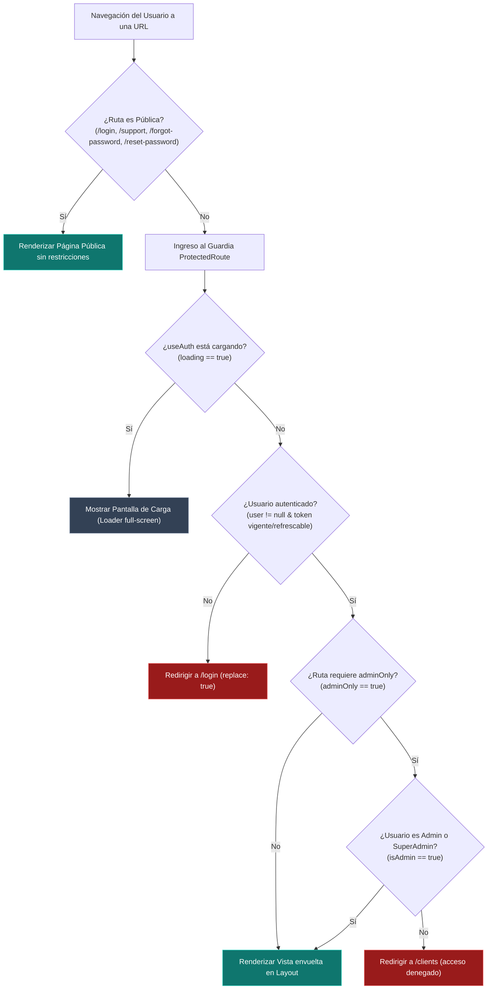

# 🔐 CRM TIBS — Autenticación, JWT, Refresh Token & Protected Routes

Este documento explica el modelo de autenticación basado en **Tokens Duales JSON Web Tokens (Access Token + Refresh Token)**, el ciclo de vida de la sesión en el cliente Web y **PWA**, la renovación silenciosa con encolamiento de peticiones, la sincronización entre pestañas mediante **BroadcastChannel**, el control de acceso basado en roles (**RBAC**) y la protección de vistas mediante el componente guard [`ProtectedRoute.tsx`](file:///Users/eimvi/Documents/GitHub/crm-tibs-app/src/core/guards/ProtectedRoute.tsx).

---

## 🛡️ Flujo de Validación de Rutas y Sesión


```mermaid
flowchart TD
    Start["Navegación del Usuario a una URL"] --> RouteCheck{"¿Ruta es Pública?<br/>(/login, /support, /forgot-password, /reset-password)"}
    
    RouteCheck -- Sí --> RenderPublic["Renderizar Página Pública sin restricciones"]
    RouteCheck -- No --> Guard["Ingreso al Guardia ProtectedRoute"]

    Guard --> CheckLoading{"¿useAuth está cargando?<br/>(loading == true)"}
    CheckLoading -- Sí --> ShowLoader["Mostrar Pantalla de Carga (Loader full-screen)"]
    CheckLoading -- No --> CheckUser{"¿Usuario autenticado?<br/>(user != null & token vigente/refrescable)"}

    CheckUser -- No --> RedirectLogin["Redirigir a /login (replace: true)"]
    CheckUser -- Sí --> CheckAdmin{"¿Ruta requiere adminOnly?<br/>(adminOnly == true)"}

    CheckAdmin -- No --> RenderView["Renderizar Vista envuelta en Layout"]
    CheckAdmin -- Sí --> VerifyRole{"¿Usuario es Admin o SuperAdmin?<br/>(isAdmin == true)"}

    VerifyRole -- Sí --> RenderView
    VerifyRole -- No --> RedirectHome["Redirigir a /clients (acceso denegado)"]

    classDef pass fill:#0f766e,stroke:#2dd4bf,color:#fff;
    classDef reject fill:#991b1b,stroke:#f87171,color:#fff;
    classDef wait fill:#334155,stroke:#94a3b8,color:#fff;

    class RenderPublic,RenderView pass;
    class RedirectLogin,RedirectHome reject;
    class ShowLoader wait;
```

---

## 🔑 1. Estructura de Tokens Duales y Ciclo de Vida PWA

Cuando el usuario inicia sesión mediante [`authService.login`](file:///Users/eimvi/Documents/GitHub/crm-tibs-app/src/services/authService.ts), el backend emite:
1. `access_token`: Almacenado en `localStorage.getItem('token')`.
2. `refresh_token`: Almacenado en `localStorage.getItem('refresh_token')`.

### 1.1. Renovación Silenciosa e Interceptores Axios (`interceptors.ts`)
Si una petición AJAX devuelve un estado `401 Unauthorized`:
1. El interceptor valida que no sea el endpoint `/auth/login` ni `/auth/refresh` y que no se haya reintentado previamente (`_retry`).
2. Si un refresco ya está en progreso (`isRefreshing = true`), la petición se encola en `failedQueue`.
3. Si es la primera petición que falla, se ejecuta `authService.refreshToken()` contra `POST /api/auth/refresh`.
4. Al obtener un nuevo `access_token`:
   * Se actualizan los tokens en `localStorage`.
   * Se procesa la cola `failedQueue`, reintentando todas las llamadas concurrentes con la nueva cabecera `Authorization: Bearer <nuevo_token>`.
5. Si el refresh falla (token revocado o expirado), se limpia el almacenamiento y se redirige a `/login`.

### 1.2. Reactivación de PWA (App Resume & `visibilitychange`)
En aplicaciones PWA instaladas en móviles o desktops, cuando el usuario regresa a la app tras suspensión:
* El hook [`useAuth.ts`](file:///Users/eimvi/Documents/GitHub/crm-tibs-app/src/hooks/useAuth.ts) escucha eventos `visibilitychange` y `focus`.
* Si el token tiene menos de 2 minutos de vigencia, se ejecuta un silent refresh proactivo en segundo plano para evitar fallos de red perceptibles.

### 1.3. Sincronización Multi-Pestaña (`BroadcastChannel`)
La constante `authChannel = new BroadcastChannel('crm_tibs_auth')`:
* Notifica eventos `'LOGOUT'`: Cierra la sesión simultáneamente en todas las pestañas/ventanas abiertas de la PWA.
* Notifica eventos `'TOKEN_REFRESHED'`: Propaga el nuevo token a todas las instancias activas.

---

## 👥 2. Matriz de Roles y Permisos (RBAC)

El frontend clasifica a los usuarios en tres niveles operativos:

| Rol | Bandera Booleana | Capacidades Principales |
| :--- | :--- | :--- |
| **`superadmin`** | `isSuperAdmin: true`, `isAdmin: true` | Control total del sistema. Acceso a creación de inquilinos (`tenants`), planes SaaS (`plans`), credenciales maestras de IA y selector global de tenant en el Navbar. |
| **`admin`** | `isAdmin: true`, `isSuperAdmin: false` | Administrador del tenant activo. Gestión de usuarios de su organización (`/users`), configuración de empresa, líneas de negocio y sincronizaciones de calendario. |
| **`executive`** | `isEjecutivo: true`, `isAdmin: false` | Asesor comercial / técnico. Operación del Pipeline, registro de actividades, gestión de clientes asignados y atención de chats y tickets. |

---

## 🚪 3. Implementación del Guardia `ProtectedRoute`

En [`src/core/guards/ProtectedRoute.tsx`](file:///Users/eimvi/Documents/GitHub/crm-tibs-app/src/core/guards/ProtectedRoute.tsx):

```tsx
const ProtectedRoute: React.FC<Props> = ({ children, adminOnly = false }) => {
  const { user, isAdmin, loading } = useAuth();

  if (loading) {
    return <div className="flex h-screen w-screen items-center justify-center"><Loader /></div>;
  }

  if (!user) {
    return <Navigate to="/login" replace />;
  }

  if (adminOnly && !isAdmin) {
    return <Navigate to="/clients" replace />;
  }

  return children;
};
```

---

## 🔗 Enlaces Relacionados
* [[CRM TIBS APP]] — Hub Maestro.
* [[CRM TIBS - Multi-Tenancy, Axios & Interceptores]] — Inyección del token Bearer y cabeceras dinámicas.
* [[CRM TIBS - Centro de Configuracion, Tenants & Roles]] — Administración de usuarios y permisos.
* [[Catalogo de Componentes y Vistas]] — Mapeo de rutas protegidas y públicas.
