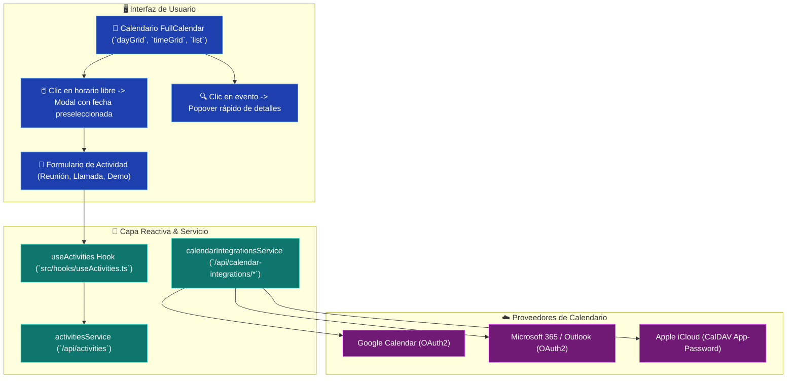

# 📅 CRM TIBS — Calendario FullCalendar & Actividades

Este documento detalla la integración del motor interactivo de agenda con **FullCalendar** ([`@fullcalendar/react`](file:///c:/Users/sopor/Proyectos/CRM/crm-tibs-app/package.json)), el hook de gestión operativa [`useActivities.ts`](file:///c:/Users/sopor/Proyectos/CRM/crm-tibs-app/src/hooks/useActivities.ts), el sistema cromático de tipos de cita y la coordinación de sincronización bidireccional con **Google Calendar, Microsoft Outlook y Apple iCloud**.

---

## 🗓️ Flujo Operativo de Actividades y Sincronización

---

## ⚙️ 1. Configuración y Plugins de FullCalendar

En [`src/components/Activity/ActivitiesCalendar.tsx`](file:///c:/Users/sopor/Proyectos/CRM/crm-tibs-app/src/components/Activity/ActivitiesCalendar.tsx), se ensambla el componente utilizando cuatro plugins oficiales:
* **`dayGridPlugin`:** Vista mensual de cuadrícula (`dayGridMonth`).
* **`timeGridPlugin`:** Vista semanal y diaria con franjas horarias configurables (`timeGridWeek`, `timeGridDay`).
* **`interactionPlugin`:** Detección de selección de rangos de fechas (`dateClick`, `select`).
* **`listPlugin`:** Vista compacta estilo lista cronológica (`listWeek`).
* **Localización en Español:** Importación de `esLocale` desde `@fullcalendar/core/locales/es` para nombres de meses, días y etiquetas amigables.

---

## 🎨 2. Renderizado Personalizado de Eventos y Recordatorios

FullCalendar delega el renderizado visual de cada bloque horario a componentes React específicos:

1. **Tarjetas de Cita Estándar ([`ActivityEventCard.tsx`](file:///c:/Users/sopor/Proyectos/CRM/crm-tibs-app/src/components/Activity/ActivityEventCard.tsx)):**
   * Asigna colores dinámicos basados en [`activityColors.ts`](file:///c:/Users/sopor/Proyectos/CRM/crm-tibs-app/src/components/Activity/activityColors.ts) según la categoría (llamada en azul, reunión presencial en verde, demo técnica en púrpura).
   * Muestra la hora de inicio, el nombre del contacto o empresa asociada y el ejecutivo responsable.
2. **Chips de Recordatorio (`ReminderEventCard`):**
   * Destacados con borde ámbar y fondo amarillo suave (`#fef3c7`).
   * Renderiza el icono `Bell` de [`lucide-react`](file:///c:/Users/sopor/Proyectos/CRM/crm-tibs-app/package.json) para advertir al usuario sobre compromisos críticos inmediatos.

---

## 🔍 3. Popovers Contextuales vs Modales de Edición

Para maximizar la agilidad del ejecutivo:
* **Clic Simple:** Despliega [`ActivityPopover.tsx`](file:///c:/Users/sopor/Proyectos/CRM/crm-tibs-app/src/components/Activity/ActivityPopover.tsx) posicionado matemáticamente junto al cursor, mostrando notas rápidas, empresa, teléfono y botones de acción rápida.
* **Editar / Crear:** Abre el modal modalizado [`ActivityForm.tsx`](file:///c:/Users/sopor/Proyectos/CRM/crm-tibs-app/src/components/Activity/ActivityForm.tsx) con autocompletado de clientes, oportunidades relacionadas y validación de horarios con la función auxiliar `toLocalDateTimeString`.

---

## ☁️ 4. Sincronización con Calendarios Externos

En [`src/services/calendarIntegrationsService.ts`](file:///c:/Users/sopor/Proyectos/CRM/crm-tibs-app/src/services/calendarIntegrationsService.ts), se manejan las integraciones de agenda corporativa:
1. **Google & Outlook (Flujo OAuth2):**
   * El usuario solicita la URL de autorización vía `getCalendarAuthUrl('google' | 'outlook')`.
   * Es redirigido al consentimiento del proveedor y, tras autorizar los scopes de lectura/escritura de calendarios, el backend vincula los tokens de refresco.
2. **Apple iCloud (Protocolo CalDAV):**
   * Mediante `connectICloudCalendar(email, appPassword)`, se registra una contraseña de aplicación específica de iCloud, permitiendo sincronizar citas de iPhones y Macs directamente con el CRM.

---

## 🔗 Enlaces Relacionados
* [[CRM TIBS APP]] — Hub Maestro.
* [[CRM TIBS - Tablero Kanban & Pipeline Comercial]] — Actividades vinculadas a acuerdos de venta.
* [[CRM TIBS - Modulo de Clientes, Empresas & CRM]] — Contactos convocados a reuniones.
* [[CRM TIBS - Centro de Configuracion, Tenants & Roles]] — Panel de vinculación de calendarios en `SettingsPage`.
