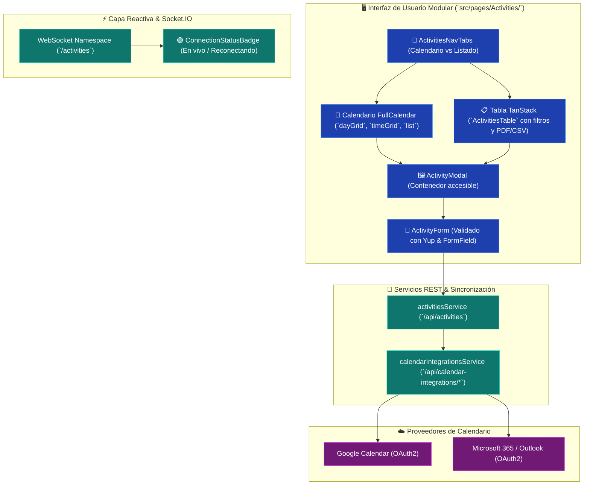

# 📅 CRM TIBS — Calendario FullCalendar & Actividades

Este documento detalla la gestión integral de citas, reuniones, demos y bitácora de seguimiento comercial de **CRM TIBS App**, su **Arquitectura Modular por Capas** homologada bajo el estándar de diseño limpio, la integración con **FullCalendar** ([`@fullcalendar/react`](file:///c:/Users/sopor/Proyectos/CRM/crm-tibs-app/package.json)), validación declarativa con **Yup**, sincronización en vivo vía **WebSockets** (`/activities`) y la interoperabilidad con **Google Calendar y Microsoft Outlook**.

---

## 🏗️ Arquitectura Modular de la Agenda Comercial (`src/pages/Activities/`)

Siguiendo el estándar desacoplado implementado en el CRM, el módulo de actividades opera bajo una arquitectura modular limpia por responsabilidades:

```
src/pages/Activities/
├── ActivitiesPage.tsx                   # Orquestador del módulo con control de sub-vistas (Calendario vs Listado), guards y WebSockets
├── index.ts                           # Exportador barril principal
│
├── components/                        # Componentes autónomos del módulo
│   ├── ActivitiesNavTabs.tsx          # Conmutador visual estilizado ("Calendario" vs "Listado") con contadores
│   ├── ActivitiesTable.tsx            # Tabla TanStack Table (@tanstack/react-table) con buscador libre, filtros de usuario/tipo/fecha y exportaciones
│   ├── ActivityModal.tsx              # Modal contenedor responsive con cabecera de icono y descripción
│   └── ActivityForm.tsx               # Formulario reactivo con Yup (activityValidationSchema), FormField, Select y sección de alertas
│
├── schemas/
│   └── activities.schema.ts           # Esquema Yup (activityValidationSchema), ActivityFormData y Filtros
│
└── utils/
    ├── activities.columns.tsx         # ColumnDef<Activity> con badges de proveedores (Google/Outlook), tipo, recordatorio y acciones
    └── activities.helpers.ts          # validateActivityForm (Yup async runner), filterActivities, exports PDF/CSV
```

---

## 🗓️ Flujo Operativo de Actividades y Sincronización


```mermaid
flowchart TD
    subgraph UI ["🖥️ Interfaz de Usuario Modular (`src/pages/Activities/`)"]
        NavTabs["🔀 ActivitiesNavTabs (Calendario vs Listado)"]
        CalView["📅 Calendario FullCalendar (`dayGrid`, `timeGrid`, `list`)"]
        TableView["📋 Tabla TanStack (`ActivitiesTable` con filtros y PDF/CSV)"]
        Modal["🖼️ ActivityModal (Contenedor accesible)"]
        Form["📝 ActivityForm (Validado con Yup & FormField)"]
    end

    subgraph ReactiveWS ["⚡ Capa Reactiva & Socket.IO"]
        WS["WebSocket Namespace (`/activities`)"]
        Badges["🟢 ConnectionStatusBadge (En vivo / Reconectando)"]
    end

    subgraph Services ["📡 Servicios REST & Sincronización"]
        ActService["activitiesService (`/api/activities`)"]
        SyncService["calendarIntegrationsService (`/api/calendar-integrations/*`)"]
    end

    subgraph ProveedoresExternos ["☁️ Proveedores de Calendario"]
        Google["Google Calendar (OAuth2)"]
        Outlook["Microsoft 365 / Outlook (OAuth2)"]
    end

    NavTabs --> CalView
    NavTabs --> TableView
    CalView --> Modal
    TableView --> Modal
    Modal --> Form
    Form --> ActService
    WS --> Badges
    ActService --> SyncService
    SyncService --> Google
    SyncService --> Outlook

    classDef ui fill:#1e40af,stroke:#60a5fa,color:#fff;
    classDef ws fill:#0f766e,stroke:#2dd4bf,color:#fff;
    classDef cloud fill:#701a75,stroke:#d946ef,color:#fff;

    class NavTabs,CalView,TableView,Modal,Form ui;
    class WS,Badges,ActService,SyncService ws;
    class Google,Outlook cloud;
```

---

## ✅ 1. Validación Declarativa con Yup & Formulario Reactivo (`ActivityForm.tsx`)

En [`activities.schema.ts`](file:///c:/Users/sopor/Proyectos/CRM/crm-tibs-app/src/pages/Activities/schemas/activities.schema.ts), se define el esquema de integridad:
* **`activityValidationSchema`:**
  - Audita longitud de descripción (mínimo 3, máximo 300 caracteres).
  - Obligatoriedad de tipo de actividad (`typeActivityId`) y fecha de ejecución (`date`).
  - Validación condicional del recordatorio: si `reminderEnabled` está activo, exige título descriptivo (máximo 100 caracteres) y fecha/hora de disparo de la notificación.
* **`ActivityForm.tsx`:**
  - Organizado en tres secciones con encabezados estilizados:
    1. *Detalles de la Cita o Actividad:* Tipo de actividad, fecha y hora (`datetime-local`) y descripción en `TextArea`.
    2. *Vinculación Comercial & Contactos:* Selector de cuenta empresarial (con multiselección de contactos convocados) o contacto individual independiente, junto con la oportunidad comercial del embudo.
    3. *Alerta de Recordatorio:* Interruptor con animación interactiva (`Bell`) para habilitar o deshabilitar notificaciones previas.
  - Gestión rigurosa de estados `touched`, `errors` y ejecución asíncrona mediante `validateActivityForm`.

---

## 📋 2. Tabla Homologada TanStack (`ActivitiesTable.tsx` & `activities.columns.tsx`)

* Construida sobre el componente base compartido `Table` en variante `cards`.
* **Insignias de Sincronización Externa:** Iconos SVG vectoriales de Google Calendar y Microsoft Outlook para identificar el origen del evento.
* **Celda Dinámica de Recordatorio (`ActivityReminderCell`):** Campanita interactiva dorada con animación oscilante (`swing`), popover flotante en escritorio y bloque descriptivo inline en vista móvil.
* **Herramientas de Exportación:** Generación instantánea de reportes en PDF apaisado (`exportActivitiesToPDF`) y hojas de cálculo CSV (`exportActivitiesToCSV`).
* **Filtros Integrados:** Búsqueda libre, filtrado por ejecutivo asignado, tipo de actividad y selector de fecha.

---

## ⚙️ 3. Configuración y Plugins de FullCalendar (`ActivitiesCalendar.tsx`)

En [`src/components/Activity/ActivitiesCalendar.tsx`](file:///c:/Users/sopor/Proyectos/CRM/crm-tibs-app/src/components/Activity/ActivitiesCalendar.tsx), se ensambla el motor de agenda utilizando cuatro plugins oficiales:
* **`dayGridPlugin`:** Vista mensual de cuadrícula (`dayGridMonth`).
* **`timeGridPlugin`:** Vista semanal y diaria con franjas horarias configurables (`timeGridWeek`, `timeGridDay`).
* **`interactionPlugin`:** Detección de selección de rangos de fechas (`dateClick`, `select`).
* **`listPlugin`:** Vista compacta estilo lista cronológica (`listWeek`).
* **Localización en Español:** Importación de `esLocale` desde `@fullcalendar/core/locales/es` para nombres de meses, días y etiquetas amigables.

---

## 🔄 4. Orquestador y Ciclo de Vida (`ActivitiesPage.tsx`)

* **Guards de Red (`isFetchingRef`):** Previene peticiones simultáneas provocadas por el montaje dual en React 19 y StrictMode.
* **Persistencia de URL:** Sincroniza el parámetro `?view=calendar` o `?view=table` para mantener el estado de la vista al recargar o compartir enlaces.
* **Tiempo Real:** Conexión nativa con Socket.IO sobre el namespace `/activities` para reflejar altas, modificaciones y bajas en tiempo real con indicador [`ConnectionStatusBadge.tsx`](file:///c:/Users/sopor/Proyectos/CRM/crm-tibs-app/src/components/shared/ConnectionStatusBadge.tsx).
* **Retrocompatibilidad:** La ruta original en [`ActivitiesPage.tsx`](file:///c:/Users/sopor/Proyectos/CRM/crm-tibs-app/src/pages/ActivitiesPage.tsx) delega directamente en el orquestador modular de [`src/pages/Activities/`](file:///c:/Users/sopor/Proyectos/CRM/crm-tibs-app/src/pages/Activities/index.ts).

---

## 🔗 Enlaces Relacionados
* [[CRM TIBS APP]] — Hub Maestro.
* [[CRM TIBS - Modulo de Clientes, Empresas & CRM]] — Módulo de clientes y empresas B2B.
* [[CRM TIBS - Tablero Kanban & Pipeline Comercial]] — Actividades vinculadas a acuerdos de venta.
* [[CRM TIBS - Centro de Configuracion, Tenants & Roles]] — Panel de vinculación de calendarios en `SettingsPage`.
* [[Catalogo de Componentes y Vistas]] — Vistas y componentes del frontend.
