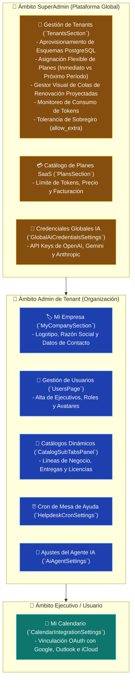

# ⚙️ CRM TIBS — Centro de Configuración, Tenants & Roles

Este documento describe la arquitectura del panel de administración central ([`SettingsPage.tsx`](file:///c:/Users/sopor/Proyectos/CRM/crm-tibs-app/src/pages/SettingsPage.tsx)), la gestión de inquilinos (**Tenants**) y planes de suscripción SaaS, la configuración de credenciales de Inteligencia Artificial y la gobernanza de usuarios mediante **Control de Acceso Basado en Roles (RBAC)**.

---

## 🏛️ Jerarquía de Ajustes y Ámbitos de Seguridad (RBAC)

---

## 🏢 1. Aprovisionamiento, Asignación de Planes y Colas de Renovación (`TenantsSection.tsx`)

El módulo de inquilinos ([`TenantsSection.tsx`](file:///c:/Users/sopor/Proyectos/CRM/crm-tibs-app/src/components/Settings/TenantsSection.tsx) y [`tenantsService.ts`](file:///c:/Users/sopor/Proyectos/CRM/crm-tibs-app/src/services/tenantsService.ts)) proporciona a los SuperAdmins una interfaz integral para el ciclo de vida del cliente corporativo:

### 1.1. Aprovisionamiento Atómico
* **Creación de Organizaciones:** Dispara la inicialización de un nuevo esquema PostgreSQL independiente en el backend con su usuario administrador inicial y plan de arranque.

### 1.2. Asignación Flexible de Planes
Modal interactivo de suscripción que soporta:
* ⚡ **Cambio Inmediato (`immediate`):**
  * `reset_date`: Reinicia el ciclo computando desde hoy (`NOW() + months`).
  * `keep_current_date`: Aplica upgrade instantáneo de nivel y tokens conservando la fecha de corte actual.
  * `updateQueuedPlans`: Actualiza en cascada los períodos ya encolados al nuevo plan.
* 🕒 **Cambio al Próximo Período (`next_period`):**
  * Programa el nuevo plan en la cola sin alterar el ciclo vigente para su adopción automática al corte.

### 1.3. Gestor Visual de Colas de Renovación Automática
* **Monitoreo en Tiempo Real (`getTenantRenewalQueue`):** Expone tarjetas de métricas con el corte actual, períodos en cola y la fecha límite de cobertura proyectada (`coverage_until`).
* **Secuencia de Períodos Proyectados:** Lista ordenada `#1, #2...` con tokens, precio, duración y fechas calculadas dinámicamente (`projected_start_date` $\rightarrow$ `projected_end_date`).
* **Cancelación Unitaria:** Cancelación de períodos específicos mediante confirmación visual con `Notification`.
* **Encolado por Lote (`periodsCount`):** Selector de cantidad (1, 2, 3, 6, 12 períodos) para registrar pagos prepagados en una sola operación.
* **Badges en Tabla Principal:** Chip `+N en cola` con acceso directo al gestor de renovaciones.

### 1.4. Control de Consumo y Sobregiro (`allow_extra`)
* Bandera booleana que determina si un cliente corporativo puede exceder temporalmente su cuota de tokens sin que el backend bloquee las consultas con error 402.

---

## 👥 2. Administración de Usuarios y Permisos (`UsersPage.tsx`)

La pantalla de usuarios ([`src/pages/UsersPage.tsx`](file:///c:/Users/sopor/Proyectos/CRM/crm-tibs-app/src/pages/UsersPage.tsx)) está restringida exclusivamente a usuarios administradores mediante `ProtectedRoute adminOnly={true}`:
* **Asignación de Roles:**
  * `superadmin`: Acceso irrestricto a toda la infraestructura.
  * `admin`: Administrador exclusivo del esquema del tenant asignado.
  * `executive`: Asesor comercial/técnico con vistas operativas.
* **Carga de Avatares:** [`ProfileImageUploadModal.tsx`](file:///c:/Users/sopor/Proyectos/CRM/crm-tibs-app/src/components/User/ProfileImageUploadModal.tsx) sube imágenes al endpoint `/api/users/:id/profile-image` mediante multipart/form-data.
* **Activación/Desactivación:** `updateUserStatus(id, isActive)` revoca de inmediato la validez del token del usuario sin destruir sus registros históricos en el pipeline.

---

## 📑 3. Catálogos Dinámicos de Oportunidades

A través de [`CatalogSubTabsPanel.tsx`](file:///c:/Users/sopor/Proyectos/CRM/crm-tibs-app/src/components/Settings/CatalogSubTabsPanel.tsx) y [`opportunityCatalogsService.ts`](file:///c:/Users/sopor/Proyectos/CRM/crm-tibs-app/src/services/opportunityCatalogsService.ts), los administradores personalizan las opciones de sus formularios comerciales:
1. **Líneas de Negocio (`/api/business-lines`):** División comercial a la que pertenece el proyecto (e.g. *Consultoría*, *Desarrollo a Medida*, *Infraestructura Cloud*).
2. **Tipos de Entrega (`/api/delivery-types`):** Modalidad de prestación de servicios (e.g. *Remoto*, *Híbrido*, *En Sitio*).
3. **Licenciamientos (`/api/licensings`):** Esquema de venta (e.g. *SaaS Anual*, *Perpetuo*, *Mensual*).

---

## 🤖 4. Credenciales de IA y Ajustes del Agente Omnicanal

* **Credenciales Maestras ([`GlobalAiCredentialsSettings.tsx`](file:///c:/Users/sopor/Proyectos/CRM/crm-tibs-app/src/components/Settings/GlobalAiCredentialsSettings.tsx)):** Gestión de llaves de OpenAI, Google Gemini o Anthropic Claude utilizadas por los microservicios de IA de la plataforma.
* **Comportamiento del Bot ([`AiAgentSettings.tsx`](file:///c:/Users/sopor/Proyectos/CRM/crm-tibs-app/src/components/Settings/AiAgentSettings.tsx)):** Parámetros de temperatura, instrucciones de saludo por canal y asignación de sub-agentes especializados por área de negocio.

---

## 🔗 Enlaces Relacionados
* [[CRM TIBS APP]] — Hub Maestro.
* [[CRM TIBS - Multi-Tenancy, Axios & Interceptores]] — Inyección del esquema tenant en peticiones.
* [[CRM TIBS - Autenticacion, JWT & Protected Routes]] — Seguridad basada en roles.
* [[CRM TIBS - Chat Omnicanal, WebSockets & Agente IA]] — Configuración de bots y sub-agentes.
