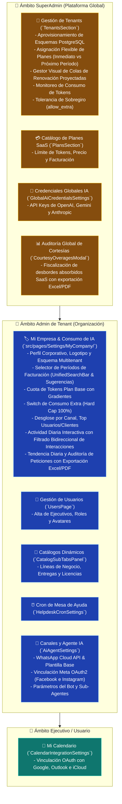

# ⚙️ Billy Sales & Services — Centro de Configuración, Tenants & Roles

Este documento describe la arquitectura del panel de administración central ([`SettingsPage.tsx`](file:///c:/Users/sopor/Proyectos/CRM/crm-tibs-app/src/pages/Settings/SettingsPage.tsx)), la gestión de inquilinos (**Tenants**) y planes de suscripción SaaS, la sección unificada y refactorizada de **Mi Empresa** ([`MyCompanyPage.tsx`](file:///c:/Users/sopor/Proyectos/CRM/crm-tibs-app/src/pages/Settings/MyCompany/MyCompanyPage.tsx)) que incorpora íntegramente la gestión de **Consumo de IA & Suscripción** bajo una arquitectura modular limpia (`components/`, `schemas/`, `utils/`), la configuración de canales de comunicación omnicanal, las credenciales de Inteligencia Artificial y la gobernanza de usuarios mediante **Control de Acceso Basado en Roles (RBAC)**.

---

## 🏛️ Jerarquía de Ajustes y Ámbitos de Seguridad (RBAC)


```mermaid
graph TD
    subgraph AmbitoSuperAdmin ["👑 Ámbito SuperAdmin (Plataforma Global)"]
        Tenants["🏢 Gestión de Tenants (`TenantsSection`)<br/>- Aprovisionamiento de Esquemas PostgreSQL<br/>- Asignación Flexible de Planes (Inmediato vs Próximo Período)<br/>- Gestor Visual de Colas de Renovación Proyectadas<br/>- Monitoreo de Consumo de Tokens<br/>- Tolerancia de Sobregiro (allow_extra)"]
        Plans["💳 Catálogo de Planes SaaS (`PlansSection`)<br/>- Límite de Tokens, Precio y Facturación"]
        AICreds["🔑 Credenciales Globales IA (`GlobalAiCredentialsSettings`)<br/>- API Keys de OpenAI, Gemini y Anthropic"]
        GlobalAudit["📊 Auditoría Global de Cortesías (`CourtesyOveragesModal`)<br/>- Fiscalización de desbordes absorbidos SaaS con exportación Excel/PDF"]
    end

    subgraph AmbitoAdmin ["🏢 Ámbito Admin de Tenant (Organización)"]
        Company["🏷️ Mi Empresa & Consumo de IA (`src/pages/Settings/MyCompany/`)<br/>- Perfil Corporativo, Logotipo y Esquema Multitenant<br/>- Selector de Períodos de Facturación (UnifiedSearchBar & Sugerencias)<br/>- Cuota de Tokens Plan Base con Gradientes<br/>- Switch de Consumo Extra (Hard Cap 100%)<br/>- Desglose por Canal, Top Usuarios/Clientes<br/>- Actividad Diaria Interactiva con Filtrado Bidireccional de Interacciones<br/>- Tendencia Diaria y Auditoría de Peticiones con Exportación Excel/PDF"]
        Users["👥 Gestión de Usuarios (`UsersPage`)<br/>- Alta de Ejecutivos, Roles y Avatares"]
        Catalogs["📑 Catálogos Dinámicos (`CatalogSubTabsPanel`)<br/>- Líneas de Negocio, Entregas y Licencias"]
        CronSLA["⏰ Cron de Mesa de Ayuda (`HelpdeskCronSettings`)"]
        BotConfig["🤖 Canales y Agente IA (`AiAgentSettings`)<br/>- WhatsApp Cloud API & Plantilla Base<br/>- Vinculación Meta OAuth2 (Facebook e Instagram)<br/>- Parámetros del Bot y Sub-Agentes"]
    end

    subgraph AmbitoPersonal ["👤 Ámbito Ejecutivo / Usuario"]
        MyCal["📅 Mi Calendario (`CalendarIntegrationSettings`)<br/>- Vinculación OAuth con Google, Outlook e iCloud"]
    end

    AmbitoSuperAdmin --> AmbitoAdmin
    AmbitoAdmin --> AmbitoPersonal

    classDef sa fill:#854d0e,stroke:#eab308,color:#fff;
    classDef adm fill:#1e40af,stroke:#60a5fa,color:#fff;
    classDef usr fill:#0f766e,stroke:#2dd4bf,color:#fff;

    class Tenants,Plans,AICreds,GlobalAudit sa;
    class Company,Users,Catalogs,CronSLA,BotConfig adm;
    class MyCal usr;
```

---

## 🏢 1. Arquitectura Modular de "Mi Empresa" (`src/pages/Settings/MyCompany/`)

Para optimizar la mantenibilidad, escalabilidad y evitar monolitos de código, la sección **Mi Empresa** unifica el perfil corporativo y toda la analítica de consumo/suscripción en una estructura modular:

```
src/pages/Settings/
├── SettingsPage.tsx               # Orquestador del centro de ajustes con barra lateral
└── MyCompany/                     # Módulo desacoplado de Mi Empresa
    ├── MyCompanyPage.tsx          # Orquestador principal de la vista con Tabs compartidas
    ├── index.ts                   # Exportador barril
    ├── components/                # Sub-componentes visuales reutilizables
    │   ├── CompanyProfileCard.tsx         # Tarjeta de perfil, identidad corporativa y upload de logo
    │   ├── PlanSubscriptionOverview.tsx   # Visualización de plan, cuota base, extra y cortesía técnica
    │   ├── BillingCycleSelector.tsx       # Buscador unificado con sugerencias de ciclo e indicadores históricos
    │   ├── ChannelsConsumptionGrid.tsx    # Cuadrícula de consumo por canales (WhatsApp, Webchat, RAG, etc.)
    │   ├── TopConsumersGrid.tsx           # Rankings de ejecutivos internos y clientes atendidos
    │   ├── DailyTimelineChart.tsx         # Gráfico interactivo con selección y conmutación de día activo
    │   ├── InteractionHistoryTable.tsx    # Tabla compartida con banner de día activo, buscador multi-criterio y exportación
    │   └── CourtesyOveragesModal.tsx      # Modal de cortesías globales SaaS para SuperAdmins
    ├── schemas/                   # Contratos de datos, tipos y estados
    │   └── myCompany.schema.ts            # Interfaces de consumo, ciclos de facturación, transacciones y sub-tabs
    └── utils/                     # Helpers puros, columnas y generadores de reporte
        ├── myCompany.helpers.tsx          # Normalización de texto, comparador de día (isSameDay), formateadores de fecha/tokens
        ├── interactionHistory.columns.tsx # Definición ColumnDef de columnas para el historial
        ├── courtesyReport.columns.tsx     # Columnas ColumnDef para el reporte de cortesías
        ├── exportHistory.utils.ts         # Generador de auditoría en Excel (.xlsx) y PDF (landscape)
        └── exportCourtesy.utils.ts        # Exportadores especializados del reporte global de cortesías
```

### 1.1. Sub-pestañas Integradas (Tabs Compartidas)
1. **Perfil & Datos Generales:** Identidad de la organización, razón social, esquema activo, carga de logo y diagnóstico.
2. **Plan & Suscripción:** Cuota contratada, barra de progreso con gradiente reactivo, margen de sobregiro del 100% con toggle `allow_extra` y auditoría de cortesías.
3. **Canales de Atención:** Distribución gráfica y métricas de consumo por canal de comunicación.
4. **Top Usuarios y Clientes:** Rankings de ejecutivos de ventas y clientes que más interactúan con el asistente.
5. **Tendencia & Historial:**
   * **Actividad Diaria Interactiva (`DailyTimelineChart`):** Cada tarjeta diaria es interactiva (`role="button"`, con teclado accesible y cursor puntero). Al hacer clic en un día (e.g. *Mié 26 De Ago*), se resalta con anillo índigo, badge `✓ Filtro` y eleva sutilmente su tarjeta.
   * **Conmutación & Deselección Rápida:** Al volver a hacer clic en la misma tarjeta o en los botones `✖ Quitar filtro de día` / `Quitar selección y mostrar todo el período`, el filtro se desactiva de inmediato restaurando todas las actividades.
   * **Banner Contextual en Tabla:** `InteractionHistoryTable` despliega un encabezado índigo que indica claramente el día auditado y la cantidad de actividades filtradas, adaptando el estado vacío (`emptyTitle` / `emptyMessage`) cuando un día no tiene registros en esa fecha.
   * **Exportación Dinámica:** Los reportes de Excel (.xlsx) y PDF reflejan automáticamente el filtro de fecha aplicado tanto en sus datos como en los metadatos de auditoría institucional bajo la marca **Billy Sales & Services**.

---

### 1.2. Coordinación de Ciclo de Vida y Prevención de Duplicidad de Peticiones (Guard Refs)
Para resolver saturaciones en el pool de sockets TCP del navegador (límite de 6 conexiones concurrentes y estados *Stalled* ~970ms), `MyCompanyPage.tsx` implementa un flujo orquestado estricto sin caché:
* **Guards de Estado en Vuelo (`useRef`):**
  - `isFetchingCyclesRef` y `lastFetchedCyclesTenantRef`: Bloquean invocaciones simultáneas o redundantes a `GET /api/tenants/billing-cycles`. Cada organización/tenant consulta sus ciclos estrictamente una sola vez al cambiar de contexto o mediante refresco manual explícito.
  - `isFetchingBreakdownRef`, `lastFetchedBreakdownKeyRef` y `hasFetchedBreakdownRef`: Previenen dobles peticiones a `GET /api/tenants/consumption/breakdown` verificando la firma unívoca del período consultado (`tenantSchema|mode|cycleId|startDate|endDate`).
* **Desacoplamiento de Dependencias en `useCallback`:**
  - `fetchBillingCycles` depende únicamente de tipos primitivos (`tenantId`, `tenantSchema`), evitando recreaciones del callback causadas por mutaciones de atributos no relacionados en `selectedTenant` (e.g., logo, cuota extra).
  - `fetchConsumptionData` utiliza `billingCyclesRef` interno en lugar del estado directo `billingCycles` como dependencia. Con ello, la resolución asíncrona de los ciclos de facturación no dispara una segunda consulta en cascada del desglose de consumo.
* **Refresco Unificado (`handleManualRefresh`):** Conecta los botones de actualización general y reintento de fallos para consultar en paralelo y en tiempo real ambos endpoints en limpio, sin depender de cachés locales.

## ⚡ 2. Selector de Períodos de Facturación & Búsqueda Unificada (`UnifiedSearchBar`)

* **Ciclos de Facturación (`getBillingCycles`):** Conecta con `GET /api/tenants/billing-cycles`, recuperando el historial completo de ciclos del tenant.
* **Buscador Compartido `UnifiedSearchBar`:**
  - Sugerencias rápidas en menú desplegable:
    - ⚡ **Período actual ("Default"):** Ciclo activo vigente.
    - ⏪ **Período anterior:** Último ciclo cerrado registrado.
    - 📅 **Rango de fechas (Personalizado):** Selectores `Desde` y `Hasta` con confirmación explícita para evitar peticiones anticipadas.
    - 📚 **Otros ciclos históricos:** Desglose cronológico de ciclos anteriores.
  - **SearchBadges Activos:** Chips interactivos que reflejan el filtro temporal aplicado con botón `✖` para volver al ciclo actual.
  - **Banner de Modo Histórico:** Aviso informativo que bloquea modificaciones operativas (como `allow_extra`) sobre ciclos ya concluidos.

---

## 📊 3. Historial de Interacciones & Exportación Institucional

* **Buscador Reactivo Multi-Criterio:** Normaliza acentos y evalúa coincidencias simultáneas en:
  - **Fecha y Hora:** Formatos numéricos (`DD/MM/YYYY`, `HH:mm`) y legibles.
  - **Canal:** `webchat_interno`, `whatsapp`, `rag`, `messenger`, `instagram`.
  - **Origen / Contacto:** Asesores de equipo (`Equipo: [Nombre]`), contactos (`Cliente: [Nombre]`) y referencias de conversación.
  - **Acción Realizada:** Identificadores y etiquetas amigables (`Atención Inicial`, `Asesor Comercial`, `Derivación`).
* **Exportación Exclusiva a Excel (`.xlsx`) y PDF (Landscape):**
  - Enfocada estrictamente en las interacciones auditadas (sin mezclar la tendencia diaria).
  - Omite deliberadamente identificadores técnicos internos (`id`).
  - Encabezada con identidad corporativa **Billy Sales & Services** y hojas de resumen ejecutivo.

---

## 🔗 Enlaces Relacionados
* [[CRM TIBS APP]] — Hub Maestro.
* [[CRM TIBS - Multi-Tenancy, Axios & Interceptores]] — Inyección del esquema tenant en peticiones.
* [[CRM TIBS - Autenticacion, JWT & Protected Routes]] — Seguridad basada en roles.
* [[CRM TIBS - Chat Omnicanal, WebSockets & Agente IA]] — Configuración de bots y sub-agentes.
