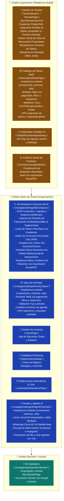

# ⚙️ Billy Sales & Services — Centro de Configuración, Tenants & Roles

Este documento describe la arquitectura del panel de administración central ([`SettingsPage.tsx`](file:///c:/Users/sopor/Proyectos/CRM/crm-tibs-app/src/pages/settings/SettingsPage.tsx)), la gestión de inquilinos (**Tenants**) y planes de suscripción SaaS, la sección unificada y refactorizada de **Mi Empresa** ([`MyCompanyPage.tsx`](file:///c:/Users/sopor/Proyectos/CRM/crm-tibs-app/src/pages/settings/MyCompany/MyCompanyPage.tsx)) que incorpora íntegramente la gestión de **Consumo de IA & Suscripción**, el módulo desacoplado de **Mi Calendario** ([`MyCalendarPage.tsx`](file:///c:/Users/sopor/Proyectos/CRM/crm-tibs-app/src/pages/settings/MyCalendar/MyCalendarPage.tsx)), la nueva arquitectura modular de **Tipos de Actividad** ([`ActivityTypesPage.tsx`](file:///c:/Users/sopor/Proyectos/CRM/crm-tibs-app/src/pages/settings/ActivityTypes/ActivityTypesPage.tsx)), la configuración de canales de comunicación omnicanal, las credenciales de Inteligencia Artificial y la gobernanza de usuarios mediante **Control de Acceso Basado en Roles (RBAC)**.

---

## 🏛️ Jerarquía de Ajustes y Ámbitos de Seguridad (RBAC)


```mermaid
graph TD
    subgraph AmbitoSuperAdmin ["👑 Ámbito SuperAdmin (Plataforma Global)"]
        Tenants["🏢 Gestión de Tenants (`TenantsSection` / `TenantsPage`)<br/>- Aprovisionamiento de Esquemas PostgreSQL<br/>- Asignación Flexible de Planes (Inmediato vs Próximo Período)<br/>- Gestor Visual de Colas de Renovación Proyectadas<br/>- Monitoreo de Consumo de Tokens<br/>- Tolerancia de Sobregiro (allow_extra)"]
        Plans["💳 Catálogo de Planes SaaS (`SubscriptionPlansPage`)<br/>- Arquitectura modular (components, schemas, utils)<br/>- TanStack Table con paginación, filtros y responsive<br/>- Validación Yup y FormField para tarifas y cuotas<br/>- KPIs superiores de planes y capacidad global"]
        AICreds["🔑 Credenciales Globales IA (`GlobalAiCredentialsSettings`)<br/>- API Keys de OpenAI, Gemini y Anthropic"]
        GlobalAudit["📊 Auditoría Global de Cortesías (`CourtesyOveragesModal`)<br/>- Fiscalización de desbordes absorbidos SaaS con exportación Excel/PDF"]
    end

    subgraph AmbitoAdmin ["🏢 Ámbito Admin de Tenant (Organización)"]
        Company["🏷️ Mi Empresa & Consumo de IA (`src/pages/settings/MyCompany/`)<br/>- Perfil Corporativo, Logotipo y Esquema Multitenant<br/>- Selector de Períodos de Facturación (UnifiedSearchBar & Sugerencias)<br/>- Cuota de Tokens Plan Base con Gradientes<br/>- Switch de Consumo Extra (Hard Cap 100%)<br/>- Desglose por Canal, Top Usuarios/Clientes<br/>- Actividad Diaria Interactiva con Filtrado Bidireccional de Interacciones<br/>- Tendencia Diaria y Auditoría de Peticiones con Exportación Excel/PDF"]
        ActivityTypes["📋 Tipos de Actividad (`src/pages/settings/ActivityTypes/`)<br/>- Arquitectura modular (components, schemas, utils)<br/>- TanStack Table con paginación, filtros y responsive<br/>- Validación Yup y preview cromático armónico de agenda<br/>- KPIs superiores y buscador unificado"]
        Users["👥 Gestión de Usuarios (`UsersPage`)<br/>- Alta de Ejecutivos, Roles y Avatares"]
        Catalogs["📑 Catálogos Dinámicos (`OpportunityCatalogs`)<br/>- Líneas de Negocio, Entregas y Licencias"]
        CronSLA["⏰ Notificaciones Automáticas & Cron (`AutomaticNotificationsPage`)"]
        BotConfig["🤖 Canales y Agente IA (`src/pages/settings/AiAgentChannels/`)<br/>- Arquitectura modular (components, schemas, utils)<br/>- Lienzo visual del orquestador y tabla TanStack<br/>- WhatsApp Cloud API & Plantilla Base<br/>- Vinculación Meta OAuth2 (Facebook e Instagram)<br/>- Parámetros del Bot y Sub-Agentes con Yup"]
    end

    subgraph AmbitoPersonal ["👤 Ámbito Ejecutivo / Usuario"]
        MyCal["📅 Mi Calendario (`src/pages/settings/MyCalendar/`)<br/>- Orquestador modular `MyCalendarPage`<br/>- Vinculación OAuth2 con Google y Outlook"]
    end

    AmbitoSuperAdmin --> AmbitoAdmin
    AmbitoAdmin --> AmbitoPersonal

    classDef sa fill:#854d0e,stroke:#eab308,color:#fff;
    classDef adm fill:#1e40af,stroke:#60a5fa,color:#fff;
    classDef usr fill:#0f766e,stroke:#2dd4bf,color:#fff;

    class Tenants,Plans,AICreds,GlobalAudit sa;
    class Company,Users,Catalogs,CronSLA,BotConfig,ActivityTypes adm;
    class MyCal usr;
```

---

## 🏢 1. Arquitectura Modular de "Mi Empresa" (`src/pages/settings/MyCompany/`)

Para optimizar la mantenibilidad, escalabilidad y evitar monolitos de código, la sección **Mi Empresa** unifica el perfil corporativo y toda la analítica de consumo/suscripción en una estructura modular:

```
src/pages/settings/
├── SettingsPage.tsx               # Orquestador del centro de ajustes con barra lateral
└── MyCompany/                     # Módulo desacoplado de Mi Empresa
    ├── MyCompanyPage.tsx          # Orquestador principal de la vista con Tabs compartidas
    ├── index.ts                   # Exportador barril
    ├── components/                # Sub-componentes visuales reutilizables
    │   ├── CompanyProfileCard.tsx         # Tarjeta de perfil, identidad corporativa y upload de logo
    │   ├── PlanSubscriptionOverview.tsx   # Visualización de plan, cuota base, extra y cortesía técnica
    │   ├── BillingCycleSelector.tsx       # Buscador unificado con sugerencias de ciclo e indicadores históricos
    │   ├── ChannelsConsumptionGrid.tsx    # Cuadrícula de consumo por canales (WhatsApp, Webchat, RAG, etc.)
    │   ├── TopConsumersGrid.tsx           # Rankings de ejecutivos internos y clientes atendidos
    │   ├── DailyTimelineChart.tsx         # Gráfico interactivo con selección y conmutación de día activo
    │   ├── InteractionHistoryTable.tsx    # Tabla compartida con banner de día activo, buscador multi-criterio y exportación
    │   └── CourtesyOveragesModal.tsx      # Modal de cortesías globales SaaS para SuperAdmins
    ├── schemas/                   # Contratos de datos, tipos y estados
    │   └── myCompany.schema.ts            # Interfaces de consumo, ciclos de facturación, transacciones y sub-tabs
    └── utils/                     # Helpers puros, columnas y generadores de reporte
        ├── myCompany.helpers.tsx          # Normalización de texto, comparador de día (isSameDay), formateadores de fecha/tokens
        ├── interactionHistory.columns.tsx # Definición ColumnDef de columnas para el historial
        ├── courtesyReport.columns.tsx     # Columnas ColumnDef para el reporte de cortesías
        ├── exportHistory.utils.ts         # Generador de auditoría en Excel (.xlsx) y PDF (landscape)
        └── exportCourtesy.utils.ts        # Exportadores especializados del reporte global de cortesías
```

### 1.1. Sub-pestañas Integradas (Tabs Compartidas)
1. **Perfil & Datos Generales:** Identidad de la organización, razón social, esquema activo, carga de logo y diagnóstico.
2. **Plan & Suscripción:** Cuota contratada, barra de progreso con gradiente reactivo, margen de sobregiro del 100% con toggle `allow_extra` y auditoría de cortesías.
3. **Canales de Atención:** Distribución gráfica y métricas de consumo por canal de comunicación.
4. **Top Usuarios y Clientes:** Rankings de ejecutivos de ventas y clientes que más interactúan con el asistente.
5. **Tendencia & Historial:**
   * **Actividad Diaria Interactiva (`DailyTimelineChart`):** Cada tarjeta diaria es interactiva (`role="button"`, con teclado accesible y cursor puntero). Al hacer clic en un día (e.g. *Mié 26 De Ago*), se resalta con anillo índigo, badge `✓ Filtro` y eleva sutilmente su tarjeta.
   * **Conmutación & Deselección Rápida:** Al volver a hacer clic en la misma tarjeta o en los botones `✖ Quitar filtro de día` / `Quitar selección y mostrar todo el período`, el filtro se desactiva de inmediato restaurando todas las actividades.
   * **Banner Contextual en Tabla:** `InteractionHistoryTable` despliega un encabezado índigo que indica claramente el día auditado y la cantidad de actividades filtradas, adaptando el estado vacío (`emptyTitle` / `emptyMessage`) cuando un día no tiene registros en esa fecha.
   * **Exportación Dinámica:** Los reportes de Excel (.xlsx) y PDF reflejan automáticamente el filtro de fecha aplicado tanto en sus datos como en los metadatos de auditoría institucional bajo la marca **Billy Sales & Services**.

---

### 1.2. Coordinación de Ciclo de Vida y Prevención de Duplicidad de Peticiones (Guard Refs)
Para resolver saturaciones en el pool de sockets TCP del navegador (límite de 6 conexiones concurrentes y estados *Stalled* ~970ms), `MyCompanyPage.tsx` implementa un flujo orquestado estricto sin caché:
* **Guards de Estado en Vuelo (`useRef`):**
  - `isFetchingCyclesRef` y `lastFetchedCyclesTenantRef`: Bloquean invocaciones simultáneas o redundantes a `GET /api/tenants/billing-cycles`. Cada organización/tenant consulta sus ciclos estrictamente una sola vez al cambiar de contexto o mediante refresco manual explícito.
  - `isFetchingBreakdownRef`, `lastFetchedBreakdownKeyRef` y `hasFetchedBreakdownRef`: Previenen dobles peticiones a `GET /api/tenants/consumption/breakdown` verificando la firma unívoca del período consultado (`tenantSchema|mode|cycleId|startDate|endDate`).
* **Desacoplamiento de Dependencias en `useCallback`:**
  - `fetchBillingCycles` depende únicamente de tipos primitivos (`tenantId`, `tenantSchema`), evitando recreaciones del callback causadas por mutaciones de atributos no relacionados en `selectedTenant` (e.g., logo, cuota extra).
  - `fetchConsumptionData` utiliza `billingCyclesRef` interno en lugar del estado directo `billingCycles` como dependencia. Con ello, la resolución asíncrona de los ciclos de facturación no dispara una segunda consulta en cascada del desglose de consumo.
* **Refresco Unificado (`handleManualRefresh`):** Conecta los botones de actualización general y reintento de fallos para consultar en paralelo y en tiempo real ambos endpoints en limpio, sin depender de cachés locales.

## ⚡ 2. Selector de Períodos de Facturación & Búsqueda Unificada (`UnifiedSearchBar`)

* **Ciclos de Facturación (`getBillingCycles`):** Conecta con `GET /api/tenants/billing-cycles`, recuperando el historial completo de ciclos del tenant.
* **Buscador Compartido `UnifiedSearchBar`:**
  - Sugerencias rápidas en menú desplegable:
    - ⚡ **Período actual ("Default"):** Ciclo activo vigente.
    - ⏪ **Período anterior:** Último ciclo cerrado registrado.
    - 📅 **Rango de fechas (Personalizado):** Selectores `Desde` y `Hasta` con confirmación explícita para evitar peticiones anticipadas.
    - 📚 **Otros ciclos históricos:** Desglose cronológico de ciclos anteriores.
  - **SearchBadges Activos:** Chips interactivos que reflejan el filtro temporal aplicado con botón `✖` para volver al ciclo actual.
  - **Banner de Modo Histórico:** Aviso informativo que bloquea modificaciones operativas (como `allow_extra`) sobre ciclos ya concluidos.

---

## 📊 3. Historial de Interacciones & Exportación Institucional

* **Buscador Reactivo Multi-Criterio:** Normaliza acentos y evalúa coincidencias simultáneas en:
  - **Fecha y Hora:** Formatos numéricos (`DD/MM/YYYY`, `HH:mm`) y legibles.
  - **Canal:** `webchat_interno`, `whatsapp`, `rag`, `messenger`, `instagram`.
  - **Origen / Contacto:** Asesores de equipo (`Equipo: [Nombre]`), contactos (`Cliente: [Nombre]`) y referencias de conversación.
  - **Acción Realizada:** Identificadores y etiquetas amigables (`Atención Inicial`, `Asesor Comercial`, `Derivación`).
* **Exportación Exclusiva a Excel (`.xlsx`) y PDF (Landscape):**
  - Enfocada estrictamente en las interacciones auditadas (sin mezclar la tendencia diaria).
  - Omite deliberadamente identificadores técnicos internos (`id`).
  - Encabezada con identidad corporativa **Billy Sales & Services** y hojas de resumen ejecutivo.

---

## 📅 4. Arquitectura Modular de "Mi Calendario" (`src/pages/settings/MyCalendar/`)

Siguiendo el mismo patrón arquitectónico de desacoplamiento introducido en **Mi Empresa**, la sección de **Mi Calendario** ha sido modularizada para gestionar las integraciones de agenda con Google Calendar y Microsoft Outlook:

```
src/pages/settings/
├── SettingsPage.tsx               # Orquestador del centro de ajustes con barra lateral
└── MyCalendar/                    # Módulo desacoplado de Mi Calendario
    ├── MyCalendarPage.tsx         # Orquestador principal de la vista con SettingsContainer
    ├── index.ts                   # Exportador barril
    ├── components/                # Sub-componentes visuales reutilizables
    │   ├── CalendarSyncStatusBanner.tsx   # Banner dinámico de estado activo / conectado vs sugerencia
    │   ├── CalendarProvidersGrid.tsx      # Cuadrícula responsiva de proveedores (Google y Outlook)
    │   └── CalendarProviderCard.tsx       # Tarjeta individual por proveedor con bloqueo y acciones
    ├── schemas/                   # Contratos de datos, tipos y estados
    │   └── myCalendar.schema.ts           # Interfaces de integración, proveedores y notificaciones
    └── utils/                     # Helpers puros, catálogo y validadores
        └── myCalendar.helpers.tsx         # Catálogo de proveedores e iconos SVG oficiales (Google, Outlook)
```

### 4.1. Características Técnicas del Módulo
* **Contenedor Institucional (`SettingsContainer`):** Estandariza la cabecera, descripción e icono de la vista integrando el botón de comprobación en tiempo real en `rightAction`.
* **Desacoplamiento de Proveedores (`CalendarProvidersGrid` & `CalendarProviderCard`):**
  - **Google Calendar:** Flujo OAuth2 automático con redirección consentida y lectura de `calendar_sync` en callback.
  - **Microsoft Outlook:** Flujo OAuth2 para cuentas corporativas Microsoft 365 y personales Outlook/Live.
* **Gestión de Exclusividad de Conexión:** Si el usuario tiene un proveedor activo, la otra tarjeta se bloquea de manera informativa indicando el estado de bloqueo para evitar inconsistencias en la agenda.
* **Diseño Minimalista y Directo:** Enfocado exclusivamente en el estado de vinculación y las tarjetas de acción de los proveedores compatibles.

---

## 📋 5. Arquitectura Modular de "Tipos de Actividad" (`src/pages/settings/ActivityTypes/`)

Siguiendo la misma directiva de modularidad aplicada a **Mi Empresa** y **Mi Calendario**, la sección de **Tipos de Actividad** ha sido migrada desde `src/components/ActivityType/` hacia una estructura modular desacoplada en `src/pages/settings/ActivityTypes/`:

```
src/pages/settings/
├── SettingsPage.tsx               # Orquestador del centro de ajustes con barra lateral
└── ActivityTypes/                 # Módulo desacoplado de Tipos de Actividad
    ├── ActivityTypesPage.tsx      # Orquestador principal de la vista con SettingsContainer y KPIs
    ├── index.ts                   # Exportador barril
    ├── components/                # Sub-componentes visuales reutilizables
    │   ├── ActivityTypesStatsBanner.tsx # Indicadores métricos superiores (total, activos, inactivos)
    │   ├── ActivityTypesTable.tsx       # Tabla TanStack Table con columnas, footer reactivo y estado vacío
    │   ├── ActivityTypeModal.tsx        # Modal contenedor de alta/edición responsive
    │   └── ActivityTypeForm.tsx         # Formulario con validación Yup, preview cromático y switch de estado
    ├── schemas/                   # Contratos de datos, tipos y esquemas de validación
    │   └── activityTypes.schema.ts      # Esquema Yup (activityTypeValidationSchema), TypeActivity y tipos
    └── utils/                     # Helpers puros, columnas y validadores
        ├── activityTypes.columns.tsx    # ColumnDef TanStack Table con badges, paleta de agenda y acciones
        └── activityTypes.helpers.ts     # Filtros normalizados, cálculo de KPIs y runner de validación Yup
```

### 5.1. Características Técnicas del Módulo
* **TanStack Table (`@tanstack/react-table`):**
  - Utiliza el componente compartido unificado `Table<TypeActivity>` (`src/components/shared/Table`).
  - Columnas estructuradas con `ColumnDef`: identificación cromática sincronizada con el calendario, badge de estado y acciones (editar/eliminar).
  - Paginación interna de 8 elementos por página, ordenamiento por columnas y soporte responsivo móvil con `mobileLabel`.
  - Fila de pie de tabla (`footerRow`) que informa la proporción de tipos visibles versus el total y enlace para limpiar filtros.
* **Validación de Datos con Yup:**
  - Esquema estricto `activityTypeValidationSchema` que audita requerimiento, longitud mínima (2 caracteres) y límite superior (50 caracteres).
  - Integración reactiva con `FormField` e `Input`, informando errores de validación en tiempo real al tipear y al desenfocar (`onBlur`).
* **Sincronización Cromática con FullCalendar:**
  - Emplea directamente la función `getActivityColor` (`src/components/Activity/activityColors.ts`).
  - Incluye vista previa interactiva en vivo dentro del formulario y en la tabla, permitiendo ver el matiz cromático exacto antes de guardar.
* **Búsqueda y Filtros Unificados (`UnifiedSearchBar`):**
  - Filtrado en vivo por texto en el nombre del tipo.
  - Menú desplegable para filtrar por disponibilidad (`Activos`, `Inactivos`, `Todos`) con generación de `SearchBadge` removibles.
* **Componentes Compartidos Utilizados:**
  - `SettingsContainer`: Encabezado institucional con botón de actualización en tiempo real y alta de nuevo tipo.
  - `ConfirmModal`: Confirmación destructiva antes de eliminar tipologías con mensaje explicativo sobre el tipo de respaldo predeterminado.
  - `Notification`: Sistema estandarizado de alertas para éxito y manejo de errores HTTP.

---

## 🏷️ 6. Arquitectura Modular de "Etiquetas de Oportunidad" (`src/pages/Settings/OpportunityLabels/`)

Siguiendo el mismo estándar de desacoplamiento modular de componentes, esquemas Yup y utilerías, la sección de **Etiquetas de Oportunidad** ha sido modularizada preservando la experiencia visual del asistente interactivo de 2 pasos con simulador en tiempo real:

```
src/pages/Settings/
├── SettingsPage.tsx               # Orquestador del centro de ajustes con barra lateral
└── OpportunityLabels/             # Módulo modular de Etiquetas de Oportunidad
    ├── OpportunityLabelsPage.tsx  # Orquestador principal con SettingsContainer y gestión de estado
    ├── index.ts                   # Exportador barril
    ├── components/                # Sub-componentes visuales reutilizables
    │   ├── OpportunityLabelsStepper.tsx   # Indicador visual del asistente (Paso 1 y Paso 2)
    │   ├── OpportunityFieldsSelector.tsx  # Paso 1: Alerta informativa y tarjetas interactivas de campos
    │   ├── OpportunityLabelEditForm.tsx   # Paso 2: Formulario con Yup, anti-duplicados y botones de acción
    │   └── OpportunityFormMockup.tsx      # Columna derecha: Simulador interactivo del formulario con selección al vuelo
    ├── schemas/                   # Contratos de datos, tipos y esquemas de validación
    │   └── opportunityLabels.schema.ts    # Esquema Yup dinámico (createOpportunityLabelValidationSchema) y tipos
    └── utils/                     # Helpers puros, metadatos y validadores
        └── opportunityLabels.helpers.ts   # Metadatos de campos, descripciones, categorías y validador Yup
```

### 6.1. Características Técnicas del Módulo
* **Asistente Guiado de 2 Pasos (`OpportunityLabelsStepper`):**
  - **Paso 1 (Seleccionar Campo):** Tarjetas interactivas con badges de categoría (`Clasificación`, `Servicios y Montos`, `Licencias y Montos`), clave interna (`field_key`), descripción funcional del impacto en el CRM y valor activo.
  - **Paso 2 (Modificar Etiqueta):** Interfaz enfocada con botón de retorno, campo de texto con validación reactiva, prevención de duplicidad y confirmación de guardado.
* **Simulador Interactivo de Formulario en Vivo (`OpportunityFormMockup`):**
  - Réplica visual fidedigna de las secciones del formulario de oportunidades (Datos del Proyecto, Detalles Financieros y Clasificación).
  - En el **Paso 1**, despliega las insignias interactivas `👆 Clic` sobre bordes punteados; al hacer clic en cualquier campo del simulador, el asistente transiciona directamente al Paso 2 con ese campo seleccionado.
  - En el **Paso 2**, resalta el campo activo con borde sólido índigo y badge `✎ Editando`, reflejando las ediciones de texto en tiempo real conforme el usuario escribe.
* **Validación Declarativa con Yup:**
  - Esquema dinámico `createOpportunityLabelValidationSchema` que audita requerimiento, longitud y chequeo estricto de duplicidad mediante regla `.test('unique-name')` contra los otros campos del catálogo.
* **Componentes Compartidos y Tipografía Homologada:**
  - Emplea la tipografía corporativa `Open Sans` con pesos estándar (`font-bold`, `font-semibold`), integrando `SettingsContainer`, `Notification`, `Button` y `FormField`.

---

## 📑 7. Arquitectura Modular de "Valores de Catálogos" (`src/pages/settings/OpportunityCatalogs/`)

Siguiendo el estándar de diseño y desacoplamiento modular por capas aplicado a **Tipos de Actividad** y **Mi Empresa**, la sección de **Valores de Catálogos** (Línea de Negocio, Tipo de Entrega y Licenciamiento) ha sido refactorizada hacia una arquitectura modular desacoplada:

```
src/pages/settings/
├── SettingsPage.tsx               # Orquestador del centro de ajustes con barra lateral
└── OpportunityCatalogs/           # Módulo desacoplado de Valores de Catálogos
    ├── OpportunityCatalogsPage.tsx# Orquestador principal con SettingsContainer, selector de catálogos y KPIs
    ├── index.ts                   # Exportador barril
    ├── components/                # Sub-componentes visuales reutilizables
    │   ├── CatalogSubTabsNav.tsx          # Navegación interactiva de sub-pestañas con títulos dinámicos e iconos
    │   ├── OpportunityCatalogsStatsBanner.tsx # Indicadores métricos KPI (Total, Activas, En Uso, Inactivas)
    │   ├── OpportunityCatalogsTable.tsx   # Tabla TanStack Table con buscador, filtro de estado y filtro de uso
    │   ├── CatalogOptionModal.tsx         # Modal contenedor responsive para alta y edición
    │   ├── CatalogOptionForm.tsx          # Formulario con validación Yup, FormField y toggle de estado
    │   └── RelatedOpportunitiesModal.tsx  # Modal interactivo con listado de oportunidades y enlace al Pipeline
    ├── schemas/                   # Contratos de datos, tipos y esquemas de validación
    │   └── opportunityCatalogs.schema.ts  # Esquema Yup (catalogOptionValidationSchema), tipos y filtros
    └── utils/                     # Helpers puros, columnas TanStack Table y validadores
        ├── opportunityCatalogs.columns.tsx# Definición ColumnDef con badges, toggle interactivo y acciones
        └── opportunityCatalogs.helpers.ts # Filtros normalizados, cálculo de KPIs y runner de validación Yup
```

### 7.1. Características Técnicas del Módulo
* **TanStack Table (`@tanstack/react-table`):**
  - Utiliza el componente compartido `Table<OpportunityCatalogOption>` (`src/components/shared/Table`).
  - Columnas estructuradas con `ColumnDef`: Identificación cromática y etiqueta, botón interactivo de inspección de uso en oportunidades (`Ver Oportunidades (X)`), switch toggle en vivo de disponibilidad y acciones (editar/eliminar).
  - Bloqueo de eliminación con tooltip informativo si el valor está en uso por alguna oportunidad comercial en el sistema.
  - Paginación interna de 8 elementos, ordenamiento reactivo y soporte responsive móvil con `mobileLabel`.
* **Validación Declarativa con Yup & FormField:**
  - Esquema estricto `catalogOptionValidationSchema` que verifica obligatoriedad, longitud mínima (2 caracteres) y límite superior (100 caracteres).
  - Validación anti-duplicados a nivel de catálogo para evitar colisiones de nombres.
  - Integración reactiva con `FormField`, informando errores en tiempo real y al desenfocar (`onBlur`).
* **Sub-pestañas de Catálogos Dinámicas (`CatalogSubTabsNav`):**
  - Muestra los 3 catálogos comerciales (Línea de Negocio, Tipo de Entrega, Licenciamiento) sincronizados con las etiquetas personalizadas provistas por `getOpportunityLabels`.
* **Modal de Oportunidades Relacionadas (`RelatedOpportunitiesModal`):**
  - Permite auditar en detalle qué oportunidades del CRM utilizan una opción determinada, proporcionando accesos directos clicables hacia el Pipeline comercial.
* **Componentes Compartidos Utilizados:**
  - `SettingsContainer`, `Table`, `Button`, `Badge`, `Modal`, `ConfirmModal`, `Notification`, `FormField`.

---

## ⏰ 8. Arquitectura Modular de "Notificaciones Automáticas" (`src/pages/settings/AutomaticNotifications/`)

Siguiendo el estándar de arquitectura modular desacoplada por capas aplicado a **Tipos de Actividad** y **Valores de Catálogos**, la sección de **Notificaciones Automáticas** ha sido migrada desde el monolito legacy `HelpdeskCronSettings.tsx` hacia una arquitectura modular en `src/pages/settings/AutomaticNotifications/`:

```
src/pages/settings/
├── SettingsPage.tsx               # Orquestador del centro de ajustes con barra lateral
└── AutomaticNotifications/        # Módulo desacoplado de Notificaciones Automáticas
    ├── AutomaticNotificationsPage.tsx # Orquestador principal con SettingsContainer y botón guardar
    ├── index.ts                   # Exportador barril
    ├── components/                # Sub-componentes visuales reutilizables
    │   ├── CronModeSelector.tsx   # Tarjetas interactivas de modo (Hora fija vs Intervalo)
    │   ├── CronModeInputs.tsx     # Inputs según modo (Time picker y horas/minutos numéricos)
    │   ├── CronPreviewBanner.tsx  # Banner dinámico en lenguaje natural con icono de reloj
    │   └── CronFeedbackAlert.tsx  # Feedback reactivo de guardado exitoso o errores
    ├── schemas/                   # Contratos de datos, tipos y esquemas de validación
    │   └── automaticNotifications.schema.ts # Esquema Yup (cronConfigValidationSchema) y tipos
    └── utils/                     # Helpers puros y validadores
        └── automaticNotifications.helpers.ts # getPreviewText, isValidInterval y runner Yup
```

### 8.1. Características Técnicas del Módulo
* **Fidelidad Visual Estricta:**
  - Preserva al 100% el diseño visual, espaciados, colores y disposición original del sistema (tarjetas de modo con bordes índigo, selector horario y banner descriptivo de alerta).
* **Validación Declarativa con Yup:**
  - Esquema estricto `cronConfigValidationSchema` que audita el modo (`fixed` vs `interval`), formato de hora 24h (`HH:MM`), límites de horas (0-23) y minutos (0-59), exigiendo una duración mínima acumulada de al menos 1 minuto.
  - Ejecución reactiva mediante el runner asíncrono `validateCronConfigForm`.
* **Desacoplamiento en Subcomponentes:**
  - `CronModeSelector`: Renderiza las tarjetas de modo con iconos de `Clock` y `RefreshCw` e insignias activas.
  - `CronModeInputs`: Encapsula los campos de entrada de hora o intervalo con `Input`.
  - `CronPreviewBanner`: Calcula e imprime el texto comprensible para el usuario en tiempo real.
  - `CronFeedbackAlert`: Notificaciones inline limpias con `CheckCircle` y `AlertCircle`.
* **Componentes Compartidos Utilizados:**
  - `SettingsContainer`, `Button`, `Input`.

---

### 📊 9. Arquitectura Modular de "Indicadores de Dashboard" (`src/pages/settings/DashboardIndicators/`)

Siguiendo el estándar de arquitectura modular desacoplada por capas aplicado a **Tipos de Actividad** y **Valores de Catálogos**, la sección de **Indicadores de Dashboard** ha sido refactorizada desde el monolito `DashboardSettings.tsx` hacia una arquitectura modular desacoplada en `src/pages/settings/DashboardIndicators/`:

```
src/pages/settings/
├── SettingsPage.tsx               # Orquestador del centro de ajustes con barra lateral
└── DashboardIndicators/           # Módulo desacoplado de Indicadores de Dashboard
    ├── DashboardIndicatorsPage.tsx# Orquestador principal con SettingsContainer, selector de flujos y switch
    ├── index.ts                   # Exportador barril
    ├── components/                # Sub-componentes visuales reutilizables
    │   ├── DashboardIndicatorsStatsBanner.tsx # Indicadores métricos KPI (Total, Conteo, Monto $, Etapas)
    │   ├── DashboardIndicatorsTable.tsx       # Tabla TanStack Table con buscador, filtros y responsive
    │   ├── DashboardIndicatorModal.tsx        # Modal contenedor responsive para alta y edición
    │   ├── DashboardIndicatorForm.tsx         # Formulario con validación Yup, paleta de colores y etapas
    │   └── DashboardChartStagesConfig.tsx     # Panel dedicado de configuración de etapas para gráficos
    ├── schemas/                   # Contratos de datos, tipos y esquemas de validación
    │   └── dashboardIndicators.schema.ts      # Esquema Yup (dashboardIndicatorValidationSchema) y tipos
    └── utils/                     # Helpers puros, columnas TanStack Table y validadores
        ├── dashboardIndicators.columns.tsx    # Definición ColumnDef con badges, paleta y acciones
        └── dashboardIndicators.helpers.ts     # Filtros normalizados, cálculo de KPIs y runner Yup
```

#### 9.1. Características Técnicas del Módulo
* **TanStack Table (`@tanstack/react-table`):**
  - Utiliza el componente compartido `Table<DashboardIndicator>` (`src/components/shared/Table`).
  - Columnas estructuradas con `ColumnDef`: Identificación cromática con anillo y badge, tipo de métrica (`$ Suma de Montos` o `Conteo (Registros)`), insignias de etapas vinculadas y botones de acción (editar/eliminar).
  - Paginación interna de 8 elementos, ordenamiento reactivo y soporte responsive móvil con `mobileLabel`.
* **Validación Declarativa con Yup & FormField:**
  - Esquema estricto `dashboardIndicatorValidationSchema` que audita requerimiento de título, longitud mínima (2 caracteres) y límite superior (60 caracteres), validando además el tipo ('count' | 'sum') y color.
  - Ejecución reactiva mediante el runner asíncrono `validateIndicatorForm`.
* **Conmutador de Contexto Operativo (Pipeline vs Mesa de Ayuda):**
  - Permite alternar fluidamente entre el flujo de Pipeline Comercial y Mesa de Ayuda, adaptando selectores, etapas activas e indicadores en tiempo real.
* **Configuración Desacoplada de Gráficos Analíticos (`DashboardChartStagesConfig`):**
  - Panel independiente para mapear qué etapas del flujo alimentan las tendencias gráficas (Oportunidades Abiertas, Ventas, Tickets Abiertos, Cerrados y Cancelados) con selector múltiple y guardado asíncrono.
* **Componentes Compartidos Utilizados:**
  - `SettingsContainer`, `Table`, `Button`, `Badge`, `Modal`, `ConfirmModal`, `Notification`, `FormField`, `Select`, `Loader`.

### 🤖 10. Arquitectura Modular de "Agente IA & Canales" (`src/pages/settings/AiAgentChannels/`)

Siguiendo el estándar de arquitectura modular desacoplada por capas aplicado a **Tipos de Actividad**, **Valores de Catálogos** e **Indicadores de Dashboard**, la sección de **Agente IA y Canales** ha sido refactorizada desde el monolito `AiAgentSettings.tsx` (~2025 líneas) hacia una arquitectura modular desacoplada en `src/pages/settings/AiAgentChannels/`:

```
src/pages/settings/
├── SettingsPage.tsx               # Orquestador del centro de ajustes con barra lateral
└── AiAgentChannels/               # Módulo desacoplado de Agente IA & Canales
    ├── AiAgentChannelsPage.tsx    # Orquestador principal de la vista con SettingsContainer, KPIs y pestañas
    ├── index.ts                   # Exportador barril
    ├── components/                # Sub-componentes visuales reutilizables
    │   ├── AiAgentStatsBanner.tsx # Indicadores métricos KPI (Estado Agente, Sub-Agentes activos, Canales Meta, Inferencia)
    │   ├── AiAgentTabsNav.tsx     # Barra de pestañas (General & Orquestador vs Canales de Comunicación) con badges
    │   ├── AiGeneralTab.tsx       # Switch de respuesta automática, selector de vista (Lienzo vs Tabla), parámetros y asignaciones
    │   ├── AiOrchestratorCanvas.tsx# Lienzo interactivo del grafo de orquestador (Router + Subagentes, SVG Bézier, glow, pan y drag)
    │   ├── AiSubAgentsTable.tsx   # Tabla TanStack Table (@tanstack/react-table) con buscador reactivo y filtro de estado
    │   ├── AiChannelsTab.tsx      # Tarjetas comerciales Meta (WhatsApp Cloud API, Facebook Messenger, Instagram Direct)
    │   ├── AiRouterModal.tsx      # Modal para configurar el Prompt de Directivas del Enrutador Principal con validación Yup
    │   ├── AiSubAgentModal.tsx    # Modal de alta/edición de sub-agentes con slider de temperatura y panel Drag & Drop de herramientas
    │   └── AiWhatsAppChannelModal.tsx # Modal de credenciales de WhatsApp Cloud API con validación Yup y pestaña de Plantilla Base
    ├── schemas/                   # Contratos de datos, tipos y esquemas de validación
    │   └── aiAgent.schema.ts      # Esquemas Yup (subAgentValidationSchema, routerPromptValidationSchema, etc.) y tipos
    └── utils/                     # Helpers puros, columnas TanStack Table y validadores
        ├── aiAgent.helpers.ts     # Cálculo de KPIs (calculateAiAgentStats), layout inicial de nodos y runner de filtros
        └── subAgents.columns.tsx  # Definición ColumnDef con badges cromáticos, temperatura, herramientas y acciones
```

#### 10.1. Características Técnicas del Módulo
* **Doble Modo de Vista para Sub-Agentes (Lienzo Gráfico vs Tabla TanStack):**
  - **Lienzo Visual Interactivo (`AiOrchestratorCanvas`):** Grafo con renderizado SVG, curvas Bézier, efectos de brillo (`glow-indigo`), drag and drop de nodos con límites elásticos, panning interactivo con fondo de matriz de puntos y maximizado a pantalla completa.
  - **Tabla TanStack Table (`@tanstack/react-table` en `AiSubAgentsTable`):** Visualización densa y tabular para administración rápida con paginación, filtros de estado (`Todos`, `Activos`, `Inactivos`), búsqueda reactiva y badges de herramientas (`AVAILABLE_TOOLS`).
* **Validación Declarativa con Yup & `useFormValidation`:**
  - Esquema `subAgentValidationSchema` para clave única (`slug`), nombre, descripción para el enrutador, directivas de prompt y temperatura calibrada (0.0 a 1.0).
  - Esquema `routerPromptValidationSchema` para las directivas globales del Agente Principal.
  - Esquema `whatsappChannelValidationSchema` para App ID, WABA ID, Phone ID, Access Token y Verify Token del webhook.
* **Canales de Comunicación Meta (OAuth2 en 1 Clic & Webhook):**
  - Conexión desatendida mediante popup con comunicación inter-proceso (IPC) resiliente vía `BroadcastChannel('meta_oauth_channel')`, `window.postMessage` y `localStorage`.
  - Recarga en caliente en tiempo real y sincronización directa con Meta Graph API.
  - Integración nativa con `WhatsAppBaseTemplateSettings` para la gestión de la plantilla oficial de inicio de conversación (`crm_inicio_conversacion`).
* **Componentes Compartidos Utilizados:**
  - `SettingsContainer`, `Table`, `Button`, `Badge`, `Modal`, `ConfirmModal`, `Notification`, `Input`, `TextArea`, `Select`, `Loader`.

---
### 🏢 11. Arquitectura Modular de "Gestión de Organizaciones" (`src/pages/settings/Tenants/`)

Siguiendo el estándar de arquitectura modular desacoplada por capas aplicado a **Tipos de Actividad** y **Mi Empresa**, la sección de **Gestión de Organizaciones (Tenants)** ha sido migrada desde el monolito `src/components/Settings/TenantsSection.tsx` (~1224 líneas) hacia una arquitectura modular desacoplada en `src/pages/settings/Tenants/`:

```
src/pages/settings/
├── SettingsPage.tsx               # Orquestador del centro de ajustes con barra lateral
└── Tenants/                       # Módulo desacoplado de Gestión de Organizaciones
    ├── TenantsPage.tsx            # Orquestador principal de la vista con SettingsContainer y KPIs
    ├── index.ts                   # Exportador barril
    ├── components/                # Sub-componentes visuales reutilizables
    │   ├── TenantsStatsBanner.tsx # Indicadores métricos KPI (Total, Activas, Inactivas, Con Cola, Excedente)
    │   ├── TenantsTable.tsx       # Tabla TanStack Table con buscador reactivo, filtros y responsive
    │   ├── TenantProvisionModal.tsx # Modal de provisión de organización con Yup y Select
    │   ├── TenantManageModal.tsx  # Modal unificado de gestión de organización (Tabs)
    │   ├── TenantGeneralTab.tsx   # Pestaña 1: Datos generales, esquema inmutable y switches
    │   ├── TenantPlanTab.tsx      # Pestaña 2: Asignación de plan, modos inmediato vs diferido
    │   └── TenantRenewalQueueTab.tsx # Pestaña 3: Métricas de cola, secuencia y encolado
    ├── schemas/                   # Contratos de datos, tipos y esquemas de validación
    │   └── tenants.schema.ts      # Esquemas Yup (provision, general, plan, queue), tipos y filtros
    └── utils/                     # Helpers puros, columnas TanStack Table y validadores
        ├── tenants.columns.tsx    # Definición ColumnDef con badges, switch de sobreconsumo y acciones
        └── tenants.helpers.ts     # Filtros normalizados, cálculo de KPIs y runners de validación Yup
```

#### 11.1. Características Técnicas del Módulo
* **TanStack Table (`@tanstack/react-table`):**
  - Emplea el componente compartido `Table<TenantPlanInfo>` (`src/components/shared/Table`).
  - Columnas estructuradas con `ColumnDef`: Identificación de organización con esquema PostgreSQL en formato mono, plan y cuotas vigentes, próxima renovación con acceso directo interactivo a la cola (`+{count} en cola`), botón interactivo de tolerancia de sobregiro (`allow_extra`), insignia de estado activo/inactivo y acciones unificadas (Editar/Eliminar).
  - Paginación interna de 8 elementos por página, ordenamiento por columnas y soporte responsivo móvil con `mobileLabel`.
* **Validación Declarativa con Yup & FormField:**
  - `provisionTenantValidationSchema`: Valida requerimientos de nombre de empresa, nombre de usuario administrador (alfanumérico y sin caracteres inválidos), correo electrónico válido y plan inicial.
  - `tenantGeneralValidationSchema`: Audita cambios al nombre y control de acceso.
  - `tenantPlanValidationSchema` & `tenantEnqueueValidationSchema`: Valida las directivas de duración, lotes de períodos y políticas de corte.
* **Modal Unificado de Gestión en 3 Pestañas (`TenantManageModal`):**
  - **General:** Actualización de razón social, auditoría de esquema de base de datos y switches de activación/sobregiro.
  - **Plan & Suscripción:** Asignación reactiva de nuevos planes con tres políticas claras (Upgrade inmediato manteniendo fecha de corte, Reinicio de ciclo desde hoy, o Programación para el próximo ciclo al vencimiento).
  - **Cola de Renovación:** Métricas de cobertura proyectada, historial de ciclos prepagados con cancelación individual y generador de lotes prepagados (1, 2, 3, 6, 12 períodos o manual).
* **Componentes Compartidos Utilizados:**
  - `SettingsContainer`, `Table`, `Button`, `Badge`, `Modal`, `ConfirmModal`, `Notification`, `FormField`, `Select`.

---

### 💳 12. Arquitectura Modular de "Planes de Suscripción" (`src/pages/settings/SubscriptionPlans/`)

Siguiendo el estándar de arquitectura modular desacoplada por capas aplicado a **Tipos de Actividad**, **Valores de Catálogos** y **Gestión de Organizaciones**, la sección de **Planes de Suscripción** ha sido migrada desde el componente monolítico `src/components/Settings/PlansSection.tsx` hacia una arquitectura modular desacoplada en `src/pages/settings/SubscriptionPlans/`:

```
src/pages/settings/
├── SettingsPage.tsx               # Orquestador del centro de ajustes con barra lateral
└── SubscriptionPlans/             # Módulo desacoplado de Planes de Suscripción
    ├── SubscriptionPlansPage.tsx  # Orquestador principal con SettingsContainer, KPIs y modal
    ├── index.ts                   # Exportador barril
    ├── components/                # Sub-componentes visuales reutilizables
    │   ├── SubscriptionPlansStatsBanner.tsx # Indicadores métricos KPI (Total, Activos, Inactivos)
    │   ├── SubscriptionPlansTable.tsx       # Tabla TanStack Table con buscador reactivo, filtros y responsive
    │   ├── SubscriptionPlanModal.tsx        # Modal contenedor responsive para alta y edición
    │   └── SubscriptionPlanForm.tsx         # Formulario con validación Yup, FormField, períodos y switch
    ├── schemas/                   # Contratos de datos, tipos y esquemas de validación
    │   └── subscriptionPlans.schema.ts      # Esquema Yup (subscriptionPlanValidationSchema) y tipos
    └── utils/                     # Helpers puros, columnas TanStack Table y formateadores
        ├── subscriptionPlans.columns.tsx    # Definición ColumnDef con badges, precios, tokens y acciones
        └── subscriptionPlans.helpers.ts     # Filtros normalizados, cálculo de KPIs y runner de validación Yup
```

#### 12.1. Características Técnicas del Módulo
* **TanStack Table (`@tanstack/react-table`):**
  - Emplea el componente compartido `Table<Plan>` (`src/components/shared/Table`).
  - Columnas estructuradas con `ColumnDef`: Identificación del plan con insignia cromática de servicio e ID, precio formateado en divisa USD (`$XX.XX USD`), cuota de tokens con tipografía mono y badge de IA (`100,000 tokens`), periodicidad con etiqueta descriptiva (Mensual, Trimestral, Semestral, Anual), insignia de estado activo/inactivo con `Badge` (`dot`) y acciones unificadas (Editar / Desactivar).
  - Paginación interna de 8 elementos por página, ordenamiento por columnas y soporte responsivo móvil con `mobileLabel`.
* **Validación Declarativa con Yup & FormField:**
  - Esquema estricto `subscriptionPlanValidationSchema` que audita obligatoriedad y límites del nombre (2 a 60 caracteres), precio numérico mayor o igual a cero, límite de tokens entero no negativo y período de facturación en meses enteros (1 a 60).
  - Ejecución reactiva mediante el runner asíncrono `validateSubscriptionPlanForm`, informando errores en tiempo real y al desenfocar (`onBlur`).
* **Sugerencias Rápidas de Período y Switch de Disponibilidad:**
  - `SubscriptionPlanForm` provee atajos en 1 clic para períodos comunes (1 mes Mensual, 3 meses Trimestral, 6 meses Semestral, 12 meses Anual) además de entrada numérica libre.
  - Switch interactivo para alternar entre estado Activo (disponible en selector de tenants) e Inactivo (restringido de nuevas asignaciones).
* **Componentes Compartidos Utilizados:**
  - `SettingsContainer`, `Table`, `Button`, `Badge`, `Modal`, `ConfirmModal`, `Notification`, `FormField`.

## 🔗 Enlaces Relacionados
* [[CRM TIBS APP]] — Hub Maestro.
* [[CRM TIBS - Calendario FullCalendar & Actividades]] — Sincronización y uso operativo de tipos de actividad en agenda.
* [[CRM TIBS - Multi-Tenancy, Axios & Interceptores]] — Inyección del esquema tenant en peticiones.
* [[CRM TIBS - Autenticacion, JWT & Protected Routes]] — Seguridad basada en roles.
* [[CRM TIBS - Chat Omnicanal, WebSockets & Agente IA]] — Configuración de bots y sub-agentes.
