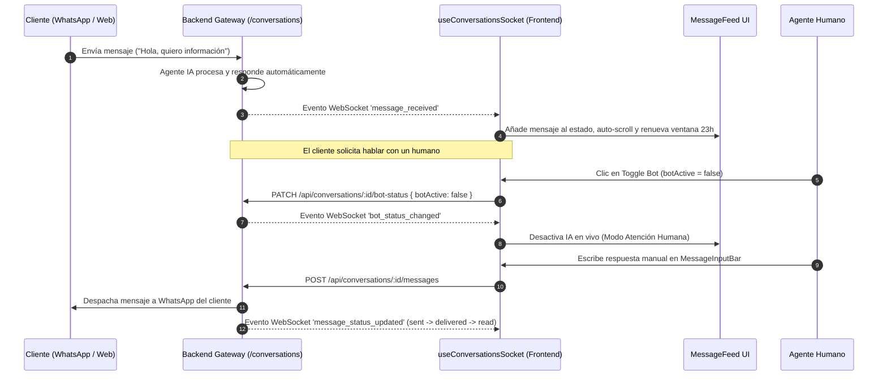
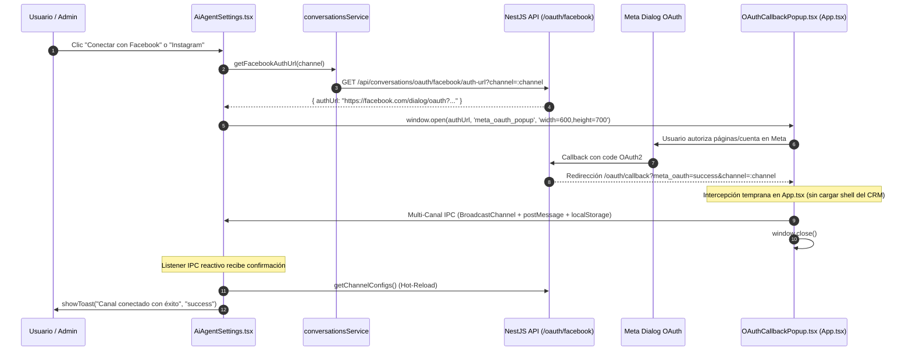

# 💬 CRM TIBS — Chat Omnicanal, WebSockets & Agente IA

Este documento detalla la arquitectura de comunicación en tiempo real de **CRM TIBS App**, la integración bidireccional con **Socket.IO Client** ([`socket.io-client`](file:///c:/Users/sopor/Proyectos/CRM/crm-tibs-app/package.json)), el hook orquestador [`useConversationsSocket.ts`](file:///c:/Users/sopor/Proyectos/CRM/crm-tibs-app/src/hooks/useConversationsSocket.ts), el conmutador de control del **Agente de IA**, el simulador de mensajes entrantes, la política de ventana de 23 horas de WhatsApp, el módulo de **Plantilla Base de WhatsApp para Apertura/Reactivación (`crm_inicio_conversacion`)**, el flujo de **Vinculación OAuth2 en 1 Clic para Facebook e Instagram**, y el widget asistente flotante [`WebChat.tsx`](file:///c:/Users/sopor/Proyectos/CRM/crm-tibs-app/src/components/WebChat/WebChat.tsx).

---

## ⚡ Secuencia de Mensajería en Tiempo Real y Alternancia IA / Humano



---

## 🔌 1. Conexión WebSocket y Prevención de Stale Closures

En [`src/hooks/useConversationsSocket.ts`](file:///c:/Users/sopor/Proyectos/CRM/crm-tibs-app/src/hooks/useConversationsSocket.ts), se establece el enlace persistente sobre el namespace `/conversations`:

```typescript
const rawUrl = import.meta.env.VITE_BASE_URL || 'http://localhost:3091';
const socketPath = rawUrl.includes('/backend') ? '/backend/socket.io' : '/socket.io';
const originUrl = rawUrl.replace(/\/backend\/?$/, '');

const socket = io(`${originUrl}/conversations`, {
  path: socketPath,
  query: { userId: currentUserId }
});
```

### Prevención de Estados Obsoletos (*Stale Closures*):
Debido a que los listeners de Socket.IO se registran una sola vez en un `useEffect`, el hook utiliza referencias mutables sincronizadas para consultar el estado en caliente sin recrear sockets:
* `selectedConvRef.current = selectedConv;`
* `allUsersRef.current = allUsers;`
* `loadConversationsListRef.current = loadConversationsList;`

---

## 📡 2. Catálogo de Eventos WebSocket Escuchados

| Evento Socket | Payload | Efecto en la Interfaz |
| :--- | :--- | :--- |
| **`connect`** | Vacío | Confirma conexión activa e imprime en consola del navegador. |
| **`message_received`** | `Message` | Actualiza la lista lateral de conversaciones. Si coincide con la conversación activa, anexa el mensaje al feed sin duplicados y ejecuta scroll al final (`scrollToBottom`). Si proviene del cliente (`sender === 'contact'`), reactiva `is24HourWindowActive = true` y desbloquea el input inmediatamente. |
| **`message_status_updated`** | `MessageStatusUpdatedEvent` | Actualiza en tiempo real el estado de entrega (`pending`, `sent`, `delivered`, `read`, `failed`), el `externalMessageId` y el `errorMessage` tanto en el feed activo como en el último mensaje de la barra lateral. |
| **`bot_status_changed`** | `{ conversationId, botActive }` | Conmuta el switch visual de IA en la cabecera [`ChatWindowHeader.tsx`](file:///c:/Users/sopor/Proyectos/CRM/crm-tibs-app/src/components/WebChat/ChatWindowHeader.tsx) y en la tarjeta de chat lateral. |
| **`conversation_assigned`** | `{ conversationId, assignedUserId }` | Actualiza el avatar y nombre del ejecutivo asignado a la conversación en tiempo real. |

---

## 🟢 3. Política de Ventana de 24h y Margen Preventivo de 23 Horas en WhatsApp

* **Regla de Meta y Margen de Seguridad:** Meta aplica una ventana estricta de atención al cliente de 24 horas a partir de `lastCustomerMessageAt`. El CRM aplica un corte preventivo a las **23 horas** (`safetyWindowExpiresAt`) para prevenir desincronizaciones de reloj y mensajes perdidos.
* **Bloqueo Inteligente de Entrada ([`MessageInputBar.tsx`](file:///c:/Users/sopor/Proyectos/CRM/crm-tibs-app/src/components/WebChat/MessageInputBar.tsx)):**
  * Cuando `conversation.channel === 'whatsapp'` y `!conversation.is24HourWindowActive` (o han transcurrido $\ge$ 23h):
    * Se oculta la barra de texto libre y botón de envío regular.
    * Se despliega un banner de alerta informativa: *"Ventana de Atención de WhatsApp Expirada (Margen de 23h)"*.
    * **Botón Unificado de Acción con Hover Preview:**
      * Un único botón prioritario **`[ ⚡ Enviar Plantilla ]`** en la barra inferior.
      * **Live Hover Preview:** Al pasar el cursor sobre el botón, se despliega una tarjeta flotante estilizada como burbuja de WhatsApp sobre fondo texturizado oficial (`#efeae2`), renderizando el encabezado, el cuerpo con las variables del contacto pre-sustituidas con chips dinámicos, pie de página, hora y doble check azul ✓✓. Al dar clic, se despacha directamente a Meta sin modales de confirmación intermedios.
* **Indicadores Visuales Reactivos:**
  * **Lista lateral ([`ChatListSidebar.tsx`](file:///c:/Users/sopor/Proyectos/CRM/crm-tibs-app/src/components/WebChat/ChatListSidebar.tsx)):** Badges dinámicos que se recalculan cada 60 segundos:
    * Verde discreto: `"21h restantes"` ($> 2$ horas restantes).
    * Ámbar/naranja con pulso: `"Expira en 1h 15m"` ($< 2$ horas restantes).
    * Rojo/gris: `"Ventana cerrada (23h) • Usar plantilla"`.
  * **Cabecera ([`ChatWindowHeader.tsx`](file:///c:/Users/sopor/Proyectos/CRM/crm-tibs-app/src/components/WebChat/ChatWindowHeader.tsx)):** Pill interactivo con tooltip que detalla la fecha y hora de expiración, con navegación directa al catálogo de plantillas al hacer clic.
* **Intercepción Defensiva:** Si se intenta enviar un mensaje de texto libre y el backend retorna HTTP 400 por expiración de ventana, [`useConversationsSocket.ts`](file:///c:/Users/sopor/Proyectos/CRM/crm-tibs-app/src/hooks/useConversationsSocket.ts) marca la ventana como inactiva localmente, notifica al usuario y abre automáticamente el selector.

---

## ⚡ 4. Plantilla Base de WhatsApp: Configuración Meta y Envío Rápido en 1 Clic

La Plantilla Base (`crm_inicio_conversacion`) resuelve la fricción de contactar a un cliente por primera vez o reanudar una conversación tras la expiración de la ventana de 23 horas.

### 4.1 Configuración de Canal y Sincronización Directa con Meta
Implementado en [`WhatsAppBaseTemplateSettings.tsx`](file:///c:/Users/sopor/Proyectos/CRM/crm-tibs-app/src/components/Settings/WhatsAppBaseTemplateSettings.tsx), integrado en el modal de ajustes de canales en [`AiAgentSettings.tsx`](file:///c:/Users/sopor/Proyectos/CRM/crm-tibs-app/src/components/Settings/AiAgentSettings.tsx):

* **Diseño Minimalista y Abstracción Total de Metadatos de Meta:**
  * **Sin Campos Técnicos Visibles:** En la interfaz **NO se muestra el nombre técnico de la plantilla (`crm_inicio_conversacion`) ni selectores/campos de categoría (`UTILITY`) ni idioma (`es`)**. Toda la configuración técnica es gestionada de manera transparente por el backend.
  * **Banner Superior de Estado:** Muestra el estado oficial en Meta (`Aprobada en Meta` con badge verde, `En revisión`, `Rechazada`), el identificador único `META TEMPLATE ID` y el botón interactivo **`REFRESCAR META`** para consultar el estado en caliente.
  * **Formulario Enfocado Exclusivamente en Contenido:** La pantalla expone única y exclusivamente los 3 componentes editables de texto:
    1. **Encabezado (`headerText`):** Opcional, texto de hasta 60 caracteres con contador en vivo `X / 60`.
    2. **Cuerpo del Mensaje (`bodyText`):** Obligatorio, hasta 1024 caracteres con contador en vivo `X / 1024`.
       * **3 Botones de Inserción de Variables en Posición de Cursor:**
         - `[+ {{1}} Nombre del Cliente]`
         - `[+ {{2}} Empresa / Negocio]`
         - `[+ {{3}} Asesor / Agente]`
       * **Alerta Sutil Preventiva:** Detecta en tiempo real si falta alguna variable intermedia correlativa exigida por Meta (ej. si se usa `{{2}}` sin `{{1}}`, o `{{3}}` sin `{{2}}`).
       * **Leyenda Oficial:** *"Las variables {{1}}, {{2}} y {{3}} se reemplazarán automáticamente por el nombre del contacto, la empresa y el agente asignado al enviar la plantilla desde el chat."*
    3. **Pie de Mensaje (`footerText`):** Opcional, texto de hasta 60 caracteres con contador en vivo `X / 60`.
    4. **Botón de Acción:** **`GUARDAR Y SINCRONIZAR CON META`**.

* **Validaciones Yup Estándar del Sistema ([`whatsappTemplateSchema.ts`](file:///c:/Users/sopor/Proyectos/CRM/crm-tibs-app/src/utils/whatsappTemplateSchema.ts)):**
  El formulario utiliza el hook estándar [`useFormValidation.ts`](file:///c:/Users/sopor/Proyectos/CRM/crm-tibs-app/src/components/shared/useFormValidation.ts) del sistema y esquemas Yup puros:
  1. **Validación Exclusiva del Cuerpo (`whatsappBodySchema`):**
     * **Ratio Variable-to-Text (Prevención Error Meta #2388293):** Cuando el mensaje contiene variables (`{{1}}`), Meta exige al menos **6 a 10 palabras fijas** y **mínimo 35 caracteres** de texto real. Si no se cumple, Yup genera de inmediato el mensaje de error estándar inline debajo del textarea.
     * **Correlatividad Estricta de Meta:** Valida que las variables inicien obligatoriamente en `{{1}}` y sean consecutivas (`{{1}}`, `{{2}}`, `{{3}}`) sin huecos.
     * **Sin Variables Huérfanas ni Flotantes:** Prohíbe mensajes formados solo por variables o variables solas en una línea.
     * **Texto Base Predeterminado Optimizado:** `"Hola {{1}}, te saluda {{3}} de {{2}}. Me comunico contigo para dar seguimiento y revisar lo siguiente:"` (14 palabras, 85 caracteres, aprobado por Meta).
  2. **Campos Opcionales de Texto:**
     * `headerText`: Texto opcional hasta 60 caracteres.
     * `footerText`: Texto opcional hasta 60 caracteres.
  3. **Manejo Estándar de Errores en UI:** Errores inline en texto rojo (`text-rose-600 text-[11px]`) con borde reactivo únicamente cuando el campo no cumple las reglas.

* **Payload Estricto de Guardado (`PUT /api/conversations/channels/:channelConfigId/base-template`):**
  Envía exclusivamente los campos de contenido para cumplir con la validación estricta del backend:
  ```json
  {
    "headerText": "Notificación Importante",
    "bodyText": "Hola {{1}}, te saluda {{3}} de {{2}}. Me comunico contigo para dar seguimiento y revisar lo siguiente:",
    "footerText": "Responde a este mensaje para continuar"
  }
  ```

* **Previsualizador WhatsApp en Vivo con Chips Diferenciados:** Burbuja interactiva que sustituye dinámicamente cada variable por su valor de ejemplo correspondiente:
  - `{{1}}` $\rightarrow$ Chip verde esmeralda `[ Juan Pérez ]` (Nombre del Cliente).
  - `{{2}}` $\rightarrow$ Chip azul cielo `[ TIBS Soluciones ]` (Empresa / Negocio).
  - `{{3}}` $\rightarrow$ Chip índigo `[ Carlos Asesor ]` (Asesor / Agente).

### 4.2 Envío Directo en 1 Clic con Hover Preview (`MessageInputBar.tsx`)
* **Consumo de `GET /api/conversations/:id/base-template`:**
  * El endpoint prioritario retorna la plantilla base oficial configurada (`crm_inicio_conversacion`) junto a sus componentes y las variables de negocio ya resueltas para la conversación activa (`resolvedVariables` y `contact`).
  * Precarga el nombre del contacto (`conversation.clientName` o `client.nombre`) en la variable `{{1}}`, la **empresa vinculada al contacto** (`client.company.nombre` o `client.empresa`) en `{{2}}` (o vacío si el contacto no tiene empresa asignada) y el asesor en `{{3}}`.
* **Hover Preview Inteligente y Despacho en 1 Clic Sin Modales:**
  * **Sin Modales Innecesarios:** Se eliminó el modal intermedio de confirmación. Al existir ya una previsualización completa en la burbuja emergente (*Hover Preview*), el mensaje se despacha directamente a Meta en cuanto el usuario hace clic en *"Enviar Plantilla"* o en el footer del popover *"Clic para enviar"*.
  * **Previsualización Flotante ([`MessageInputBar.tsx`](file:///c:/Users/sopor/Proyectos/CRM/crm-tibs-app/src/components/WebChat/MessageInputBar.tsx)):**
    * `{{1}}` (Esmeralda): Nombre del Cliente / Contacto (`resolvedVariables[1]` o `conversation.clientName`).
    * `{{2}}` (Cielo): Empresa o Negocio del contacto (`resolvedVariables[2]` o `conversation.client.company.nombre` / `conversation.client.empresa`). Si no existe relación con empresa, se renderiza limpio y sin chip simulado.
    * `{{3}}` (Índigo): Asesor asignado (`resolvedVariables[3]` o `conversation.assignedUser.username` / usuario en sesión).
  * **Envío a Meta WhatsApp Cloud API:** Si el contacto no tiene empresa, se despacha `' '` (espacio en blanco) para cumplir con la regla de Meta que prohíbe parámetros de texto vacíos `""`, manteniendo el texto limpio en WhatsApp para el cliente.
  * **Acceso Alternativo al Catálogo:** Si el usuario desea enviar una plantilla diferente a la base, dispone del enlace *"Ver catálogo completo"* en el banner de ventana cerrada o haciendo clic en el badge superior de la ventana.
* **Estandarización Total con Componentes Compartidos (`src/components/shared/`):**
  * Toda la suite de mensajería utiliza exclusivamente los componentes base del CRM:
    * [`Modal.tsx`](file:///c:/Users/sopor/Proyectos/CRM/crm-tibs-app/src/components/shared/Modal.tsx): Base estructural de [`WhatsAppTemplateSelectorModal.tsx`](file:///c:/Users/sopor/Proyectos/CRM/crm-tibs-app/src/components/WebChat/WhatsAppTemplateSelectorModal.tsx).
    * [`Badge.tsx`](file:///c:/Users/sopor/Proyectos/CRM/crm-tibs-app/src/components/shared/Badge.tsx): Etiquetas cromáticas en [`ChatListSidebar.tsx`](file:///c:/Users/sopor/Proyectos/CRM/crm-tibs-app/src/components/WebChat/ChatListSidebar.tsx) (Bot/Humano), en la vista previa y en la lista de plantillas (`Meta Verified`, `UTILITY`, `MARKETING`, `Aprobada`).
    * [`Button.tsx`](file:///c:/Users/sopor/Proyectos/CRM/crm-tibs-app/src/components/shared/Button.tsx): Envío directo en [`MessageInputBar.tsx`](file:///c:/Users/sopor/Proyectos/CRM/crm-tibs-app/src/components/WebChat/MessageInputBar.tsx), reintentos y acciones en [`WhatsAppTemplateSelectorModal.tsx`](file:///c:/Users/sopor/Proyectos/CRM/crm-tibs-app/src/components/WebChat/WhatsAppTemplateSelectorModal.tsx) y despacho en [`SimulatorPanel.tsx`](file:///c:/Users/sopor/Proyectos/CRM/crm-tibs-app/src/components/WebChat/SimulatorPanel.tsx).
    * [`EmptyState.tsx`](file:///c:/Users/sopor/Proyectos/CRM/crm-tibs-app/src/components/shared/EmptyState.tsx): Pantalla de inicio sin chat activo en [`ConversationsPage.tsx`](file:///c:/Users/sopor/Proyectos/CRM/crm-tibs-app/src/pages/ConversationsPage.tsx), bandeja vacía en [`ChatListSidebar.tsx`](file:///c:/Users/sopor/Proyectos/CRM/crm-tibs-app/src/components/WebChat/ChatListSidebar.tsx) y filtros sin resultados en [`WhatsAppTemplateSelectorModal.tsx`](file:///c:/Users/sopor/Proyectos/CRM/crm-tibs-app/src/components/WebChat/WhatsAppTemplateSelectorModal.tsx).
    * [`Input.tsx`](file:///c:/Users/sopor/Proyectos/CRM/crm-tibs-app/src/components/shared/Input.tsx) y [`TextArea.tsx`](file:///c:/Users/sopor/Proyectos/CRM/crm-tibs-app/src/components/shared/TextArea.tsx): Captura de parámetros dinámicos de plantillas y entradas del panel simulador.
    * [`Loader.tsx`](file:///c:/Users/sopor/Proyectos/CRM/crm-tibs-app/src/components/shared/Loader.tsx) y [`Notification.tsx`](file:///c:/Users/sopor/Proyectos/CRM/crm-tibs-app/src/components/shared/Notification.tsx): Cargas y avisos globales del sistema.

---

## 📬 5. Rastreo de Estados de Entrega (Delivery Receipts)

* **Estados soportados:** `'pending' | 'sent' | 'delivered' | 'read' | 'failed'`.
* **Iconografía en Mensajes Salientes ([`MessageFeed.tsx`](file:///c:/Users/sopor/Proyectos/CRM/crm-tibs-app/src/components/WebChat/MessageFeed.tsx)):**
  * `pending`: Reloj gris 🕒 (`Clock`).
  * `sent`: Un check gris ✓ (`Check`).
  * `delivered`: Doble check gris ✓✓ (`CheckCheck`).
  * `read`: Doble check azul ✓✓ (`CheckCheck` en azul Meta).
  * `failed`: Icono de advertencia rojo ⚠️ (`AlertCircle`) con animación y Tooltip que muestra `errorMessage || 'Fallo en la entrega de Meta'`.
* **Mensajes de Plantilla:** Se renderizan con gradiente esmeralda, borde y badge identificador *"Plantilla de WhatsApp"*.

---

## 🧪 6. Panel Simulador de Mensajería (`SimulatorPanel.tsx`)

Para pruebas y demostraciones en desarrollo, el hook integra la acción `handleSimulate`:
* Permite inyectar mensajes sintéticos simulando cualquiera de los canales soportados:
  * **WhatsApp:** Requiere teléfono de remitente (e.g. `+525551234567`).
  * **Messenger / Instagram / WebChat:** Requiere ID de perfil social y apodo.
* Invoca [`simulateIncomingMessage`](file:///c:/Users/sopor/Proyectos/CRM/crm-tibs-app/src/services/conversationsService.ts), permitiendo comprobar cómo reacciona el Agente de IA sin necesidad de enviar mensajes reales por las APIs de Meta.

---

## 🤖 7. Asistente Virtual Flotante (`WebChat.tsx`)

Adicional a la consola omnicanal, el sistema incluye un asistente conversacional flotante disponible en toda la plataforma:
* Consume el servicio [`webchatService.ts`](file:///c:/Users/sopor/Proyectos/CRM/crm-tibs-app/src/services/webchatService.ts) vía `POST /api/webchat/query`.
* **Capacidades Analíticas:** Permite a los usuarios consultar en lenguaje natural sobre sus ventas, oportunidades ganadas, clientes con más compras o tickets pendientes.
* **Redirección Reactiva (`dashboardRedirect`):** Si la respuesta de la IA determina que el usuario debe consultar una pantalla específica con filtros aplicados, la interfaz puede navegar reactivamente hacia `/dashboard?period=month`.

---

## 🏛️ 8. Vinculación Meta OAuth2 en 1 Clic y Cumplimiento App Review

Para satisfacer las directivas de Meta App Review (`pages_show_list`, `pages_manage_metadata`, `pages_messaging`, `instagram_business_basic`, `instagram_manage_messages`) manteniendo una interfaz limpia y amigable:

### 8.1 Sección Canales de Comunicación (`AiAgentSettings.tsx`)
* **Vinculación Desatendida OAuth2 en 1 Clic:**
  * **Botones Independientes:** Cada tarjeta comercial cuenta con su propio botón de conexión dedicado:
    - **Facebook Messenger:** Dispara `handleConnectMeta('facebook')` consumiendo `GET /api/conversations/oauth/facebook/auth-url?channel=facebook`. Solicita exclusivamente los permisos de Fan Page y vincula la página seleccionada.
    - **Instagram Direct:** Dispara `handleConnectMeta('instagram')` consumiendo `GET /api/conversations/oauth/facebook/auth-url?channel=instagram`. Solicita los permisos de Instagram Business y vincula exclusivamente la cuenta de Instagram conectada.
  * **Abstracción Total de Complejidad Técnica:** Se eliminaron definitivamente de la interfaz los inputs manuales técnicos (App ID, Page ID, Token de acceso permanente, Verify Token y Callback URL). La vinculación se resuelve íntegramente mediante el handshake de Meta.
  * **Apertura en Popup Aislado:** La autorización se despliega en una ventana emergente centrada (`width=600, height=700`), manteniendo al usuario en su contexto de trabajo en el CRM.



### 8.2 Arquitectura de Retorno, Autocierre y Comunicación IPC Multi-Canal (`OAuthCallbackPopup.tsx`)
* **Detección Temprana en `App.tsx`:**
  * Para evitar que la ventana emergente cargue el shell completo del CRM, verifique sesión o intente navegar a `/conversations` (lo cual ocurría por políticas de protección o redirecciones predeterminadas), `App.tsx` evalúa tempranamente `window.location.search.includes('meta_oauth') || window.location.pathname === '/oauth/callback'`.
  * Si la condición se cumple, se renderiza directamente `<OAuthCallbackPopup />` en aislamiento total.
* **Mecanismo de Notificación Tripartita Resiliente a Escudos de Navegadores:**
  * Ciertos navegadores con políticas estrictas de privacidad (como Brave Shields o Safari ITP) eliminan la referencia `window.opener` (`null`) al producirse redirecciones entre dominios cruzados (Meta $\rightarrow$ CRM).
  * Para garantizar que la ventana principal reciba el evento sin importar las restricciones del navegador, `OAuthCallbackPopup` emite simultáneamente por 3 vías de comunicación inter-proceso (IPC):
    1. **`BroadcastChannel('meta_oauth_channel')`:** Canal nativo entre ventanas/pestañas del mismo origen que no depende de punteros de memoria ni referencias a `window.opener`.
    2. **`window.opener.postMessage(...)`:** Vía directa para navegadores convencionales (Chrome, Firefox, Edge).
    3. **`localStorage.setItem('meta_oauth_result', ...)`:** Genera un evento `storage` capturado inmediatamente por listeners en la ventana padre.
* **Cierre Automático y Contingencia en Padre:**
  * El popup ejecuta `window.close()` en 300ms tras emitir las señales.
  * Como contingencia adicional para navegadores que bloquean llamadas de cierre generadas por script, el componente padre [`AiAgentSettings.tsx`](file:///c:/Users/sopor/Proyectos/CRM/crm-tibs-app/src/components/Settings/AiAgentSettings.tsx) mantiene la referencia `metaPopupRef.current` y fuerza el cierre de la ventana en cuanto detecta el resultado.

### 8.3 Recarga en Caliente de la Sección de Canales (Hot-Reload)
* **Sincronización Reactiva:** [`AiAgentSettings.tsx`](file:///c:/Users/sopor/Proyectos/CRM/crm-tibs-app/src/components/Settings/AiAgentSettings.tsx) implementa un `useEffect` con suscripción triple a `BroadcastChannel`, eventos `storage` y eventos `message`.
* **Actualización en Tiempo Real:** Al recibir la señal de éxito, dispara inmediatamente `getChannelConfigs()`, actualizando en caliente la tarjeta del canal vinculado (avatar oficial de Meta, nombre de Fan Page o @usuario de Instagram, ID de activo y badge `Conectado`) sin requerir recargar la página.
* **Retroalimentación con SweetAlert2:** Notifica al usuario en la esquina superior con el sistema unificado de toasts ([`toast.ts`](file:///c:/Users/sopor/Proyectos/CRM/crm-tibs-app/src/utils/toast.ts)).

### 8.4 Enriquecimiento en Tiempo Real con Meta Graph API
* El endpoint `GET /api/conversations/channels` consulta directamente a Meta en tiempo real retornando nombres oficiales, fotos de perfil y números formateados mediante la interfaz `ChannelConfig`.
* **WhatsApp Cloud API:** Muestra prioritariamente el nombre verificado oficial (`waVerifiedName`), con fallback a `channel.name`. Muestra además el número telefónico formateado (`metaDetails.display_phone_number`) o `phoneNumberId`, avatar oficial si está disponible, y estado `Conectado`.
* **Facebook Messenger:** Muestra el nombre oficial de la Fan Page conectada (`fbPageName`), con fallback a `channel.name`. Muestra en texto secundario el ID de la página (`ID: ${channel.accountId}`), avatar de la Fan Page y badge de estado.
* **Instagram Direct:** Muestra la cuenta comercial formateada con `@username` (`metaProfileName` o `@${igUsername}`), con fallback a `channel.name`. Expone el ID de la cuenta de Instagram (`ID: ${channel.accountId}`) y avatar oficial.
* **Estados de Carga y Sincronización Manual:** Durante la consulta a Meta (`isLoadingChannels`), las tarjetas despliegan un skeleton animado suave. Además, se integra un botón "Sincronizar Meta" que permite forzar la re-verificación contra Meta Graph API sin recargar la pantalla.

### 8.5 Cabecera de Conversación Activa (`ChatWindowHeader.tsx`)
* **Identificación del Activo:** En lugar de identificadores numéricos crudos, la cabecera expone directamente el nombre de la página o activo con el que se atiende al cliente:
  - Facebook: `Atendiendo desde Facebook Page: [Nombre de la Fan Page]`
  - Instagram: `Atendiendo desde Instagram: @[username]`
  - WhatsApp: `Atendiendo desde WhatsApp: [Nombre de Cuenta]`
* **Carga Defensiva:** Resuelve automáticamente el nombre del canal activo incluso ante recargas o navegación directa por parámetro URL.

---

## 🔗 Enlaces Relacionados
* [[CRM TIBS APP]] — Hub Maestro.
* [[CRM TIBS - Arquitectura Frontend & React 19]] — Stack y estándares de desarrollo.
* [[CRM TIBS - Cotizaciones PDF & Modulo de Productos]] — Detección y envío de cotizaciones en el feed.
* [[CRM TIBS - Modulo de Clientes, Empresas & CRM]] — Datos del cliente que nutren la cabecera del chat.
* [[CRM TIBS - Centro de Configuracion, Tenants & Roles]] — Configuración del bot y sub-agentes.
* [[Catalogo de Componentes y Vistas]] — Inventario de componentes y vistas del sistema.
* [[Matriz de Servicios y Hooks API]] — Servicios REST y WebSocket de mensajería.
