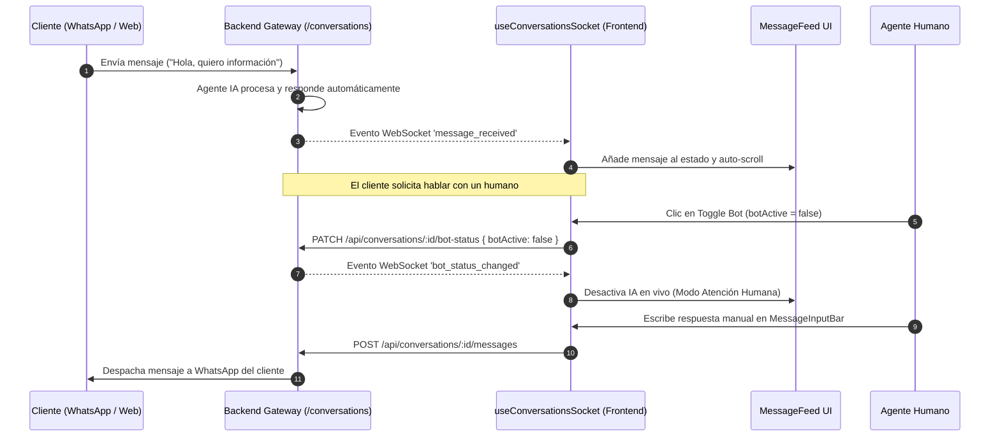

# 💬 CRM TIBS — Chat Omnicanal, WebSockets & Agente IA

Este documento detalla la arquitectura de comunicación en tiempo real de **CRM TIBS App**, la integración bidireccional con **Socket.IO Client** ([`socket.io-client`](file:///c:/Users/sopor/Proyectos/CRM/crm-tibs-app/package.json)), el hook orquestador [`useConversationsSocket.ts`](file:///c:/Users/sopor/Proyectos/CRM/crm-tibs-app/src/hooks/useConversationsSocket.ts), el conmutador de control del **Agente de IA**, el simulador de mensajes entrantes y el widget asistente flotante [`WebChat.tsx`](file:///c:/Users/sopor/Proyectos/CRM/crm-tibs-app/src/components/WebChat/WebChat.tsx).

---

## ⚡ Secuencia de Mensajería en Tiempo Real y Alternancia IA / Humano



---

## 🔌 1. Conexión WebSocket y Prevención de Stale Closures

En [`src/hooks/useConversationsSocket.ts`](file:///c:/Users/sopor/Proyectos/CRM/crm-tibs-app/src/hooks/useConversationsSocket.ts), se establece el enlace persistente sobre el namespace `/conversations`:

```typescript
const rawUrl = import.meta.env.VITE_BASE_URL || 'http://localhost:3091';
const socketPath = rawUrl.includes('/backend') ? '/backend/socket.io' : '/socket.io';
const originUrl = rawUrl.replace(/\/backend\/?$/, '');

const socket = io(`${originUrl}/conversations`, {
  path: socketPath,
  query: { userId: currentUserId }
});
```

### Prevención de Estados Obsoletos (*Stale Closures*):
Debido a que los listeners de Socket.IO se registran una sola vez en un `useEffect`, el hook utiliza referencias mutables sincronizadas para consultar el estado en caliente sin recrear sockets:
* `selectedConvRef.current = selectedConv;`
* `allUsersRef.current = allUsers;`
* `loadConversationsListRef.current = loadConversationsList;`

---

## 📡 2. Catálogo de Eventos WebSocket Escuchados

| Evento Socket | Payload | Efecto en la Interfaz |
| :--- | :--- | :--- |
| **`connect`** | Vacío | Confirma conexión activa e imprime en consola del navegador. |
| **`message_received`** | `MessageItem` | Actualiza la lista lateral de conversaciones. Si coincide con la conversación activa, anexa el mensaje al feed sin duplicados y ejecuta scroll al final (`scrollToBottom`). |
| **`bot_status_changed`** | `{ conversationId, botActive }` | Conmuta el switch visual de IA en la cabecera [`ChatWindowHeader.tsx`](file:///c:/Users/sopor/Proyectos/CRM/crm-tibs-app/src/components/WebChat/ChatWindowHeader.tsx) y en la tarjeta de chat lateral. |
| **`conversation_assigned`** | `{ conversationId, assignedUserId }` | Actualiza el avatar y nombre del ejecutivo asignado a la conversación en tiempo real. |

---

## 🧪 3. Panel Simulador de Mensajería (`SimulatorPanel.tsx`)

Para propósitos de pruebas y demostraciones en desarrollo, el hook integra la acción `handleSimulate`:
* Permite inyectar mensajes sintéticos simulando cualquiera de los canales soportados:
  * **WhatsApp:** Requiere teléfono de remitente (e.g. `+525551234567`).
  * **Messenger / Instagram / WebChat:** Requiere ID de perfil social y apodo.
* Invoca [`simulateIncomingMessage`](file:///c:/Users/sopor/Proyectos/CRM/crm-tibs-app/src/services/conversationsService.ts), permitiendo comprobar cómo reacciona el Agente de IA sin necesidad de enviar mensajes reales por las APIs de Meta.

---

## 🤖 4. Asistente Virtual Flotante (`WebChat.tsx`)

Adicional a la consola omnicanal, el sistema incluye un asistente conversacional flotante disponible en toda la plataforma:
* Consume el servicio [`webchatService.ts`](file:///c:/Users/sopor/Proyectos/CRM/crm-tibs-app/src/services/webchatService.ts) vía `POST /api/webchat/query`.
* **Capacidades Analíticas:** Permite a los usuarios consultar en lenguaje natural sobre sus ventas, oportunidades ganadas, clientes con más compras o tickets pendientes.
* **Redirección Reactiva (`dashboardRedirect`):** Si la respuesta de la IA determina que el usuario debe consultar una pantalla específica con filtros aplicados, la interfaz puede navegar reactivamente hacia `/dashboard?period=month`.

---

## 🔗 Enlaces Relacionados
* [[CRM TIBS APP]] — Hub Maestro.
* [[CRM TIBS - Cotizaciones PDF & Modulo de Productos]] — Detección y envío de cotizaciones en el feed.
* [[CRM TIBS - Modulo de Clientes, Empresas & CRM]] — Datos del cliente que nutren la cabecera del chat.
* [[CRM TIBS - Centro de Configuracion, Tenants & Roles]] — Configuración del bot y sub-agentes.
