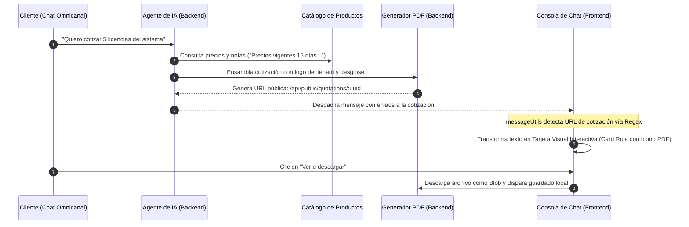

# 📦 CRM TIBS — Cotizaciones PDF & Módulo de Productos

Este documento detalla la estructura del **Catálogo de Productos y Servicios**, la integración de directivas de cotización para el **Agente de IA**, el motor de generación de documentos PDF mediante **jsPDF** ([`jspdf`](file:///c:/Users/sopor/Proyectos/CRM/crm-tibs-app/package.json)) y la detección reactiva de tarjetas descargables de cotización en el feed del chat ([`messageUtils.tsx`](file:///c:/Users/sopor/Proyectos/CRM/crm-tibs-app/src/utils/messageUtils.tsx)).

---

## 📄 Flujo de Cotización Automática y Descarga PDF



---

## 🏷️ 1. Módulo de Productos y Notas para el Agente de IA

En [`src/components/Product/ProductForm.tsx`](file:///c:/Users/sopor/Proyectos/CRM/crm-tibs-app/src/components/Product/ProductForm.tsx), cada producto o servicio registra:
* **Datos Comerciales:** Nombre, código SKU, precio base, moneda (MXN/USD) y descripción detallada.
* **Archivos Adjuntos (`ProductFilesTab.tsx`):** Fichas técnicas, catálogos en PDF y hojas de especificaciones.
* **Notas Libres para el Agente de IA:** Campo de texto libre donde los administradores definen reglas de negociación (e.g. *"Si el cliente solicita más de 10 unidades, ofrecer 10% de descuento; tiempo de entrega 3 días hábiles"*). El bot de IA lee estas notas al vuelo durante las conversaciones en vivo.

---

## 🔍 2. Detección Inteligente de Enlaces PDF en Mensajes

Para evitar que los usuarios y clientes vean enlaces crudos e inamistosos, [`src/utils/messageUtils.tsx`](file:///c:/Users/sopor/Proyectos/CRM/crm-tibs-app/src/utils/messageUtils.tsx) analiza el texto entrante mediante expresiones regulares:

```typescript
const pdfMatch = content.match(
  /(https?:\/\/[^\s\)\]"]+\.pdf|https?:\/\/[^\s\)\]"]*\/api\/public\/quotations\/[a-f0-9\-]{36}|\/api\/public\/quotations\/[a-f0-9\-]{36}|\/uploads\/[^\s\)\]"]+\.pdf|uploads\/[^\s\)\]"]+\.pdf)/i
);
```

### Renderizado de Tarjeta Interactiva:
Cuando la expresión regular encuentra una coincidencia:
1. Extrae la URL absoluta hacia el documento.
2. Renderiza una tarjeta estilizada con fondo blanco translúcido (`bg-white/20`), icono `FileText` de Lucide sobre un contenedor rojo y texto *"Cotización en PDF — Ver o descargar"*.
3. **Descarga Segura en Blobs:** Al hacer clic, ejecuta una llamada `fetch(fullUrl)` convirtiendo la respuesta en un `Blob` temporal (`window.URL.createObjectURL(blob)`), garantizando la descarga inmediata en el dispositivo del cliente.

---

## 📑 3. Motor de Generación de Reportes con jsPDF

El frontend utiliza [`jspdf`](file:///c:/Users/sopor/Proyectos/CRM/crm-tibs-app/package.json) y el plugin [`jspdf-autotable`](file:///c:/Users/sopor/Proyectos/CRM/crm-tibs-app/package.json) en múltiples dominios:
* **Pipeline Comercial ([`usePipeline.ts`](file:///c:/Users/sopor/Proyectos/CRM/crm-tibs-app/src/hooks/usePipeline.ts)):** Exportación tabular de acuerdos, importes, probabilidades de cierre y ejecutivos a cargo.
* **Actividades ([`useActivities.ts`](file:///c:/Users/sopor/Proyectos/CRM/crm-tibs-app/src/hooks/useActivities.ts)):** Resumen cronológico de reuniones y llamadas realizadas por el equipo.
* **Tickets de Soporte ([`useHelpdesk.ts`](file:///c:/Users/sopor/Proyectos/CRM/crm-tibs-app/src/hooks/useHelpdesk.ts)):** Reporte de incidencias por prioridad y días en etapa.
* **Dashboard ([`useDashboard.ts`](file:///c:/Users/sopor/Proyectos/CRM/crm-tibs-app/src/hooks/useDashboard.ts)):** Resumen ejecutivo con métricas de ventas y soporte.

---

## 🔗 Enlaces Relacionados
* [[CRM TIBS APP]] — Hub Maestro.
* [[CRM TIBS - Chat Omnicanal, WebSockets & Agente IA]] — Feed donde se muestran las cotizaciones.
* [[CRM TIBS - Tablero Kanban & Pipeline Comercial]] — Oportunidades asociadas a cotizaciones.
* [[CRM TIBS - Dashboard, Analitica & Reportes]] — Ventas acumuladas de productos.
