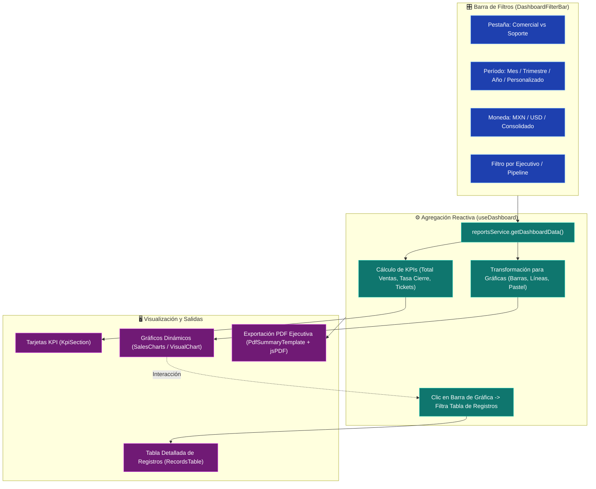

# 📈 CRM TIBS — Dashboard, Analítica & Reportes

Este documento describe el centro de inteligencia de negocios de **CRM TIBS App**, el procesamiento y agregación de indicadores clave de rendimiento (**KPIs**) en [`useDashboard.ts`](file:///c:/Users/sopor/Proyectos/CRM/crm-tibs-app/src/hooks/useDashboard.ts), el motor de gráficas visuales y la exportación de resúmenes ejecutivos en PDF y Excel.

---

## 📊 Arquitectura de Analítica y Filtrado Interactivo

---

## 🎚️ 1. Pestañas de Negocio: Comercial vs Soporte

El dashboard divide su alcance analítico en dos grandes vertientes gobernadas por la propiedad `activeTab`:
1. **Pestaña Comercial (`activeTab === 'commercial'`):**
   * Total de ingresos cerrados y pronóstico ponderado de ventas.
   * Tasa de conversión de oportunidades (`won / (won + lost)`).
   * Desglose mensual de acuerdos por etapa del pipeline.
   * Ranking de ejecutivos comerciales más productivos.
2. **Pestaña de Soporte (`activeTab === 'support'`):**
   * Total de tickets generados y porcentaje de resolución.
   * Distribución de incidentes por nivel de severidad (Urgente, Alta, Media, Baja).
   * Tiempo promedio de permanencia en etapas de diagnóstico.

---

## 💵 2. Manejo Multidivisa y Filtros Temporales

En el hook [`useDashboard.ts`](file:///c:/Users/sopor/Proyectos/CRM/crm-tibs-app/src/hooks/useDashboard.ts), las métricas se adaptan dinámicamente:
* **Filtro de Moneda (`currencyFilter`):** Permite aislar transacciones en `MXN`, `USD` o generar una vista `consolidado` convirtiendo valores para proporcionar una cifra global homogénea.
* **Periodos Preestablecidos:** Selección inmediata de *Mes Actual*, *Último Trimestre*, *Año en Curso* o *Rango Personalizado* con selectores de fecha de inicio y fin.

---

## 🖱️ 3. Filtrado Cruzado Interactivo (*Drill-Down*)

Una característica clave de [`useDashboard.ts`](file:///c:/Users/sopor/Proyectos/CRM/crm-tibs-app/src/hooks/useDashboard.ts) es la función `handleChartClick`:
* Al hacer clic sobre una barra de un mes específico (e.g. *"Agosto"*) o sobre una etapa en el gráfico de pastel (e.g. *"Propuesta"*), el dashboard activa un filtro secundario.
* La tabla inferior de registros [`RecordsTable.tsx`](file:///c:/Users/sopor/Proyectos/CRM/crm-tibs-app/src/components/Dashboard/RecordsTable.tsx) actualiza de inmediato su contenido para mostrar exclusivamente las oportunidades o tickets correspondientes al segmento seleccionado.

---

## 📄 4. Generación de Resúmenes Ejecutivos en PDF

A través de [`PdfSummaryTemplate.tsx`](file:///c:/Users/sopor/Proyectos/CRM/crm-tibs-app/src/components/Dashboard/PdfSummaryTemplate.tsx) y la acción `handleExportPDF`:
1. Ensambla una plantilla estructurada fuera de pantalla con el membrete y logotipo del tenant.
2. Utiliza `html2canvas` para capturar con alta fidelidad las gráficas vectoriales.
3. Invoca `jsPDF` para compilar un reporte ejecutivo con tablas de indicadores y desgloses de rendimiento listo para juntas directivas.

---

## 🔗 Enlaces Relacionados
* [[CRM TIBS APP]] — Hub Maestro.
* [[CRM TIBS - Tablero Kanban & Pipeline Comercial]] — Datos de ventas que alimentan el dashboard.
* [[CRM TIBS - Mesa de Ayuda, Tickets & Helpdesk]] — Datos de tickets para el módulo de soporte.
* [[CRM TIBS - Centro de Configuracion, Tenants & Roles]] — Creación de indicadores personalizados.
