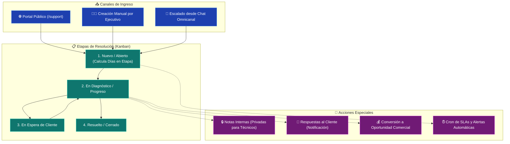

# 🎫 CRM TIBS — Mesa de Ayuda, Tickets & Helpdesk

Este documento describe la arquitectura y flujos operativos de la **Mesa de Ayuda (Helpdesk)** en **CRM TIBS App**, abarcando el tablero Kanban de incidencias con [`@dnd-kit`](file:///c:/Users/sopor/Proyectos/CRM/crm-tibs-app/src/hooks/useHelpdesk.ts), la matriz de prioridades, notas técnicas internas/públicas, cálculo de envejecimiento en etapa (SLAs) y conversión de tickets a oportunidades comerciales.

---

## 🔄 Ciclo de Vida del Ticket de Soporte

---

## 🎛️ 1. Tablero Kanban y Sensores Drag & Drop

Al igual que en el módulo de ventas, [`useHelpdesk.ts`](file:///c:/Users/sopor/Proyectos/CRM/crm-tibs-app/src/hooks/useHelpdesk.ts) implementa [`@dnd-kit/core`](file:///c:/Users/sopor/Proyectos/CRM/crm-tibs-app/package.json) con sensores de tolerancia (`PointerSensor` y `TouchSensor`).
* **Visualización en Tiempo Real:** Al mover un ticket entre columnas, se dispara `updateTicket(ticketId, { stage_id })`, actualizando de inmediato la etapa de soporte.
* **Cálculo de Días en Etapa:** Cada tarjeta [`TicketCard.tsx`](file:///c:/Users/sopor/Proyectos/CRM/crm-tibs-app/src/components/Helpdesk/TicketCard.tsx) calcula el tiempo transcurrido desde la última transición, advirtiendo visualmente si un caso ha superado el umbral tolerable de inactividad.

---

## 🚦 2. Matriz de Prioridades y Severidad

Los tickets se clasifican mediante un esquema visual de cuatro niveles:
1. **Urgente (Rojo Intenso):** Fallas críticas que detienen la operación del cliente. Requieren atención inmediata.
2. **Alta (Ámbar / Naranja):** Degeneración de servicios principales sin bloqueo total.
3. **Media (Azul):** Consultas operativas y solicitudes de configuración.
4. **Baja (Gris / Pizarra):** Sugerencias o mejoras no críticas.

---

## 💬 3. Interacciones: Notas Públicas vs Notas Internas

En el modal de inspección [`TicketDetail.tsx`](file:///c:/Users/sopor/Proyectos/CRM/crm-tibs-app/src/components/Helpdesk/TicketDetail.tsx) y su pestaña [`TicketInteractionsTab.tsx`](file:///c:/Users/sopor/Proyectos/CRM/crm-tibs-app/src/components/Helpdesk/TicketInteractionsTab.tsx):
* **Notas Públicas:** Mensajes dirigidos al solicitante que pueden disparar correos o avisos en el portal `/support`.
* **Notas Internas (Privadas):** Comentarios confidenciales entre ingenieros de soporte para diagnóstico técnico (análisis de logs, reproducciones de bugs) no visibles para el usuario final.

---

## 💰 4. Conversión a Oportunidad Comercial

Frecuentemente, una consulta técnica revela una necesidad de contratación de licencias adicionales o consultoría especializada.
* El hook [`useHelpdesk.ts`](file:///c:/Users/sopor/Proyectos/CRM/crm-tibs-app/src/hooks/useHelpdesk.ts) expone la acción `handleConvertToOpportunity`.
* Toma los datos de la empresa, contacto y título de la incidencia, e invoca `createOpportunity` de [`opportunitiesService.ts`](file:///c:/Users/sopor/Proyectos/CRM/crm-tibs-app/src/services/opportunitiesService.ts), sembrando el nuevo prospecto en la primera etapa del Pipeline comercial de forma instantánea.

---

## ⏰ 5. Automatización de SLAs con Helpdesk Cron

En [`src/services/helpdeskCronService.ts`](file:///c:/Users/sopor/Proyectos/CRM/crm-tibs-app/src/services/helpdeskCronService.ts), se configuran los parámetros del cron de fondo:
* Horarios de evaluación de SLAs.
* Días máximos permitidos antes de escalar un ticket a un supervisor.
* Alertas preventivas vía correo electrónico a los ejecutivos asignados.

---

## 🔗 Enlaces Relacionados
* [[CRM TIBS APP]] — Hub Maestro.
* [[CRM TIBS - Tablero Kanban & Pipeline Comercial]] — Destino de tickets convertidos a venta.
* [[CRM TIBS - Modulo de Clientes, Empresas & CRM]] — Contactos y empresas que originan tickets.
* [[CRM TIBS - Dashboard, Analitica & Reportes]] — Métricas agregadas de soporte y SLAs.
