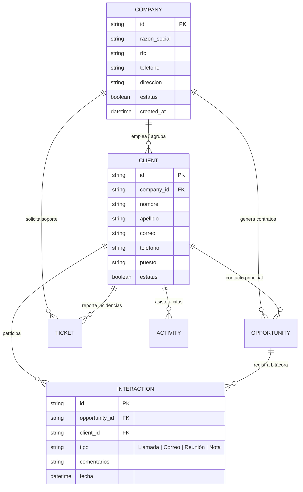

# 👥 CRM TIBS — Módulo de Clientes, Empresas & CRM

Este documento detalla la gestión de cuentas corporativas (**Empresas**) y contactos individuales (**Clientes**) en el modelo de ventas B2B de **CRM TIBS App**, el seguimiento cronológico de la bitácora de interacciones y su interconexión con el Pipeline y Helpdesk.

---

## 🏛️ Modelo Relacional de Entidades CRM

---

## 🏢 1. Directorio de Empresas (`CompaniesPage.tsx`)

En el contexto corporativo, las cuentas matrices se gestionan a través de [`useCompanies.ts`](file:///c:/Users/sopor/Proyectos/CRM/crm-tibs-app/src/hooks/useCompanies.ts) y [`companiesService.ts`](file:///c:/Users/sopor/Proyectos/CRM/crm-tibs-app/src/services/companiesService.ts):
* **Identificación Fiscal:** Captura de Razón Social y RFC para comprobaciones fiscales mexicanas.
* **Control de Activación:** Permite suspender empresas mediante `updateCompanyStatus(id, estatus)`, lo que previene que ejecutivos abran nuevas oportunidades con cuentas inactivas o en mora.
* **Jerarquía de Contactos:** Cada empresa expone un arreglo de contactos subordinados (`company.contacts`), facilitando la selección de tomadores de decisión en cotizaciones.

---

## 👤 2. Directorio de Contactos y Clientes (`ClientsPage.tsx`)

El hook [`useClients.ts`](file:///c:/Users/sopor/Proyectos/CRM/crm-tibs-app/src/hooks/useClients.ts) administra el catálogo de personas naturales:
* **Vinculación Flexible:** Un contacto puede pertenecer a una empresa o existir como cliente directo independiente.
* **Validación de Datos:** Validación de correos electrónicos corporativos y teléfonos internacionales en formato estándar para interoperar con el motor de mensajería de WhatsApp.
* **Selector Rápido:** Componente compartido [`CreatableSelect.tsx`](file:///c:/Users/sopor/Proyectos/CRM/crm-tibs-app/src/components/shared/CreatableSelect.tsx) en el formulario de oportunidades para registrar nuevos prospectos sin abandonar el flujo de venta.

---

## 📝 3. Bitácora de Interacciones (`InteractionsTab.tsx`)

A través de [`interactionsService.ts`](file:///c:/Users/sopor/Proyectos/CRM/crm-tibs-app/src/services/interactionsService.ts), los ejecutivos registran el historial de puntos de contacto:
1. **Llamadas Telefónicas:** Acuerdos y compromisos verbales.
2. **Correos Enviados:** Seguimientos a propuestas y cotizaciones.
3. **Reuniones Presenciales o Virtuales:** Minutas de acuerdos.
4. **Notas Internas Privadas:** Información de contexto confidencial sobre el cliente (restricciones presupuestales, tiempos de decisión interna).

---

## 🔗 Enlaces Relacionados
* [[CRM TIBS APP]] — Hub Maestro.
* [[CRM TIBS - Tablero Kanban & Pipeline Comercial]] — Oportunidades vinculadas a clientes.
* [[CRM TIBS - Mesa de Ayuda, Tickets & Helpdesk]] — Tickets de soporte asociados a empresas.
* [[CRM TIBS - Chat Omnicanal, WebSockets & Agente IA]] — Mensajería en vivo con clientes registrados.
