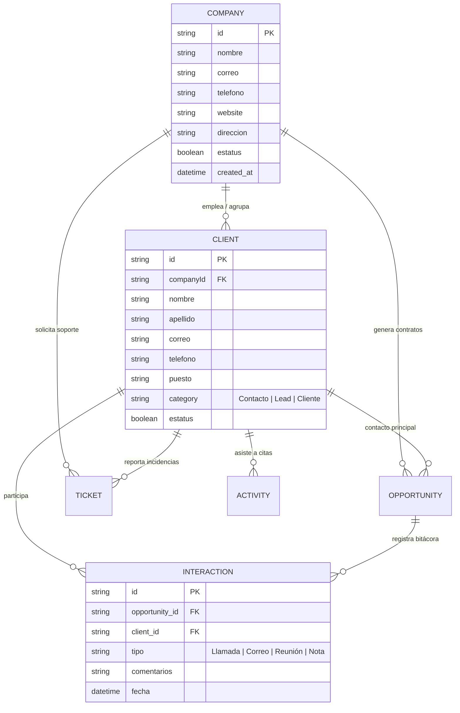

# 👥 CRM TIBS — Módulo de Clientes, Empresas & CRM

Este documento detalla la gestión de cuentas corporativas (**Empresas**) y contactos individuales (**Clientes**) en el modelo de ventas B2B de **CRM TIBS App**, la nueva **Arquitectura Modular por Capas** implementada bajo el estándar unificado de configuración (TanStack Table, Yup, FormField, banners de KPI y guards de ciclo de vida), el seguimiento cronológico de la bitácora de interacciones y su interconexión con el Pipeline y Helpdesk.

---

## 🏛️ Modelo Relacional de Entidades CRM


```mermaid
erDiagram
    COMPANY ||--o{ CLIENT : "emplea / agrupa"
    COMPANY ||--o{ OPPORTUNITY : "genera contratos"
    COMPANY ||--o{ TICKET : "solicita soporte"

    CLIENT ||--o{ OPPORTUNITY : "contacto principal"
    CLIENT ||--o{ INTERACTION : "participa"
    CLIENT ||--o{ ACTIVITY : "asiste a citas"
    CLIENT ||--o{ TICKET : "reporta incidencias"

    OPPORTUNITY ||--o{ INTERACTION : "registra bitácora"

    COMPANY {
        string id PK
        string nombre
        string correo
        string telefono
        string website
        string direccion
        boolean estatus
        datetime created_at
    }

    CLIENT {
        string id PK
        string companyId FK
        string nombre
        string apellido
        string correo
        string telefono
        string puesto
        string category "Contacto | Lead | Cliente"
        boolean estatus
    }

    INTERACTION {
        string id PK
        string opportunity_id FK
        string client_id FK
        string tipo "Llamada | Correo | Reunión | Nota"
        string comentarios
        datetime fecha
    }
```

---

## 🏗️ Arquitectura Modular del Directorio Comercial (`src/pages/Clients/`)

Siguiendo el estándar de arquitectura modular implementado en el módulo de configuraciones (`src/pages/settings/`), el módulo de clientes y cuentas B2B ha sido desacoplado íntegramente bajo un directorio unificado que contiene dos submódulos autónomos (`contacts/` y `companies/`):

```
src/pages/Clients/
├── ClientsPage.tsx                  # Orquestador del módulo con control de sub-pestañas y guards
├── index.ts                         # Exportador barril principal
│
├── components/                      # Componentes compartidos del contenedor
│   └── ClientsNavTabs.tsx           # Conmutador visual estilizado ("Contactos" vs "Empresas") con contadores
│
├── contacts/                        # 👤 SUBMÓDULO DE CONTACTOS (Personas)
│   ├── components/
│   │   ├── ContactsStatsBanner.tsx  # KPIs: Total Contactos, Activos, Con Empresa, Sin Asignar
│   │   ├── ContactsTable.tsx        # Tabla TanStack Table (@tanstack/react-table) con buscador y filtros
│   │   ├── ContactModal.tsx         # Modal contenedor responsive
│   │   └── ContactForm.tsx          # Formulario reactivo con Yup, FormField, CreatableSelect y touched/errors
│   ├── schemas/
│   │   └── contacts.schema.ts       # Esquema Yup (contactValidationSchema), ContactFormData, Filtros y KPIs
│   └── utils/
│       ├── contacts.columns.tsx     # ColumnDef<Client> con avatar, categoría cromática y acciones
│       └── contacts.helpers.ts      # validateContactForm (Yup async runner), calculateContactStats, filterContacts
│
└── companies/                       # 🏢 SUBMÓDULO DE EMPRESAS (Cuentas B2B)
    ├── components/
    │   ├── CompaniesStatsBanner.tsx # KPIs: Total Cuentas, Activas, Con Contactos, Inactivas
    │   ├── CompaniesTable.tsx       # Tabla TanStack Table con buscador, estado y acciones
    │   ├── CompanyModal.tsx         # Modal contenedor responsive
    │   └── CompanyForm.tsx          # Formulario reactivo con Yup, FormField, TextArea y touched/errors
    ├── schemas/
    │   └── companies.schema.ts      # Esquema Yup (companyValidationSchema), CompanyFormData, Filtros y KPIs
    └── utils/
        ├── companies.columns.tsx    # ColumnDef<Company> con razón social, website clicable y acciones
        └── companies.helpers.ts     # validateCompanyForm (Yup async runner), calculateCompanyStats, filterCompanies
```

---

## 👤 1. Submódulo de Contactos (`src/pages/Clients/contacts/`)

El catálogo de personas individuales y tomadores de decisiones opera a través de [`clientsService.ts`](file:///c:/Users/sopor/Proyectos/CRM/crm-tibs-app/src/services/clientsService.ts):

* **Validación Declarativa con Yup (`contacts.schema.ts`):**
  - Esquema estricto `contactValidationSchema` que verifica obligatoriedad y límites de nombre, apellido, correo electrónico corporativo válido, teléfono mediante regex internacional, puesto de trabajo y categoría (`Contacto | Lead | Cliente`).
  - Runner asíncrono puro `validateContactForm` que devuelve los errores agrupados en `Record<string, string>`.
* **Indicadores Métricos KPI (`ContactsStatsBanner.tsx`):**
  - **Total de Contactos:** Número total de registros en la base de datos.
  - **Contactos Activos:** Disponibles para citas, tareas y asignación comercial.
  - **Vinculados a Empresa:** Contactos agrupados bajo una cuenta B2B matriz.
  - **Independientes:** Contactos sin cuenta empresarial asociada.
* **Tabla TanStack (`ContactsTable.tsx` & `contacts.columns.tsx`):**
  - Avatar generado dinámicamente con las iniciales del contacto y diseño cromático según estado.
  - Insignia de categoría (`Badge`) con variaciones cromáticas (`success` para Cliente, `warning` para Lead, `info` para Contacto).
  - Paginación interna integrada, sticky headers, buscador libre y filtros de categoría y estado activo/inactivo.
  - Inyección de dependencias de catálogo (`companies` y `executives`) pasadas limpiamente por props desde el orquestador, evitando consultas de red redundantes.

---

## 🏢 2. Submódulo de Cuentas B2B / Empresas (`src/pages/Clients/companies/`)

El catálogo de organizaciones corporativas opera a través de [`companiesService.ts`](file:///c:/Users/sopor/Proyectos/CRM/crm-tibs-app/src/services/companiesService.ts):

* **Validación Declarativa con Yup (`companies.schema.ts`):**
  - Esquema estricto `companyValidationSchema` que audita razón social o nombre comercial (2 a 120 caracteres), correo general válido, formato de conmutador telefónico, longitud de sitio web y dirección fiscal.
  - Runner asíncrono puro `validateCompanyForm`.
* **Indicadores Métricos KPI (`CompaniesStatsBanner.tsx`):**
  - **Total Empresas B2B:** Volumen total de cuentas dadas de alta.
  - **Cuentas Activas:** Empresas habilitadas para cotizaciones y pipeline.
  - **Con Contactos:** Cuentas con nómina de asesores o interlocutores asignados.
  - **Suspendidas / Inactivas:** Cuentas temporalmente deshabilitadas.
* **Tabla TanStack (`CompaniesTable.tsx` & `companies.columns.tsx`):**
  - Identificación con icono corporativo violeta y desglose de dirección fiscal.
  - Contador reactivo de contactos asociados (`X contactos`).
  - Enlace externo interactivo para navegación inmediata hacia el sitio web oficial.
  - Conmutador reactivo de estado activo/suspendido con modal de confirmación ([`ConfirmModal.tsx`](file:///c:/Users/sopor/Proyectos/CRM/crm-tibs-app/src/components/shared/ConfirmModal.tsx)).

---

## ⚡ 3. Orquestador y Ciclo de Vida (`ClientsPage.tsx`)

* **Guards de Red (`useRef`):**
  - Emplea `isFetchingRef` para prevenir peticiones redundantes o simultáneas provocadas por el montaje dual en React 19 y StrictMode.
* **Sincronización de URL:**
  - Detecta y actualiza el query param `?tab=contacts` o `?tab=companies` para permitir enlaces directos y persistencia al recargar.
* **Retrocompatibilidad Total:**
  - [`ClientsPage.tsx`](file:///c:/Users/sopor/Proyectos/CRM/crm-tibs-app/src/pages/ClientsPage.tsx) y [`CompaniesPage.tsx`](file:///c:/Users/sopor/Proyectos/CRM/crm-tibs-app/src/pages/CompaniesPage.tsx) delegan directamente en el nuevo orquestador modular sin alterar las rutas existentes en [`App.tsx`](file:///c:/Users/sopor/Proyectos/CRM/crm-tibs-app/src/App.tsx).

---

## 📝 4. Bitácora de Interacciones (`InteractionsTab.tsx`)

A través de [`interactionsService.ts`](file:///c:/Users/sopor/Proyectos/CRM/crm-tibs-app/src/services/interactionsService.ts), los ejecutivos registran el historial de puntos de contacto:
1. **Llamadas Telefónicas:** Acuerdos y compromisos verbales.
2. **Correos Enviados:** Seguimientos a propuestas y cotizaciones.
3. **Reuniones Presenciales o Virtuales:** Minutas de acuerdos.
4. **Notas Internas Privadas:** Información de contexto confidencial sobre el cliente.

---

## 🔗 Enlaces Relacionados
* [[CRM TIBS APP]] — Hub Maestro.
* [[CRM TIBS - Tablero Kanban & Pipeline Comercial]] — Oportunidades vinculadas a clientes.
* [[CRM TIBS - Mesa de Ayuda, Tickets & Helpdesk]] — Tickets de soporte asociados a empresas.
* [[CRM TIBS - Centro de Configuracion, Tenants & Roles]] — Arquitectura modular de referencia.
