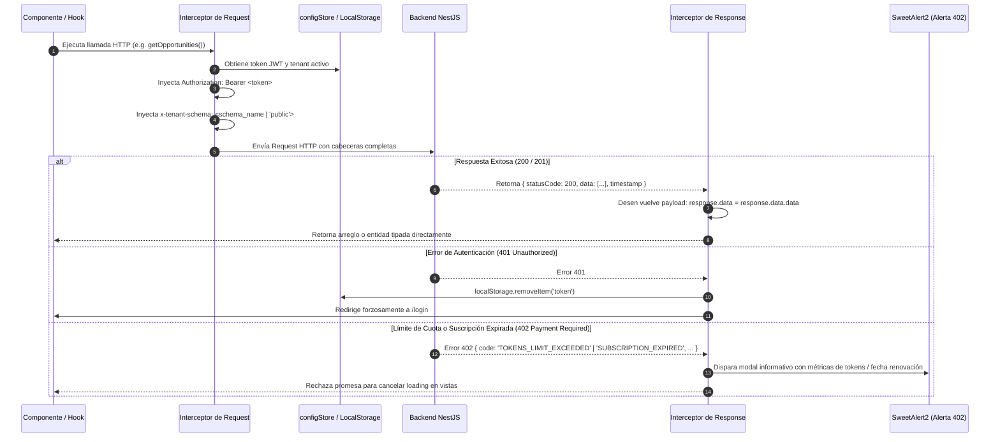

# 🏢 CRM TIBS — Multi-Tenancy, Axios & Interceptores

Este documento detalla la implementación del aislamiento **Multi-Tenancy por esquema de base de datos** en el frontend, el funcionamiento del cliente HTTP singleton [`axiosInstance`](file:///c:/Users/sopor/Proyectos/CRM/crm-tibs-app/src/core/axios/axiosInstance.ts) y los interceptores que gobiernan la inyección de credenciales y la captura de errores en [`src/core/axios/interceptors.ts`](file:///c:/Users/sopor/Proyectos/CRM/crm-tibs-app/src/core/axios/interceptors.ts).

---

## 🔄 Ciclo de Vida del Interceptor Axios



---

## 💉 1. Inyección de Esquema Multi-Tenant (`x-tenant-schema`)

En la arquitectura de base de datos de CRM TIBS, cada empresa cliente habita en un **esquema PostgreSQL independiente** (e.g. `tenant_acme`, `tenant_corporativo_mx`), mientras que los usuarios globales y el control de inquilinos residen en el esquema `public`.

En [`interceptors.ts`](file:///c:/Users/sopor/Proyectos/CRM/crm-tibs-app/src/core/axios/interceptors.ts), el interceptor de solicitud se encarga de determinar qué esquema debe atender la consulta:

```typescript
// Fragmento de src/core/axios/interceptors.ts
axiosInstance.interceptors.request.use(
    config => {
        const token = localStorage.getItem('token');
        if (token) {
            config.headers['Authorization'] = `Bearer ${token}`;
        }

        // Inyectar el esquema del tenant seleccionado
        const selectedTenant = configStore.getSelectedTenant();
        if (selectedTenant && selectedTenant.schema_name) {
            config.headers['x-tenant-schema'] = selectedTenant.schema_name;
        } else {
            config.headers['x-tenant-schema'] = 'public';
        }

        return config;
    },
    error => Promise.reject(error)
);
```

> [!NOTE]
> Cuando un usuario con rol `superadmin` utiliza el selector de inquilino [`TenantSelector.tsx`](file:///c:/Users/sopor/Proyectos/CRM/crm-tibs-app/src/components/Settings/TenantSelector.tsx), el cambio impacta inmediatamente a `configStore`. En la siguiente llamada HTTP, el interceptor inyecta el nuevo `schema_name`, conmutando de forma instantánea el contexto de datos sin recargar la aplicación.

---

## 🎁 2. Desempaquetado Automático de Payloads NestJS

El backend utiliza un filtro/interceptor global que envuelve las respuestas en el formato:
```json
{
  "statusCode": 200,
  "data": { ... },
  "timestamp": "2026-09-08T12:00:00.000Z"
}
```

Para evitar que los servicios tengan que acceder repetitivamente a `response.data.data`, el interceptor de respuesta normaliza el objeto:

```typescript
axiosInstance.interceptors.response.use(
    response => {
        if (response.data && typeof response.data === 'object' && 'data' in response.data && 'statusCode' in response.data && 'timestamp' in response.data) {
            response.data = response.data.data;
        }
        return response;
    },
    error => { ... }
);
```

---

## 🚨 3. Gestión Resiliente de Errores Globales

### Código HTTP 401 (Sesión Caducada)
Si el token JWT expira o es revocado:
1. Se limpia el almacenamiento local: `localStorage.removeItem('token')`.
2. Se evalúa `window.location.pathname`: si el usuario no está en `/login`, es redirigido automáticamente a la pantalla de acceso.

### Código HTTP 402 (Límites de Tokens y Suscripción)
CRM TIBS incorpora un modelo de facturación basado en cuota de tokens para llamadas a modelos de IA. Cuando un tenant agota su capacidad o expira su periodo de facturación, el backend rechaza la petición con código 402 y un detalle estructurado:

```typescript
if (code === 'TOKENS_LIMIT_EXCEEDED') {
    Swal.fire({
        icon: 'warning',
        title: 'Límite de Tokens Alcanzado',
        html: `
          <p class="text-slate-600 mb-3">${message}</p>
          <div class="bg-amber-50 border border-amber-200 rounded-xl p-3 text-left text-xs font-mono">
            <p><strong>Consumidos:</strong> ${detail.tokens_used?.toLocaleString() || 0} tokens</p>
            <p><strong>Límite Asignado:</strong> ${detail.tokens_limit?.toLocaleString() || 0} tokens</p>
            <p><strong>Renovación:</strong> ${detail.next_renewal_date ? new Date(detail.next_renewal_date).toLocaleDateString() : 'N/A'}</p>
          </div>
        `,
        confirmButtonText: 'Entendido',
        confirmButtonColor: '#f59e0b',
    });
} else if (code === 'SUBSCRIPTION_EXPIRED') {
    Swal.fire({
        icon: 'error',
        title: 'Suscripción Expirada',
        text: message,
        confirmButtonText: 'Aceptar',
        confirmButtonColor: '#ef4444',
    });
}
```

---

## 🔗 Enlaces Relacionados
* [[CRM TIBS APP]] — Hub Maestro.
* [[CRM TIBS - Autenticacion, JWT & Protected Routes]] — Generación y decodificación del token.
* [[CRM TIBS - Centro de Configuracion, Tenants & Roles]] — Panel de control de esquemas e inquilinos.
* [[Matriz de Servicios y Hooks API]] — Servicios que dependen de `axiosInstance`.
