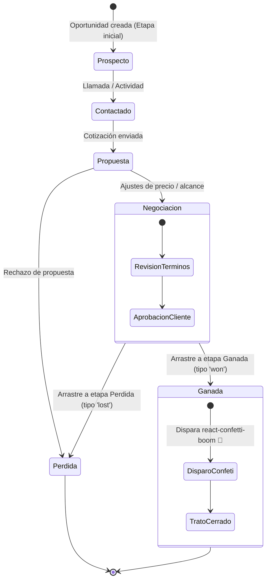

# 📊 CRM TIBS — Tablero Kanban & Pipeline Comercial

Este documento analiza en profundidad el funcionamiento del **embudo comercial (Pipeline)**, la implementación técnica del arrastre y soltado (**Drag & Drop**) con [`@dnd-kit`](file:///c:/Users/sopor/Proyectos/CRM/crm-tibs-app/src/hooks/usePipeline.ts), la semántica de etapas de venta, la animación celebratoria de tratos ganados y los mecanismos de sincronización y exportación a PDF.

---

## 🔄 Máquina de Estados del Flujo Comercial



---

## 🎯 1. Arquitectura de Arrastre y Soltado con `@dnd-kit`

En [`src/hooks/usePipeline.ts`](file:///c:/Users/sopor/Proyectos/CRM/crm-tibs-app/src/hooks/usePipeline.ts), se configuran los sensores de interacción optimizados tanto para mouse como para pantallas táctiles móviles:

```typescript
const sensors = useSensors(
  useSensor(PointerSensor, { activationConstraint: { distance: 5 } }),
  useSensor(TouchSensor, { activationConstraint: { delay: 250, tolerance: 5 } })
);
```

### Prevención de Conflictos de Clic y Scroll:
* **`distance: 5`**: Requiere que el puntero se desplace al menos 5 píxeles antes de activar el estado de arrastre, evitando que un simple clic para abrir el modal de edición se confunda con un movimiento de columna.
* **`delay: 250` en Touch:** Otorga un cuarto de segundo de tolerancia en dispositivos táctiles, permitiendo que el usuario haga scroll vertical sin desplazar accidentalmente una tarjeta de trato.

---

## 🏆 2. Etapas Semánticas y Animación Celebratoria

Cada etapa (`Stage`) posee un atributo semántico que define su comportamiento en el sistema:
1. **`open` (En Proceso):** Etapa comercial viva (e.g. *Prospección*, *Demostración*, *Propuesta*). Contabiliza en el pronóstico ponderado del dashboard.
2. **`won` (Ganada / Cierre Exitoso):**
   * Al soltar una tarjeta en una etapa con esta marca, el hook detecta la transición de estado.
   * Se dispara la animación de confeti en pantalla completa mediante [`react-confetti-boom`](file:///c:/Users/sopor/Proyectos/CRM/crm-tibs-app/package.json), reforzando positivamente la gamificación del equipo de ventas.
3. **`lost` (Perdida / Descartada):** Mueve la oportunidad fuera del flujo activo y solicita opcionalmente el motivo de descarte.

---

## 🎛️ 3. Modos de Vista y Persistencia de Preferencias

El hook proporciona soporte nativo para dos perspectivas visuales gobernadas por el usuario:
* **Vista Kanban (`viewMode === 'kanban'`):** Columnas paralelas con scroll horizontal, totales de cartera por etapa y colapso visual de columnas poco transitadas (`foldedStageIds`).
* **Vista Tabla / Lista (`viewMode === 'list'`):** Listado denso con paginación de servidor, ordenación por fecha de cierre y acceso rápido a edición.

Ambas preferencias se sincronizan automáticamente en el navegador:
* `localStorage.setItem('pipeline_view_mode', viewMode)`
* `localStorage.setItem('pipeline_folded_stages', JSON.stringify(foldedStageIds))`

---

## 📄 4. Motor de Filtros y Exportación a PDF

[`usePipeline.ts`](file:///c:/Users/sopor/Proyectos/CRM/crm-tibs-app/src/hooks/usePipeline.ts) normaliza la búsqueda ignorando tildes y mayúsculas mediante la función auxiliar:

```typescript
export const normalizeSearchText = (text?: string | null): string => {
  if (!text) return '';
  return text.normalize('NFD').replace(/[\u0300-\u036f]/g, '').toLowerCase().trim();
};
```

### Exportación Dinámica con jsPDF:
El pipeline permite generar reportes ejecutivos en formato PDF con [`jspdf`](file:///c:/Users/sopor/Proyectos/CRM/crm-tibs-app/package.json) y [`jspdf-autotable`](file:///c:/Users/sopor/Proyectos/CRM/crm-tibs-app/package.json), extrayendo los contactos asociados (`getAllOpportunityContacts`), empresa, ejecutivo a cargo, moneda y etapa comercial activa en un documento listo para impresión o auditoría.

---

## 🔗 Enlaces Relacionados
* [[CRM TIBS APP]] — Hub Maestro.
* [[CRM TIBS - Modulo de Clientes, Empresas & CRM]] — Datos de contactos y cuentas vinculadas.
* [[CRM TIBS - Cotizaciones PDF & Modulo de Productos]] — Cotizaciones y precios que nutren el monto del trato.
* [[CRM TIBS - Dashboard, Analitica & Reportes]] — Métricas agregadas de conversión y embudo.
