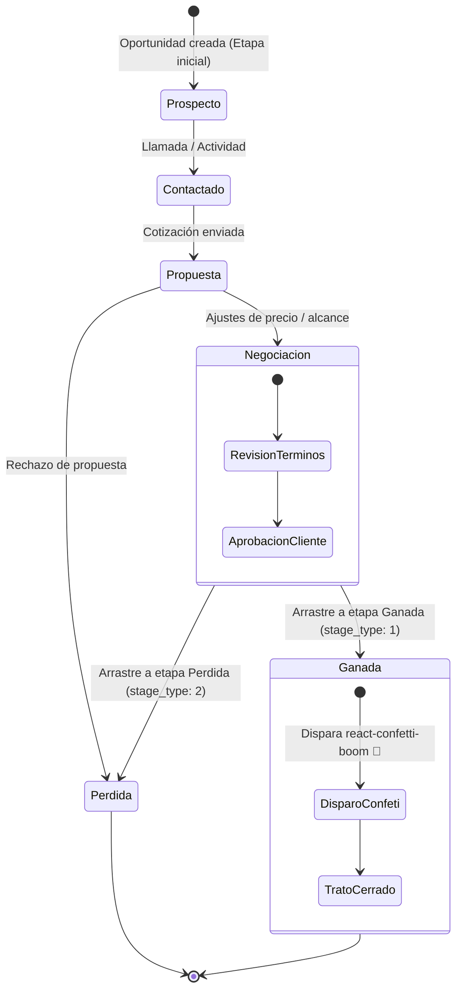

# 📊 CRM TIBS — Tablero Kanban & Pipeline Comercial

Este documento analiza en profundidad el funcionamiento del **embudo comercial (Pipeline)** de **CRM TIBS App**, su **Arquitectura Modular por Capas** homologada bajo el estándar de diseño limpio implementado en Actividades (`src/pages/Activities/`), Clientes (`src/pages/Clients/`) y Conversaciones (`src/pages/Conversations/`), la implementación técnica del arrastre y soltado (**Drag & Drop**) con [`@dnd-kit`](file:///c:/Users/sopor/Proyectos/CRM/crm-tibs-app/src/pages/Pipeline/hooks/usePipeline.ts), la validación declarativa con **Yup**, la integración tabular con **TanStack Table**, la animación celebratoria de tratos ganados y los mecanismos de sincronización en tiempo real vía WebSockets (`/pipelines`).

---

## 🏗️ Arquitectura Modular del Módulo de Pipeline (`src/pages/Pipeline/`)

Siguiendo el estándar desacoplado implementado en el CRM (homologado con `ActivitiesPage` y `ClientsPage`), la orquestación reside directamente en `PipelinePage.tsx`, eliminando contenedores intermediarios innecesarios y organizando los subcomponentes agrupados por **secciones funcionales en subcarpetas** (`kanban/`, `table/`, `toolbar/`, `modals/`):

```
src/pages/Pipeline/
├── PipelinePage.tsx                         # Orquestador maestro del módulo (integra usePipeline, Toolbar, vistas Kanban/Tabla y modales)
├── index.ts                                 # Exportador barril principal con nombres funcionales y compatibilidad total
│
├── components/                              # Componentes modulares organizados por dominios funcionales
│   ├── toolbar/                             # Cabecera, filtros rápidos y navegación de vistas
│   │   ├── PipelineToolbar.tsx              # Cabecera homologada en tarjeta con icono Kanban, UnifiedSearchBar, filtros y acciones
│   │   └── PipelineViewTabs.tsx             # Conmutador visual estilizado de sub-vistas ("Tablero Kanban" vs "Vista Tabla")
│   │
│   ├── kanban/                              # Tablero comercial Drag & Drop (@dnd-kit)
│   │   ├── PipelineKanbanView.tsx           # Vista general del tablero Kanban con SortableContext horizontal y creación de etapa
│   │   ├── PipelineKanbanColumn.tsx         # Columna individual Kanban con métricas acumuladas, semáforo de días y colapso
│   │   ├── OpportunityKanbanCard.tsx        # Tarjeta arrastrable del trato con empresa/contacto, monto, prioridad y menú contextual
│   │   └── OpportunityCardPopover.tsx       # Popover flotante en portal con detalles rápidos de la oportunidad
│   │
│   ├── table/                               # Perspectiva tabular comercial
│   │   └── PipelineTableView.tsx            # Vista tabular TanStack Table (@tanstack/react-table variante 'cards') con paginación
│   │
│   └── modals/                              # Gestor de modales, formularios, pestañas y drawers
│       ├── PipelineModalsManager.tsx        # Gestor centralizado de modales (creación/edición, eliminación y drawers)
│       ├── OpportunityForm.tsx              # Formulario reactivo validado con Yup (opportunityValidationSchema) y cálculo de productos
│       ├── OpportunityFilesTab.tsx          # Pestaña de archivos adjuntos y documentos del trato con subida, preview y descarga
│       ├── OpportunityInteractionsTab.tsx   # Pestaña de historial y notas del trato con creación reactiva y búsqueda
│       ├── PipelineStagesSettingsDrawer.tsx # Drawer lateral deslizable para configuración de etapas (reordenamiento, límites)
│       └── PipelineCustomFilterModal.tsx    # Modal multi-regla para consultas avanzadas combinadas (AND / OR)
│
├── hooks/                                   # Hooks modulares del ciclo de vida y sockets
│   └── usePipeline.ts                       # Orquestador del socket (/pipelines), sincronización REST, sensores DnD, filtros, toast y CRUD
│
├── schemas/
│   └── pipeline.schema.ts                   # Esquemas Yup (opportunityValidationSchema, stageValidationSchema), tipos y filtros
│
└── utils/
    ├── pipeline.columns.tsx                 # ColumnDef<Opportunity>[] con badges de etapa semántica, montos, moneda y acciones
    └── pipeline.helpers.ts                  # Funciones puras: validateOpportunityForm, filterOpportunities, calculatePipelineStats, PDF/CSV
```

## 🔄 Máquina de Estados del Flujo Comercial


```mermaid
stateDiagram-v2
    [*] --> Prospecto: Oportunidad creada (Etapa inicial)
    Prospecto --> Contactado: Llamada / Actividad
    Contactado --> Propuesta: Cotización enviada
    Propuesta --> Negociacion: Ajustes de precio / alcance

    state Negociacion {
        [*] --> RevisionTerminos
        RevisionTerminos --> AprobacionCliente
    }

    Negociacion --> Ganada: Arrastre a etapa Ganada (stage_type: 1)
    Negociacion --> Perdida: Arrastre a etapa Perdida (stage_type: 2)
    Propuesta --> Perdida: Rechazo de propuesta

    state Ganada {
        [*] --> DisparoConfeti: Dispara react-confetti-boom 🎉
        DisparoConfeti --> TratoCerrado
    }

    Ganada --> [*]
    Perdida --> [*]
```

---

## 🎯 1. Arquitectura de Arrastre y Soltado con `@dnd-kit`

En [`src/pages/Pipeline/hooks/usePipeline.ts`](file:///c:/Users/sopor/Proyectos/CRM/crm-tibs-app/src/pages/Pipeline/hooks/usePipeline.ts), se configuran los sensores de interacción optimizados tanto para mouse como para pantallas táctiles móviles:

```typescript
const sensors = useSensors(
  useSensor(PointerSensor, { activationConstraint: { distance: 5 } }),
  useSensor(TouchSensor, { activationConstraint: { delay: 250, tolerance: 5 } })
);
```

### Prevención de Conflictos de Clic y Scroll:
* **`distance: 5`**: Requiere que el puntero se desplace al menos 5 píxeles antes de activar el estado de arrastre, evitando que un simple clic para abrir el modal de edición se confunda con un movimiento de columna.
* **`delay: 250` en Touch:** Otorga un cuarto de segundo de tolerancia en dispositivos táctiles, permitiendo que el usuario haga scroll vertical sin desplazar accidentalmente una tarjeta de trato.

---

## 🏆 2. Etapas Semánticas y Animación Celebratoria

Cada etapa (`Stage`) posee un atributo semántico (`stage_type`) que define su comportamiento en el sistema:
1. **`stage_type: 0` (Abierta / En Proceso):** Etapa comercial viva (e.g. *Prospección*, *Demostración*, *Propuesta*). Contabiliza en el pronóstico ponderado del dashboard.
2. **`stage_type: 1` (Ganada / Cierre Exitoso):**
   * Al soltar una tarjeta en una etapa con esta marca, el hook detecta la transición de estado.
   * Se dispara la animación de confeti en pantalla completa mediante [`react-confetti-boom`](file:///c:/Users/sopor/Proyectos/CRM/crm-tibs-app/package.json), reforzando positivamente la gamificación del equipo de ventas.
3. **`stage_type: 2` (Perdida / Cierre Perdido):** Mueve la oportunidad fuera del flujo activo y descuenta de la cartera activa.

---

## 🎛️ 3. Modos de Vista y Persistencia de Preferencias

El hook proporciona soporte nativo para dos perspectivas visuales gobernadas por el usuario:
* **Vista Kanban (`viewMode === 'kanban'`):** Columnas paralelas con scroll horizontal, totales de cartera por etapa y colapso visual de columnas poco transitadas (`foldedStageIds`).
* **Vista Tabla / Lista (`viewMode === 'list'`):** Vista tabular homologada construida sobre el componente compartido `Table` (`@tanstack/react-table` con variante `cards`). Ofrece filas con diseño de tarjeta, ordenamiento nativo por columnas (proyecto, cliente/empresa, ejecutivo, etapa, monto, moneda y estado), acordeón responsive en móvil (`hideOnMobile`) para desplegar detalles secundarios, badges de etapa con íconos de resolución (`Check` para ganada, `X` para perdida) y paginación desacoplada y centralizada.

Ambas preferencias se sincronizan automáticamente en el navegador:
* `localStorage.setItem('pipeline_view_mode', viewMode)`
* `localStorage.setItem('pipeline_folded_stages', JSON.stringify(foldedStageIds))`
* Sincronización en URL: `?view=kanban` o `?view=list`

---

## 📋 4. Tabla Homologada TanStack (`PipelineTableView.tsx` & `pipeline.columns.tsx`)

* Construida sobre el componente base compartido `Table` en variante `cards`.
* Definición de columnas fuertemente tipada con `ColumnDef<Opportunity>[]`.
* **Insignias de Etapa Semántica:** Muestra el color configurado para la etapa con ícono `Check` verde para tratos ganados y `X` rojo para tratos perdidos.
* **Celda de Monto Financiero:** Formateo automático de moneda según `moneda` (MXN o USD).
* **Acciones Integradas:** Archivar/desarchivar tratos con 1 clic, editar y eliminar con verificación de permisos `isAdmin`.

---

## ✅ 5. Validación Declarativa con Yup & Formulario Reactivo (`OpportunityForm.tsx`)

En `pipeline.schema.ts`, se define el esquema de integridad homologado bajo el mismo estándar de `ContactForm` y `CompanyForm` del módulo de clientes:
* **`opportunityValidationSchema`:**
  - Audita longitud del nombre del proyecto (mínimo 3, máximo 200 caracteres).
  - Obligatoriedad de descripción del proyecto.
  - Validación condicional de vinculación: Si `linkType === 'company'`, exige seleccionar una empresa (`companyId`); si `linkType === 'contact'`, exige seleccionar un contacto (`cliente_id`).
  - Asignación obligatoria de ejecutivo comercial a cargo (`ejecutivo_id`).
  - **Obligatoriedad de Clasificación Comercial:** Exige seleccionar una Línea de Negocio (`linea_negocio_id`) y un Tipo de Entrega (`tipo_entrega_id`), marcados con asterisco `*`.
  - Validación de moneda: Si `moneda === 'USD'`, exige tipo de cambio positivo mayor a 0 (`tipoCambio`).
  - Validación no negativa de importes (`monto_licenciamiento`, `monto_servicios`, `monto_total`).
* **Estándar Homologado con Módulo de Clientes (`OpportunityForm.tsx`):**
  - **Uso estricto de componentes compartidos:** Sustitución de inputs y textareas directos por el wrapper homologado `FormField` (`label`, `error`, `as="textarea"`, `inputPrefix`) y `Select`.
  - **Auto-selección por defecto en Clasificación:** Al cargar los catálogos en una oportunidad nueva o sin clasificar, se pre-selecciona automáticamente la primera opción activa de Línea de Negocio y Tipo de Entrega.
  - **Preservación estricta de `id`:** Garantiza la presencia del UUID de la oportunidad en mutaciones (`finalOpportunity.id = initialData?.id || opportunity.id`) para que `updateOpportunity` despache el `PATCH` REST correctamente.
  - **Sincronización reactiva con `initialData`:** Efecto `useEffect` que hidrata y refresca el formulario al alternar entre oportunidades, complementado con llaves (`key={editingOpportunity?.id}`) en el gestor de modales.
  - **Feedback visual estrictamente inline (sin toast prematuro):** Si la validación falla antes de enviar peticiones, no se disparan toasts (`showToast`). El feedback se despliega exclusivamente mediante las advertencias y bordes rojos de `FormField` y la vista realiza auto-scroll al primer campo inválido. Los toasts quedan reservados exclusivamente para el resultado de peticiones HTTP (éxito o error de red/servidor).
  - **Ciclo de vida `touched` & `handleBlur`:** Validación en tiempo real al desenfocar campos (`handleBlur` y `handleFinancialBlur`) mediante `validateOpportunityForm(values)`, revelando mensajes de error únicamente cuando el campo ha sido tocado (`touched[field] ? errors[field] : undefined`).
  - **Limpieza reactiva de errores:** Al tipear (`handleChange` / `handleCurrencyChange`), los errores del campo editado se descartan de inmediato.
  - **Conmutación defensiva de vinculación:** Al cambiar de 'Empresa' a 'Contacto Individual', se reinicia el estado `touched` y se purgan los errores del campo opuesto.

## 📄 6. Motor de Filtros y Exportación a PDF/CSV

[`pipeline.helpers.ts`](file:///c:/Users/sopor/Proyectos/CRM/crm-tibs-app/src/pages/Pipeline/utils/pipeline.helpers.ts) normaliza la búsqueda ignorando tildes y mayúsculas mediante la función auxiliar:

```typescript
export const normalizeSearchText = (text?: string | null): string => {
  if (!text) return '';
  return text.normalize('NFD').replace(/[\u0300-\u036f]/g, '').toLowerCase().trim();
};
```

### Exportación Dinámica con jsPDF y CSV:
* **PDF:** Genera reportes ejecutivos en formato apaisado con `jspdf` y `jspdf-autotable`.
* **CSV:** Genera hojas de cálculo con codificación UTF-8 BOM para apertura nativa en Microsoft Excel.

---

## ⚡ 7. Conexión WebSocket Resiliente (`/pipelines`)

* **Conexión & Aislamiento Multi-Tenant:** Conexión con `createAppSocket({ namespace: 'pipelines', query: { tenantSchema } })`.
* **Suscripción Reactiva de Sala (`set_tenant`):** En el evento `connect`, emite `set_tenant` para unirse dinámicamente a `tenant:${tenantSchema}`, con soporte backend completo en `PipelinesGateway` para roles SuperAdmin y esquemas `public`.
* **Eventos en Vivo:** Escucha reactiva de altas, ediciones y bajas: `opportunityCreated`, `opportunityUpdated`, `opportunityDeleted` y `pipelineUpdated`.
* **Reconexión Resiliente:** Re-sincronización defensiva del embudo tras microcortes de red (`fetchPipelineRef.current()`).
## 🧩 8. Estandarización Total con Componentes Compartidos (Design System)

Todos los subcomponentes del módulo de Pipeline han sido refactorizados para eliminar elementos HTML nativos sin estilar o ad-hoc, adoptando de forma uniforme el sistema de diseño compartido de `src/components/shared/*`:

* **`Button` (`src/components/shared/Button`):**
  * Utilizado con variantes semánticas `primary`, `secondary`, `indigo` e `icon`.
  * Integrado con spinners nativos mediante la prop `loading` en `PipelineStagesSettingsDrawer` (guardado de etapas), `OpportunityFilesTab` (subida y descarga de archivos) y `OpportunityForm`.
  * Menús contextuales y acciones de fila (`OpportunityKanbanCard`, `pipeline.columns.tsx`, `PipelineModalsManager` y `PipelineCustomFilterModal`) estandarizados con `variant="icon"`.
* **`Input` (`src/components/shared/Input`):**
  * Reemplazo de `<input>` estándar en `PipelineStagesSettingsDrawer` (nombre de etapa y días límite con clases utilitarias compactas `!py-1.5 !px-2.5 !rounded-lg`) y `PipelineCustomFilterModal` (búsqueda de contactos, importes y filtros de texto).
* **`Select` (`src/components/shared/Select`):**
  * Selector reactivo avanzado de `react-select` estilizado para tipos de cierre de etapa, ejecutivos y productos.
* **`Badge` (`src/components/shared/Badge`):**
  * Insignias semánticas con variantes `success`, `warning`, `indigo` y soporte `dot` en `pipeline.columns.tsx` (estado activo/archivado), `PipelineStagesSettingsDrawer` (etapa inicial) y `OpportunityForm` (contador de productos seleccionados).
* **`Modal` & `ConfirmModal` (`src/components/shared/Modal`, `ConfirmModal`):**
  * Modales accesibles y responsivos con backdrop difuminado para edición de etapas, confirmación de eliminación y filtros personalizados.
* **`Notification` (`src/components/shared/Notification`):**
  * Notificaciones de feedback del sistema compartidas para confirmaciones y advertencias en la gestión de archivos (`OpportunityFilesTab`).
## 🔗 Enlaces Relacionados
* [[CRM TIBS APP]] — Hub Maestro.
* [[CRM TIBS - Modulo de Clientes, Empresas & CRM]] — Datos de contactos y cuentas vinculadas.
* [[CRM TIBS - Calendario FullCalendar & Actividades]] — Actividades y citas vinculadas a oportunidades.
* [[CRM TIBS - Cotizaciones PDF & Modulo de Productos]] — Cotizaciones y precios que nutren el monto del trato.
* [[CRM TIBS - Dashboard, Analitica & Reportes]] — Métricas agregadas de conversión y embudo.
* [[Catalogo de Componentes y Vistas]] — Vistas y componentes del frontend.
* [[Matriz de Servicios y Hooks API]] — Servicios REST y WebSocket de oportunidades.
