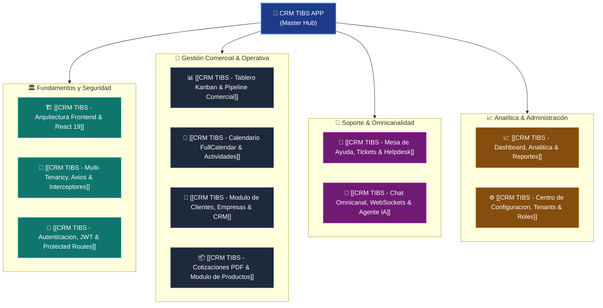

# 🚀 CRM TIBS APP — Hub Maestro de Arquitectura Frontend

**CRM TIBS APP** (también identificado como *Billy Sales & Services*) es la plataforma web de gestión de relaciones con clientes (CRM), administración de embudos comerciales B2B, calendario operativo, mesa de ayuda (Helpdesk) y consola de mensajería omnicanal en tiempo real asistida por Inteligencia Artificial. 

Diseñada como una Single Page Application (SPA) de alto desempeño con soporte para Progressive Web App (PWA), la aplicación opera bajo una arquitectura **Multi-Tenancy por esquema de base de datos PostgreSQL** aislada en el backend NestJS y gobernada de forma transparente en el frontend.

---

## 🗺️ Mapa de Módulos y Arquitectura Sistémica



---

## 🏗️ Resumen Ejecutivo del Stack Tecnológico

| Capa / Tecnología | Versión | Rol en el Proyecto |
| :--- | :--- | :--- |
| **Framework Base** | React 19.1.1 | Renderizado reactivo, concurrencia moderna y hooks de última generación. |
| **Herramienta de Build** | Vite 7.1.7 | Hot Module Replacement (HMR) ultrarrápido, compilación SWC y empaquetado optimizado. |
| **Lenguaje Tipado** | TypeScript 5.8.3 | Tipado estático estricto para modelos de datos, servicios, componentes y hooks. |
| **Enrutamiento** | React Router DOM 7.9.3 | Navegación declarativa SPA, control de sesión con `ProtectedRoute` y rutas públicas. |
| **Drag & Drop** | `@dnd-kit/core` + `@dnd-kit/sortable` | Motor de arrastre accesible para tableros Kanban en Pipeline y Helpdesk. |
| **Agenda & Calendario** | `@fullcalendar/react` 6.1.20 | Cuadrículas horarias, vistas mensual/semanal y sincronización OAuth con calendarios externos. |
| **Capa de Transporte HTTP** | Axios 1.12.2 | Cliente singleton con inyección automática de Bearer token y cabecera `x-tenant-schema`. |
| **Comunicación en Tiempo Real** | Socket.IO Client 4.8.3 | WebSockets sobre `/conversations` para chat en vivo y cambios de estado en tableros. |
| **Generación de Reportes** | jsPDF 4.2.1 + autotable 5.0.8 | Exportación estructurada de Pipeline, Tickets, Actividades y Dashboard en PDF. |
| **Alertas del Sistema** | SweetAlert2 11.23.0 | Modales reactivos ante eventos de negocio y errores 402 (cuota de tokens / expiración). |
| **Capacidades Offline/PWA** | `vite-plugin-pwa` 1.3.0 | Manifiesto web (`manifest.json`), service worker Workbox y caché de activos estáticos. |

---

## 📂 Topología de Directorios del Código Fuente (`src/`)

```
src/
├── assets/                  # Iconografía y recursos estáticos SVG/PNG
├── components/              # Componentes de interfaz divididos por dominio funcional
│   ├── Activity/            # Calendario FullCalendar, modales de cita y popovers
│   ├── ActivityType/        # Ajustes y formularios de tipos cromáticos de actividad
│   ├── Client/              # Formulario y tabla de contactos de clientes
│   ├── Company/             # Gestión de empresas B2B
│   ├── Dashboard/           # Tarjetas KPI, gráficas de ventas y plantilla PDF
│   ├── Expense/             # Gestión de gastos corporativos y recibos
│   ├── Files/               # Pestaña de archivos adjuntos
│   ├── Helpdesk/            # Tablero Kanban de soporte, cron de SLAs y detalle de ticket
│   ├── Interaction/         # Bitácora de seguimiento de oportunidades
│   ├── Layout/              # Contenedor con barra lateral y superior unificada
│   ├── Loader/              # Indicadores visuales de carga de página
│   ├── Login/               # Pantallas de bienvenida, formulario y webchat público
│   ├── Modal/               # Modales de confirmación y notificaciones
│   ├── Navbar/              # Barra superior con selector de tenant, decoraciones estacionales
│   ├── OpportunityLabel/    # Etiquetas comerciales personalizadas
│   ├── Pipeline/            # Tablero comercial, tarjetas de trato y filtros avanzados
│   ├── Product/             # Catálogo de productos y notas para el agente de IA
│   ├── Reminder/            # Recordatorios de seguimiento comercial
│   ├── Settings/            # Pestañas de configuración, OAuth de calendarios y planes
│   ├── shared/              # Sistema de diseño (Button, Input, Table, Dropzone, Tabs, Modal)
│   ├── Sidebar/             # Menú de navegación principal con animaciones colapsables
│   ├── User/                # Formularios de alta y administración de ejecutivos
│   └── WebChat/             # Centro de mensajería omnicanal y simulador de prospectos
├── core/                    # Núcleo de la aplicación
│   ├── axios/               # Instancia singleton e interceptores request/response
│   ├── guards/              # ProtectedRoute y validaciones de rol de acceso
│   └── models/              # Modelos TypeScript e interfaces de negocio
├── global/                  # Definición centralizada de endpoints REST (`endpoints.ts`)
├── hooks/                   # 13 custom hooks de lógica de negocio y tiempo real
├── pages/                   # 15 vistas de ruta principales
├── services/                # 23 clientes de servicio HTTP organizados por dominio
├── store/                   # Estado global liviano (`useConfigStore.ts`)
└── utils/                   # Utilidades de formateo de moneda, fechas y renderizado de chat
```

---

## ⚙️ Variables de Entorno y Proxy en Desarrollo

La configuración de conexión se define mediante un archivo [`.env`](file:///c:/Users/sopor/Proyectos/CRM/crm-tibs-app/.env):

```bash
VITE_BASE_URL=http://localhost:3091
```

En [`vite.config.ts`](file:///c:/Users/sopor/Proyectos/CRM/crm-tibs-app/vite.config.ts), se configuran proxies transparentes hacia el backend NestJS (puerto `3091`):
* `/api` $\rightarrow$ Enruta llamadas REST (`http://127.0.0.1:3091/api`).
* `/socket.io` $\rightarrow$ Permite actualización bidireccional WebSocket con soporte `ws: true`.
* `/uploads` $\rightarrow$ Sirve archivos estáticos (fotografías de perfil, recibos y fichas técnicas).

---

## 🔍 Diagnóstico de Deuda Técnica y Buenas Prácticas

> [!NOTE]
> **Puntos Fuertes:**
> 1. **Modularidad estricta:** La separación entre servicios HTTP (`src/services/`), custom hooks (`src/hooks/`) y componentes visuales (`src/components/`) desacopla la lógica de renderizado del transporte de datos.
> 2. **Multi-Tenancy transparente:** El interceptor de Axios extrae automáticamente el esquema seleccionado en `useConfigStore` y lo inyecta en la cabecera `x-tenant-schema`, evitando que cada componente deba preocuparse por el inquilino activo.
> 3. **Gestión unificada de errores 402:** SweetAlert2 informa de manera clara y atractiva cuando una empresa ha agotado sus tokens de IA o cuando la suscripción SaaS ha expirado.

> [!WARNING]
> **Oportunidades de Mejora / Deuda Técnica:**
> 1. **Tipado `any` en servicios de mensajería:** En [`conversationsService.ts`](file:///c:/Users/sopor/Proyectos/CRM/crm-tibs-app/src/services/conversationsService.ts) y [`useConversationsSocket.ts`](file:///c:/Users/sopor/Proyectos/CRM/crm-tibs-app/src/hooks/useConversationsSocket.ts), muchas firmas retornan `Promise<any[]>`. Se recomienda crear interfaces formales como `ConversationItem` y `ChatMessageItem` en `src/core/models/Conversation.ts`.
> 2. **Cache de datos en memoria:** Varios servicios implementan flags manuales `forceRefresh` con variables de módulo (`cachedOpportunities`, `cachedPipelines`). Sería conveniente migrar a una biblioteca de caché de servidor consolidada como TanStack Query v5 para invalidación automática y deduplicación de consultas.

---

## 🔗 Navegación y Enlaces Relacionados
* [[MOC - Mapa de Contenidos Frontend]] — Mapa de contenidos general.
* [[Guia de Contexto para Agentes de IA (MCP Retrieval)]] — Guía de búsqueda para agentes inteligentes.
* [[Catalogo de Componentes y Vistas]] — Inventario de vistas y componentes UI.
* [[Matriz de Servicios y Hooks API]] — Detalle de servicios y custom hooks.
