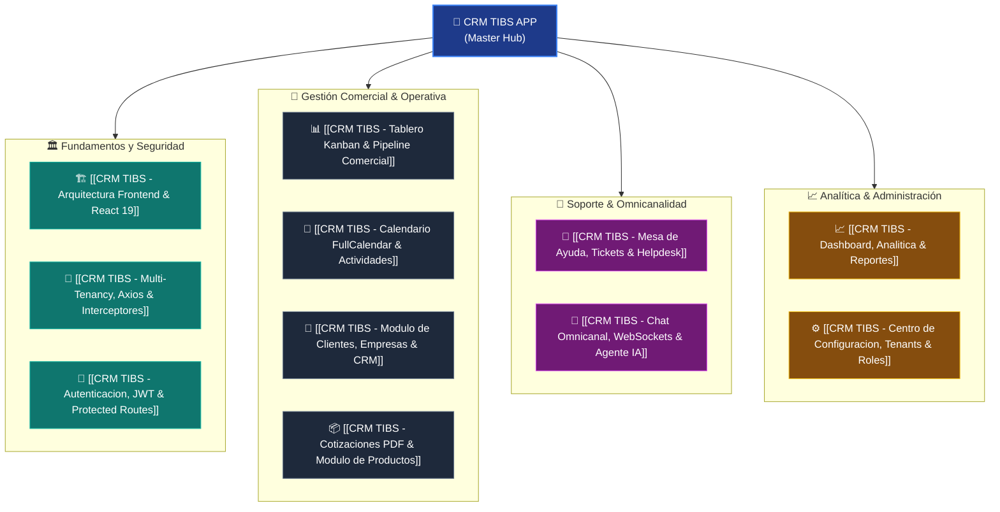

# 🚀 CRM TIBS APP — Hub Maestro de Arquitectura Frontend

**CRM TIBS APP** (también identificado como _Billy Sales & Services_) es la plataforma web de gestión de relaciones con clientes (CRM), administración de embudos comerciales B2B, calendario operativo, mesa de ayuda (Helpdesk) y consola de mensajería omnicanal en tiempo real asistida por Inteligencia Artificial.

Diseñada como una Single Page Application (SPA) de alto desempeño con soporte para Progressive Web App (PWA), la aplicación opera bajo una arquitectura **Multi-Tenancy por esquema de base de datos PostgreSQL** aislada en el backend NestJS y gobernada de forma transparente en el frontend.

---

## 🗺️ Mapa de Módulos y Arquitectura Sistémica


```mermaid
graph TD
    HUB["🚀 CRM TIBS APP<br/>(Master Hub)"]

    subgraph Fundamentos ["🏛️ Fundamentos y Seguridad"]
        ARC["🏗️ [[CRM TIBS - Arquitectura Frontend & React 19]]"]
        TEN["🏢 [[CRM TIBS - Multi-Tenancy, Axios & Interceptores]]"]
        SEC["🔐 [[CRM TIBS - Autenticacion, JWT & Protected Routes]]"]
    end

    subgraph ModulosComerciales ["💼 Gestión Comercial & Operativa"]
        PIP["📊 [[CRM TIBS - Tablero Kanban & Pipeline Comercial]]"]
        CAL["📅 [[CRM TIBS - Calendario FullCalendar & Actividades]]"]
        CRM["👥 [[CRM TIBS - Modulo de Clientes, Empresas & CRM]]"]
        PRO["📦 [[CRM TIBS - Cotizaciones PDF & Modulo de Productos]]"]
    end

    subgraph SoporteYComunicacion ["💬 Soporte & Omnicanalidad"]
        HEL["🎫 [[CRM TIBS - Mesa de Ayuda, Tickets & Helpdesk]]"]
        CHA["💬 [[CRM TIBS - Chat Omnicanal, WebSockets & Agente IA]]"]
    end

    subgraph InteligenciaYControl ["📈 Analítica & Administración"]
        DAS["📈 [[CRM TIBS - Dashboard, Analitica & Reportes]]"]
        CON["⚙️ [[CRM TIBS - Centro de Configuracion, Tenants & Roles]]"]
    end

    HUB --> Fundamentos
    HUB --> ModulosComerciales
    HUB --> SoporteYComunicacion
    HUB --> InteligenciaYControl

    classDef hub fill:#1e3a8a,stroke:#3b82f6,stroke-width:2px,color:#fff;
    classDef arch fill:#0f766e,stroke:#14b8a6,stroke-width:1px,color:#fff;
    classDef biz fill:#1e293b,stroke:#64748b,stroke-width:1px,color:#fff;
    classDef sup fill:#701a75,stroke:#d946ef,stroke-width:1px,color:#fff;
    classDef adm fill:#854d0e,stroke:#eab308,stroke-width:1px,color:#fff;

    class HUB hub;
    class ARC,TEN,SEC arch;
    class PIP,CAL,CRM,PRO biz;
    class HEL,CHA sup;
    class DAS,CON adm;
```

---

## 🏗️ Resumen Ejecutivo del Stack Tecnológico

| Capa / Tecnología          | Versión                                            | Rol en el Proyecto                                                                                                    |
| :------------------------- | :------------------------------------------------- | :-------------------------------------------------------------------------------------------------------------------- |
| **Framework Base**         | React 19.1.1                                       | Renderizado reactivo, concurrencia moderna y hooks de última generación.                                              |
| **Herramienta de Build**   | Vite 7.1.7                                         | HMR ultrarrápido, compilación SWC, proxy transparente y empaquetado optimizado.                                       |
| **Lenguaje Tipado**        | TypeScript 5.8.3                                   | Tipado estático estricto en modelos, servicios, componentes y hooks.                                                  |
| **Enrutamiento**           | React Router DOM 7.9.3                             | Navegación declarativa SPA, `ProtectedRoute` y rutas públicas.                                                        |
| **Estilos**                | TailwindCSS 3.4.1 + `@tailwindcss/vite` 4.1.x      | Utilidades CSS con integración directa en el pipeline de Vite. Sass disponible vía `sass-embedded`.                   |
| **Tablas Avanzadas**       | `@tanstack/react-table` 8.21.3                     | Motor de tablas headless para vistas de datos complejas (paginación, filtros, ordenamiento, filas sticky de totales). |
| **Validación de Esquemas** | `yup` 1.7.1                                        | Validación declarativa de formularios y contratos de datos de API.                                                    |
| **Select Avanzado**        | `react-select` 5.10.2                              | Componente de selección con búsqueda, multi-selección y personalización visual.                                       |
| **Decodificación JWT**     | `jwt-decode` 4.0.0                                 | Extracción de claims del token de sesión sin dependencias de servidor.                                                |
| **Drag & Drop**            | `@dnd-kit/core` 6.3.1 + `@dnd-kit/sortable` 10.0.0 | Motor de arrastre accesible para Kanban de Pipeline y Helpdesk.                                                       |
| **Agenda & Calendario**    | `@fullcalendar/react` 6.1.20                       | Cuadrículas horarias, vistas mensual/semanal y sincronización OAuth con calendarios externos.                         |
| **Exportación a Excel**    | `xlsx` 0.18.5                                      | Generación de archivos `.xlsx` para reportes de historial de interacciones, cortesías, pipeline y más.                |
| **Exportación a PDF**      | `jsPDF` 4.2.1 + `jspdf-autotable` 5.0.8            | Tablas institucionales y reportes ejecutivos en PDF con orientación landscape.                                        |
| **Capa HTTP**              | Axios 1.12.2                                       | Cliente singleton con inyección automática de Bearer token y cabecera `x-tenant-schema`.                              |
| **Tiempo Real**            | Socket.IO Client 4.8.3                             | WebSockets sobre `/conversations` para chat en vivo y cambios de estado en tableros.                                  |
| **Alertas del Sistema**    | SweetAlert2 11.23.0                                | Modales reactivos ante eventos de negocio y errores 402 (cuota de tokens / expiración).                               |
| **Efectos Visuales**       | `react-confetti-boom` 2.0.1                        | Celebraciones visuales ante conversiones y logros comerciales clave.                                                  |
| **PWA / Offline**          | `vite-plugin-pwa` 1.3.0                            | Manifiesto web, service worker Workbox y caché de activos estáticos.                                                  |
| **Formateo y Git Hooks**   | Prettier 3.9 + Husky 9.1 + lint-staged 16.4        | Pre-commit hook para parseo y formateo automático de código en staging y Format-on-Save compartido.                   |

## 📂 Topología de Directorios del Código Fuente (`src/`)

```
src/
├── assets/                  # Iconografía y recursos estáticos SVG/PNG
├── components/              # Componentes de interfaz divididos por dominio funcional
│   ├── Activity/            # Calendario FullCalendar, modales de cita y popovers
│   ├── ActivityType/        # Ajustes y formularios de tipos cromáticos de actividad
│   ├── Client/              # Formulario y tabla de contactos de clientes
│   ├── Company/             # Gestión de empresas B2B
│   ├── Dashboard/           # Tarjetas KPI, gráficas de ventas y plantilla PDF
│   ├── Expense/             # Gestión de gastos corporativos y recibos
│   ├── Files/               # Pestaña de archivos adjuntos
│   ├── Helpdesk/            # Tablero Kanban de soporte, cron de SLAs y detalle de ticket
│   ├── Interaction/         # Bitácora de seguimiento de oportunidades
│   ├── Layout/              # Contenedor con barra lateral y superior unificada
│   ├── Loader/              # Indicadores visuales de carga de página
│   ├── Login/               # Pantallas de bienvenida, formulario y webchat público
│   ├── Modal/               # Modales de confirmación y notificaciones
│   ├── Navbar/              # Barra superior con selector de tenant, decoraciones estacionales
│   ├── OpportunityLabel/    # Etiquetas comerciales personalizadas
│   ├── Pipeline/            # Tablero comercial, tarjetas de trato y filtros avanzados
│   ├── Product/             # Catálogo de productos y notas para el agente de IA
│   ├── Reminder/            # Recordatorios de seguimiento comercial
│   ├── Settings/            # Pestañas de configuración, OAuth de calendarios y planes
│   ├── shared/              # Sistema de diseño (Button, Input, Table, Dropzone, Tabs, Modal)
│   ├── Sidebar/             # Menú de navegación principal con animaciones colapsables
│   ├── User/                # Formularios de alta y administración de ejecutivos
│   └── WebChat/             # Centro de mensajería omnicanal y simulador de prospectos
├── core/                    # Núcleo de la aplicación
│   ├── axios/               # Instancia singleton e interceptores request/response
│   ├── guards/              # ProtectedRoute y validaciones de rol de acceso
│   └── models/              # Modelos TypeScript e interfaces de negocio
├── global/                  # Definición centralizada de endpoints REST (`endpoints.ts`)
├── hooks/                   # 13 custom hooks de lógica de negocio y tiempo real
├── pages/                   # 15 vistas de ruta principales
├── services/                # 23 clientes de servicio HTTP organizados por dominio
├── store/                   # Estado global liviano (`useConfigStore.ts`)
└── utils/                   # Utilidades de formateo de moneda, fechas y renderizado de chat
```

---

## ⚙️ Variables de Entorno y Proxy en Desarrollo

La configuración de conexión se define mediante un archivo [`.env`](file:///c:/Users/sopor/Proyectos/CRM/crm-tibs-app/.env):

```bash
VITE_BASE_URL=http://localhost:3091
```

En [`vite.config.ts`](file:///c:/Users/sopor/Proyectos/CRM/crm-tibs-app/vite.config.ts), se configuran proxies transparentes hacia el backend NestJS (puerto `3091`):

- `/api` $\rightarrow$ Enruta llamadas REST (`http://127.0.0.1:3091/api`).
- `/socket.io` $\rightarrow$ Permite actualización bidireccional WebSocket con soporte `ws: true`.
- `/uploads` $\rightarrow$ Sirve archivos estáticos (fotografías de perfil, recibos y fichas técnicas).

---

## 🔍 Diagnóstico de Deuda Técnica y Buenas Prácticas

> [!WARNING]
> **Oportunidades de Mejora / Deuda Técnica:**
>
> 1. **Tipado `any` en servicios de mensajería:** En [`conversationsService.ts`](file:///c:/Users/sopor/Proyectos/CRM/crm-tibs-app/src/services/conversationsService.ts) y [`useConversationsSocket.ts`](file:///c:/Users/sopor/Proyectos/CRM/crm-tibs-app/src/hooks/useConversationsSocket.ts), muchas firmas retornan `Promise<any[]>`. Se recomienda crear interfaces formales como `ConversationItem` y `ChatMessageItem` en `src/core/models/Conversation.ts`.
> 2. **Cache manual de datos en memoria:** Varios servicios implementan flags manuales `forceRefresh` con variables de módulo (`cachedOpportunities`, `cachedPipelines`). Sería conveniente migrar a TanStack Query v5 para invalidación automática y deduplicación de consultas en el largo plazo (actualmente se mitiga con guards `useRef` por módulo).
> 3. **Validación con `yup`:** Instalado y activo. Asegurarse de cubrir todos los formularios críticos (clientes, cotizaciones, configuración de canales) con esquemas `yup` para evitar envíos de datos incompletos o mal formados al backend.

## 🔗 Navegación y Enlaces Relacionados

- [[MOC - Mapa de Contenidos Frontend]] — Mapa de contenidos general.
- [[Guia de Contexto para Agentes de IA (MCP Retrieval)]] — Guía de búsqueda para agentes inteligentes.
- [[Catalogo de Componentes y Vistas]] — Inventario de vistas y componentes UI.
- [[Matriz de Servicios y Hooks API]] — Detalle de servicios y custom hooks.
